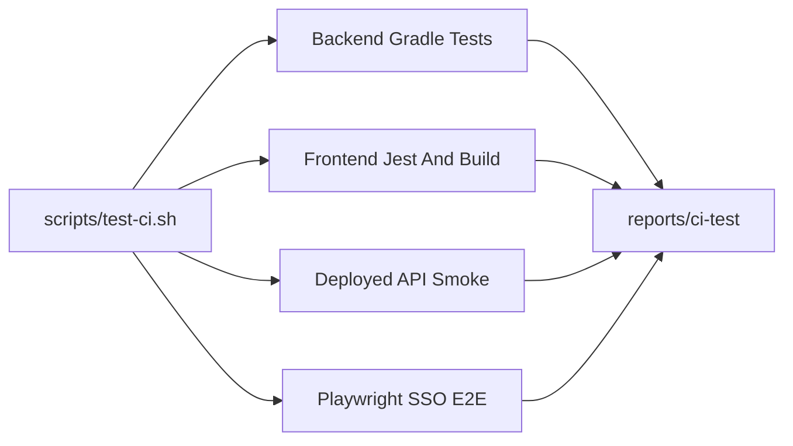

# 自动化测试方案

## 已确认决策

- 首版阻断范围：后端单元/切片测试、前端 lint/build/Jest 测试、部署环境 API 冒烟、Playwright 浏览器 E2E 全部必须通过。
- CI 形态：不绑定具体平台，提供命令行入口，流水线只需调用统一脚本。
- UI 登录：Playwright 真实打开企业 SSO 登录；前提是存在 CI 可无人值守使用的 SSO 测试账号/机制，且不会触发验证码、扫码、MFA 或风控交互。
- 覆盖率门禁：全量低基线防倒退，新改代码采用更高覆盖率要求，后续逐步抬升。
- 统一入口：新增根脚本 `[scripts/test-ci.sh](scripts/test-ci.sh)`，作为 CI 调用入口。

## 后端测试与覆盖率

后端测试分为四层，避免把所有问题都塞进 `./gradlew test`：

- L0 单元测试：纯 Kotlin/Java 逻辑，不启动 Spring，不依赖 Mongo/Redis。覆盖工具类、领域服务、协议解析、权限判断分支，命名沿用 `*Test`。
- L1 切片测试：沿用仓库已有 `@DataMongoTest`、Embedded Mongo、MockK/Mockito 模式，覆盖 DAO、Service、Repository 元数据读写，命名建议为 `*ServiceTest`、`*DaoTest`。
- L2 模块集成测试：需要 Spring 上下文、Redis、MockMvc 或协议控制器时使用，建议用 `@Tag("integration")` 或 `*IT` 标记，避免和快速单测混淆。
- L3 部署环境 API 冒烟：在测试环境完成部署后，通过 HTTP 验证健康状态、鉴权边界、基础元数据、制品协议链路。

首版后端阻断命令：

- `cd src/backend && ./gradlew clean test jacocoTestReport`：跑 L0/L1/L2 中当前默认测试。
- 新增聚合覆盖率任务，例如 `jacocoRootReport`，统一收集各子模块 Jacoco XML/HTML。
- 新增覆盖率校验任务，例如 `jacocoRootCoverageVerification`，采用全量低基线，后续按模块逐步提高。
- 部署完成后由 `scripts/test-ci.sh` 或流水线调用 API 冒烟脚本，覆盖 L3 部署环境 HTTP 链路。

报告产物：

- JUnit XML：`src/backend/**/build/test-results/test/*.xml`
- Gradle HTML 测试报告：`src/backend/**/build/reports/tests/test/`
- Jacoco XML/HTML：复制或生成到统一目录 `reports/ci-test/backend/jacoco/`
- API 冒烟日志和响应：生成到统一目录 `reports/ci-test/api-smoke/`

## 前端测试体系

- 修复 `[src/frontend/core/devops-op/package.json](src/frontend/core/devops-op/package.json)` 与 `[src/frontend/core/devops-op/jest.config.js](src/frontend/core/devops-op/jest.config.js)` 的 Jest 骨架，补齐 Vue 2 对应测试依赖、JUnit 报告和 lcov 覆盖率输出。
- 在 `[src/frontend/package.json](src/frontend/package.json)` 增加 monorepo 级测试命令，至少覆盖 `devops-op`，并为 `devops-repository` 建立同样的测试入口。
- 首批用例优先覆盖低耦合工具函数和小组件，避免一开始测试大型页面导致 mock 膨胀。
- 前端阻断命令包含 lint、单元/组件测试、覆盖率校验和生产构建。

## API 冒烟

API 冒烟不是单测替代品，而是验证“代码已经部署到测试环境后，真实对外 HTTP 链路和制品协议链路是否可用”。首版沉淀为脚本套件：通用管理面用 shell + curl，Maven、PyPI、OCI 等协议面必须使用对应生态的真实客户端验证，避免只测到 REST 路由却漏掉协议兼容问题。

### 执行位置

- 构建阶段：执行 L0/L1/L2 后端测试和打包，不在这里冒充真实环境。
- 部署阶段：流水线把后端服务部署到测试环境，例如独立 namespace、测试集群或预发环境。
- 准备阶段：测试环境必须具备固定测试数据，包括项目、仓库、测试账号和可清理的测试路径。
- 验证阶段：`scripts/smoke-test-api.sh` 只接收环境 URL 和凭证，通过 HTTP 访问测试环境。
- 清理阶段：删除本轮创建的临时制品或使用带唯一 run id 的路径，避免污染长期测试数据。

本地 `boot-assembly` 启动仍可保留为开发者预检或流水线部署前的可选步骤，但它不再定义为 L3。L3 的判定标准是“部署后的测试环境通过 HTTP 验证”。

### 测试环境前置条件

- 环境已完成后端服务部署，入口地址可由 `SMOKE_BASE_URL` 指定。
- 健康检查接口可从流水线访问，例如 `/actuator/health` 或经过网关后的等价路径。
- 存在稳定测试账号，例如 `SMOKE_USER` / `SMOKE_PASSWORD`，或测试环境签发的服务 Token。
- 存在固定测试项目和仓库，例如 `blueking`、`generic-local`、`helm-local`、`maven-local`、`pypi-local`、`oci-local`；如果环境不预置，部署后初始化步骤负责创建。
- 冒烟使用独立命名空间或路径，例如 `smoke/${SMOKE_RUN_ID}/smoke.txt`，测试结束后可清理。
- 所有请求必须携带可追踪 header，例如 `X-BKREPO-UID`、`X-Smoke-Run-Id`，方便从服务日志回溯。
- 运行机必须安装协议客户端：`curl`、`mvn`、`python`、`pip`、`twine`、`oras` 或等价 OCI 客户端。脚本启动时先做依赖检查，缺少客户端时直接失败并输出安装建议。

### 冒烟分层

L0 进程与基础设施：

- `GET /actuator/health`：期望 200，JSON 中 `status=UP`。
- `GET /actuator/info`：期望 200，用于验证 actuator 暴露和基础路由。

L1 鉴权边界：

- `GET /auth/api/user/rsa`：公开接口应返回 200。
- `GET /repository/api/project/list` 不带凭证：期望 401、403 或业务拒绝，验证匿名访问不能越权。
- `GET /repository/api/project/list` 带 `admin/password` 和 `X-BKREPO-UID: admin`：期望 200 且业务返回成功。

L2 项目与仓库元数据：

- `GET /repository/api/project/exist/blueking`：期望项目存在。
- `GET /repository/api/repo/exist/blueking/generic-local`：期望 generic 仓库存在。
- `GET /repository/api/repo/exist/blueking/helm-local`：期望 helm 仓库存在。
- `GET /repository/api/repo/list/blueking`：期望响应包含 `generic-local` 和 `helm-local`。

L3a 通用 HTTP 制品链路：

- `PUT /generic/blueking/generic-local/smoke.txt`：上传一段固定文本，期望成功。
- `GET /generic/blueking/generic-local/smoke.txt`：下载并比对 body。
- `HEAD /generic/blueking/generic-local/smoke.txt`：期望 200。
- `GET /repository/api/node/blueking/generic-local/smoke.txt`：期望节点元数据存在。
- `GET /helm/blueking/helm-local/index.yaml`：带 Basic Auth，期望 200 且内容包含 `apiVersion`。

L3b 协议客户端链路：

- Maven：用 `mvn deploy:deploy-file` 发布一个最小 jar/pom 到 `maven-local`，再用 `mvn dependency:get` 或独立临时项目解析依赖，验证上传、元数据、下载和认证链路。
- PyPI：生成一个最小 Python package，用 `twine upload` 发布到 `pypi-local`，再用 `pip install --index-url` 从测试仓库安装到临时虚拟环境，验证包索引、下载和认证链路。
- OCI：用 `oras login`、`oras push` 推送一个小文件 artifact 到 `oci-local`，再用 `oras pull` 拉取并比对 digest，验证 OCI registry API、认证和 blob/manifest 链路。
- Helm：除 `index.yaml` curl 外，后续可用 `helm repo add`、`helm package`、`helm push`、`helm pull` 验证真实 Helm 客户端链路；如果首版暂不引入 Helm 客户端，需在报告中标记 Helm 为 HTTP-only 覆盖。
- 其他协议按同样规则扩展：只要用户侧依赖专用客户端，就在 smoke 套件里放入真实客户端的最小发布/拉取闭环。

### 脚本与命令

- 新增 `scripts/smoke-test-api.sh` 作为 L3 总入口，只负责访问已部署测试环境，不负责构建、启动 MongoDB 或启动 jar。
- 新增 `scripts/smoke/api/http-core.sh`，覆盖健康检查、鉴权、项目/仓库元数据、generic、helm index 等 curl 冒烟。
- 新增 `scripts/smoke/protocols/maven.sh`，使用 Maven CLI 完成最小 publish/resolve 闭环。
- 新增 `scripts/smoke/protocols/pypi.sh`，使用 Python build/twine/pip 完成最小 publish/install 闭环。
- 新增 `scripts/smoke/protocols/oci.sh`，使用 `oras` 或团队指定 OCI 客户端完成 push/pull/digest 校验。
- 新增 `scripts/smoke/lib/report.sh`，统一记录每个脚本的开始/结束时间、状态、日志路径和失败摘要，最终汇总到 `reports/ci-test/api-smoke/report.json`。
- 新增或扩展 `scripts/test-ci.sh`，默认跑后端测试；部署完成后由流水线再调用 `scripts/smoke-test-api.sh`。
- 可选保留 `scripts/smoke-test-assembly.sh` 作为本地 `boot-assembly` 预检，但它不计入 L3 部署环境冒烟定义。

`scripts/smoke-test-api.sh` 的执行顺序：

- 检查环境变量和客户端依赖。
- 创建 `reports/ci-test/api-smoke/` 和临时工作目录。
- 执行 `http-core.sh`，先证明环境、鉴权和基础元数据可用。
- 执行协议脚本：`maven.sh`、`pypi.sh`、`oci.sh`，后续可追加 npm、nuget、composer 等。
- 执行清理逻辑，删除或标记本轮创建的临时制品。
- 生成 `report.json`，并把结果写入统一 `summary.json`，供 `index.html` 展示。

推荐环境变量：

- `SMOKE_BASE_URL=https://bkrepo-test.example.com`
- `SMOKE_USER=admin`
- `SMOKE_PASSWORD=password`
- `SMOKE_PROJECT=blueking`
- `SMOKE_GENERIC_REPO=generic-local`
- `SMOKE_HELM_REPO=helm-local`
- `SMOKE_MAVEN_REPO=maven-local`
- `SMOKE_PYPI_REPO=pypi-local`
- `SMOKE_OCI_REPO=oci-local`
- `SMOKE_RUN_ID=${CI_PIPELINE_ID:-local}`
- `SMOKE_REPORT_DIR=reports/ci-test/api-smoke`
- `SMOKE_PROTOCOLS=http,maven,pypi,oci`

### 失败诊断产物

- `reports/ci-test/api-smoke/env.json`：本次冒烟目标环境、run id、测试项目和仓库。
- `reports/ci-test/api-smoke/responses/`：每个接口的响应体。
- `reports/ci-test/api-smoke/curl/`：curl verbose 日志。
- `reports/ci-test/api-smoke/protocols/`：Maven、PyPI、OCI 等客户端命令日志、临时项目和关键输出。
- `reports/ci-test/api-smoke/report.json`：每条 HTTP 请求和每个协议客户端步骤的 name、status、latency、pass/fail、log path。

## 统一报告目录

所有测试产物必须汇总到一个可整体归档的目录：`reports/ci-test/`。流水线不需要理解各工具原始输出位置，只归档这一个目录即可。

目录结构建议：

- `reports/ci-test/index.html`：总入口文件，必须存在。
- `reports/ci-test/summary.json`：机器可读汇总，包含各阶段状态、耗时、报告链接和失败摘要。
- `reports/ci-test/backend/`：后端 JUnit XML、Gradle HTML report、Jacoco XML/HTML、覆盖率校验结果。
- `reports/ci-test/frontend/`：前端 lint 结果、Jest JUnit XML、lcov、HTML coverage、构建日志。
- `reports/ci-test/api-smoke/`：部署环境 API 冒烟报告、curl 日志、响应体、环境信息。
- `reports/ci-test/playwright/`：Playwright HTML report、trace、截图、视频。
- `reports/ci-test/logs/`：统一脚本日志和阶段执行日志。

`index.html` 要作为人读入口，至少展示：

- 本次测试总体状态：passed、failed、skipped。
- 每个阶段的状态、耗时、开始/结束时间。
- 每个阶段的入口链接，例如 backend test report、Jacoco HTML、frontend coverage、API smoke report、Playwright report。
- 失败摘要：失败阶段、失败用例或接口、关键错误信息、对应日志链接。
- 环境信息：commit、branch、run id、测试环境 URL、JDK/Node/Yarn/Gradle 版本。

生成方式建议：

- `scripts/test-ci.sh` 负责创建 `reports/ci-test/`，并在每个阶段结束后同步原始报告到对应子目录。
- 新增轻量脚本 `scripts/generate-test-report-index.sh` 或在 `scripts/test-ci.sh` 内生成静态 `index.html`。
- 即使某个阶段失败，也要尽力生成 `index.html`，把已完成阶段和失败信息展示出来。
- `index.html` 只引用相对路径，保证流水线 artifact 下载后可直接离线打开。
- 如果某个阶段被显式跳过，入口中标记为 `skipped`，不要让用户误以为报告丢失。

### 当前 assembly-check 的定位

现有 `[.github/workflows/assembly-check.yml](.github/workflows/assembly-check.yml)` 更适合定位为“部署前 assembly 启动预检”，不是 L3 部署环境冒烟。它可以继续优化：导入 `init-data.js`、用 `/actuator/health` 替代固定 `sleep 60`、curl 使用 `-f` 或显式状态码断言。但真正的 L3 应在测试环境部署完成后执行，目标是验证实际部署入口、网关、鉴权、服务路由和后端依赖组合是否可用。

## Playwright 浏览器 E2E

- 在前端侧新增 Playwright 配置与 `e2e` 目录，测试目标指向部署后的测试环境前端入口和后端 API。
- 使用 Playwright global setup 执行企业 SSO 登录，要求通过环境变量注入测试账号、密码和必要的 SSO 参数。
- 保存 trace、截图、视频和 HTML report；失败时脚本统一归档到报告目录。
- 首批场景控制在稳定关键路径：登录、首页/仓库列表可达、仓库详情或 helm index 页面链路、一次只读查询流程。

## 统一命令入口

- 新增 `[scripts/test-ci.sh](scripts/test-ci.sh)`，默认执行：后端测试与覆盖率、前端 lint/test/build；部署完成后执行部署环境 API 冒烟和 Playwright E2E。
- 支持环境变量控制子阶段，例如只跑 `backend`、`frontend`、`api-smoke`、`e2e`，但默认模式全部阻断。
- 统一报告目录固定为 `reports/ci-test/`，内部按 `backend`、`frontend`、`api-smoke`、`playwright` 分组，根目录必须生成 `index.html`。
- 脚本需使用严格模式、清晰日志、失败即退出，并在失败时尽量保留已有报告和总入口。

## 验证方式

- 本地执行 `bash scripts/test-ci.sh` 应能跑完整阻断流程。
- 单独执行各阶段命令应能快速定位失败来源。
- 覆盖率报告、JUnit/Jest 报告、部署环境 API 冒烟报告、Playwright report 都应落到 `reports/ci-test/`，且 `reports/ci-test/index.html` 可作为流水线归档报告入口。
- CI 侧只需要安装 JDK 17、Node 20.19.0、Yarn、Docker 和浏览器依赖，然后调用根脚本。

