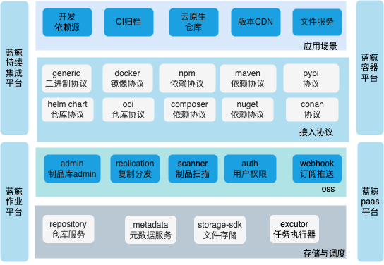

---

> **重要提示**: `master` 分支在开发过程中可能处于 *不稳定或者不可用状态* 。
请通过[releases](https://github.com/TencentBlueKing/bk-repo/releases) 而非 `master` 去获取稳定的二进制文件。

bk-repo是一个基于微服务架构设计的制品管理平台
- 架构层面使用spring boot+ spring cloud的技术栈，是一个kotlin作为主要的开发语言的gradle工程，微服务网关基于openresty。
- 功能层面提供各种类型的制品存储协议、制品代理、分发、晋级、扫描、包管理等。
- 存储层面制品库采用多级分层的策略去接收制品文件，使用对象存储去永久的存储制品文件，使用mongodb去存储节点信息与元数据信息，对外提供高于4个9的可用性。

## Overview
制品库架构图

- 应用场景层
- oss(运营支撑)层
- 接入协议层
- 存储与调度层

## Features
- auth 统一账号、权限管理，对接bk-user、bk-iam等账号权限体系
- repository 项目、仓库、节点管理、元数据管理
- generic 通用制品管理
- git git code服务
- rpm rpm包管理
- docker image、helm chart、oci 云原生镜像仓库
- npm、composer、pypi、maven、nuget依赖源微服务
- opdata 制品库admin服务
- replication 制品分发服务
- webhook服务 webhook的订阅与推送
- analyst analyst-executor 制品分析

## Experience
- [bk-repo in docker](https://hub.docker.com/r/bkrepo/bkrepo)

## Getting started
* [下载与编译](docs/install/compile.md)
* [安装部署](docs/install/binary/README.md)
* [API使用说明见这里](docs/apidoc-user/)
* [使用Helm部署BKREPO到K8S环境](support-files/kubernetes/README.md)

## Support
1. [GitHub讨论区](https://github.com/TencentBlueKing/bk-repo/discussions)
2. QQ群：495299374

## BlueKing Community
- [BK-BCS](https://github.com/Tencent/bk-bcs)：蓝鲸容器管理平台是以容器技术为基础，为微服务业务提供编排管理的基础服务平台。
- [BK-CMDB](https://github.com/Tencent/bk-cmdb)：蓝鲸配置平台（蓝鲸CMDB）是一个面向资产及应用的企业级配置管理平台。
- [BK-JOB](https://github.com/Tencent/bk-job)：蓝鲸作业平台(Job)是一套运维脚本管理系统，具备海量任务并发处理能力。
- [BK-PaaS](https://github.com/Tencent/bk-PaaS)：蓝鲸PaaS平台是一个开放式的开发平台，让开发者可以方便快捷地创建、开发、部署和管理SaaS应用。
- [BK-SOPS](https://github.com/Tencent/bk-sops)：蓝鲸标准运维（SOPS）是通过可视化的图形界面进行任务流程编排和执行的系统，是蓝鲸体系中一款轻量级的调度编排类SaaS产品。

## Contributing
- 关于 bk-repo 分支管理、issue 以及 pr 规范，请阅读 [Contributing](CONTRIBUTING.md)
- [腾讯开源激励计划](https://opensource.tencent.com/contribution) 鼓励开发者的参与和贡献，期待你的加入

## License
BK-CI/BK-REPO 是基于 MIT 协议， 详细请参考 [LICENSE](LICENSE.txt)

我们承诺未来不会更改适用于交付给任何人的当前项目版本的开源许可证（MIT 协议）。

