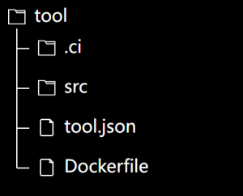

# 服务部署

## analyst服务

### 配置

```yaml
# 配置spring-cloud-stream后才支持监听制品上传事件执行扫描
spring:
  cloud:
    function:
      definition: artifactEvent
    stream:
      bindings:
        artifactEvent-in-0:
          group: scanner
          destination: artifactEvent
          binder: pulsar
scanner:
  # 扫描报告地址，用于发送企微通知时构建链接
  detailReportUrl: http://bkrepo.example.com/ui

```

## analysis-executor服务

### 配置

```yaml
scanner:
  executor:
    # 扫描执行器工作目录
    workDir: /work_dir
    # 单台机器最多执行的扫描任务数量
    maxTaskCount: 10
    # 允许扫描的最大文件大小
    fileSizeLimit: 10GB
    # 至少需要空闲的内存百分比，大于这个比例才能执行扫描任务
    atLeastFreeMemPercent: 0.2
    # 至少需要空闲的硬盘空间百分比，大于这个比例才能执行扫描任务
    atLeastUsableDiskSpacePercent: 0.3
    docker:
      enabled: true
      host: unix:///var/run/docker.sock
      version: 1.23
      connect-timeout: 5000
      read-timeout: 0
```

### 依赖

- docker daemon
- 运行服务器最好是16C/32G 以上的配置，因为扫描器目前还比较消耗资源

# 如何接入新的扫描器

## 一、创建代码库
代码库目录结构如下



.ci目录下存放CI构建脚本

src目录存放扫描工具代码

tool.json中包含了扫描工具相关配置

Dockerfile用于构建扫描工具镜像

## 二、编写工具代码
扫描工具需要以镜像的方式提供，制品库会以`docker run -v /path/to/workspace:/bkrepo/workspace toolImage:version cmd --input /bkrepo/workspace/input.json --output /bkrepo/workspace/output.json`的方式执行工具，工具需要解析`input.json`获取配置和待扫描文件信息执行扫描，并将结果按约定的格式输出到`output.json`文件中，工具执行结束后制品库会解析并存储`output.json`中包含的扫描结果

容器镜像不要设置`ENTRYPOINT`，而是在`tool.json`指定容器启动的`CMD`

当前扫描任务的工作目录会被挂载到容器内的`/bkrepo/workspace`目录，待扫描文件与`input.json`都在该目录下，扫描结束后`output.json`也需要输出到该目录

### tool.json说明
```json
{
  "name": "bkrepo-scanner",
  "image": "repo/scanner:BKREPO_TOOL_VERSION",
  "cmd": "/bkrepo-scanner/bin/bkrepo-scanner",
  "version": "BKREPO_TOOL_VERSION",
  "args": [
    {
      "type": "STRING",
      "key": "toolArg",
      "value": "toolValue",
      "des": ""
    }
  ],
  "type": "standard",
  "description": "扫描器",
  "supportFileNameExt": [
    "tar",
    "apk",
    "ipa",
    "jar"
  ],
  "supportPackageTypes": [
    "DOCKER",
    "GENERIC",
    "MAVEN"
  ],
  "supportScanTypes": [
    "SECURITY",
    "LICENSE"
  ]
}
```
| 字段名                 | 类型     | 默认值 | 可选  | 描述                                                                   |
|---------------------|--------|-----|-----|----------------------------------------------------------------------|
| name                | string |     | 否   | 扫描工具名                                                                |
| image               | string |     | 否   | 镜像                                                                   |
| cmd                 | string |     | 否   | 启动镜像用的命令                                                             |
| version             | string |     | 否   | 工具版本                                                                 |
| args                | array  | 空数组 | 是   | 工具参数数组，会添加到input.json中在执行扫描时传递给工具，参考下文input.json的toolConfig.args字段说明 |
| type                | string |     | 否   | 固定为standard                                                          |
| description         | string |     | 是   | 工具描述                                                                 |
| supportFileNameExt  | array  |     | 否   | 支持扫描的文件名后缀                                                           |
| supportPackageTypes | array  |     | 否   | 支持扫描的包类型，取值范围[GENERIC, DOCKER, MAVEN, HELM, NPM, RPM]                |
| supportScanTypes    | array  |     | 否   | 支持扫描的类型，目前仅支持漏洞扫描和许可证扫描，取值范围[SECURITY,SENSITIVE,LICENSE]             |

### input.json说明
```json
{
  "taskId": "632573a0126dd519418c88a9",
  "toolConfig": {
    "args": [
      {
        "type": "STRING",
        "key": "toolConfigKey",
        "value": "testValue",
        "des": ""
      },
      {
        "type": "STRING",
        "key": "packageType",
        "value": "GENERIC",
        "des": ""
      },
      {
        "type": "NUMBER",
        "key": "maxTime",
        "value": "180000",
        "des": ""
      }
    ]
  },
  "filePath": "/bkrepo/workspace/0903d17e58654a2c79f4e46df79dc73ccaa49b6edbc7c3278359db403b687f6e.jar",
  "sha256": "0903d17e58654a2c79f4e46df79dc73ccaa49b6edbc7c3278359db403b687f6e"
}
```
| 字段名        | 类型     | 默认值 | 可选                                                                                                                                         | 描述  |
|------------|--------|-----|--------------------------------------------------------------------------------------------------------------------------------------------|-----|
| taskId     | string || 否   | 扫描任务id                                                                                                                                     |
| toolConfig | object || 否   | 扫描工具配置，不同扫描工具可以添加不同配置，制品库默认会设置packageType和maxTime配置，maxTime表示最长允许扫描的时间，packageType表示待扫描文件的包类型，取值范围[GENERIC, DOCKER, MAVEN, HELM, NPM, RPM] |
| filePath   | string || 否   | 待扫描文件在容器中的路径                                                                                                                               |
| sha256     | string || 否   | 待扫描文件sha256                                                                                                                                |

	
#### toolConfig.args字段说明

| 字段名   | 类型     | 默认值  | 可选  | 描述                               |
|-------|--------|------|-----|----------------------------------|
| type  | string |      | 否   | 参数类型，取值范围[STRING,NUMBER,BOOLEAN] |
| key   | string |      | 否   | 参数键                              |
| value | string | null | 否   | 参数值                              |
| des   | string | 空字符串 | 否   | 参数描述信息                           |

### output.json说明

```json
 {
  "status": "SUCCESS",
  "err": null,
  "taskId": "632573a0126dd519418c88a9",
  "result": {
    "securityResults": [
      {
        "vulId": "pcmgr-342415",
        "vulName": "Vmware Spring Framework 安全特征问题漏洞",
        "cveId": "CVE-2022-22968",
        "path": "/0903d17e58654a2c79f4e46df79dc73ccaa49b6edbc7c3278359db403b687f6e.jar",
        "pkgName": "org.springframework:spring-core",
        "pkgVersions": [
          "5.3.16"
        ],
        "effectedVersion": "5.1.5.RELEASE",
        "fixedVersion": "5.2.0,>5.2.20,>5.3.18",
        "des": "Vmware Spring Framework是美国威睿（Vmware）公司的一套开源的Java、JavaEE应用程序框架。该框架可帮助开发人员构建高质量的应用。 \nVmware Spring Framework存在安全特征问题漏洞，该漏洞源于DataBinder上disallowedFields的模式是区分大小写的，这意味着字段没有得到有效保护，除非该字段的第一个字符同时以大写和小写字母列出，包括属性路径中所有嵌套字段的第一个字符的大写和小写字母。远程攻击者利用该漏洞可以绕过实施的安全限制。",
        "solution": "目前厂商已发布升级补丁以修复漏洞，补丁获取链接： \nhttps://tanzu.vmware.com/security/cve-2022-22968",
        "references": [
          "https://tanzu.vmware.com/security/cve-2022-22968",
          "https://security.netapp.com/advisory/ntap-20220602-0004/",
          "https://www.oracle.com/security-alerts/cpujul2022.html"
        ],
        "cvss": 5.3,
        "severity": "medium"
      }
    ],
    "licenseResults": [
      {
        "licenseName": "apache-2.0",
        "path": "/0903d17e58654a2c79f4e46df79dc73ccaa49b6edbc7c3278359db403b687f6e.jar",
        "pkgName": "org.springframework:spring-core",
        "pkgVersion": "5.3.16"
      }
    ]
  }
}
```

| 字段名    | 类型     | 默认值  | 可选  | 描述                                |
|--------|--------|------|-----|-----------------------------------|
| status | string |      | 否   | 扫描状态，取值范围[SUCCESS,FAILED,TIMEOUT] |
| err    | string | null | 是   | 扫描失败时的错误信息                        |
| taskId | string |      | 否   | 扫描任务id                            |
| result | object | null | 是   | 扫描成功需要输出该字段，表示扫描结果                |

#### result.securityResults字段说明

| 字段名             | 类型     | 默认值  | 可选  | 描述                                  |
|-----------------|--------|------|-----|-------------------------------------|
| vulId           | string |      | 否   | 漏洞id，可以用cveId或者其他漏洞库中的id            |
| vulName         | string | null | 是   | 漏洞名                                 |
| cveId           | string | null | 是   | cveId                               |
| path            | string | null | 是   | 当被扫描的包是压缩包时，表示存在漏洞的组件在被扫描压缩包中的路径    |
| pkgName         | string | null | 是   | 扫描到该漏洞的组件名                          |
| pkgVersions     | array  | 空数组  | 是   | 扫描到的存在该漏洞的组件版本数组                    |
| fixedVersion    | string | null | 是   | 修复漏洞的组件版本                           |
| effectedVersion | string | null | 是   | 受影响版本                               |
| des             | string | null | 是   | 描述                                  |
| solution        | string | null | 是   | 修复方案                                |
| references      | array  | 空数组  | 是   | 相关引用链接                              |
| cvss            | number | null | 是   | cvss                                |
| severity        | string |      | 否   | 漏洞等级，取值范围[low,medium,high,critical] |
   	
#### result.licenseResults字段说明

| 字段名             | 类型     | 默认值  | 可选  | 描述                                |
|-----------------|--------|------|-----|-----------------------------------|
| licenseName     | string |      | 否   | 许可证名                              |
| licenseNamepath | string | null | 是   | 当被扫描的包是压缩包时，表示存在许可证的组件在被扫描压缩包中的路径 |
| pkgName         | string | null | 是   | 扫描到该许可证的组件名                       |
| pkgVersions     | array  | 空数组  | 是   | 扫描到的存在该许可证的组件版本数组                 |

## 使用工具

工具打包镜像发布到镜像仓库后，可以在制品库Admin中配置为standard类型的扫描器使用