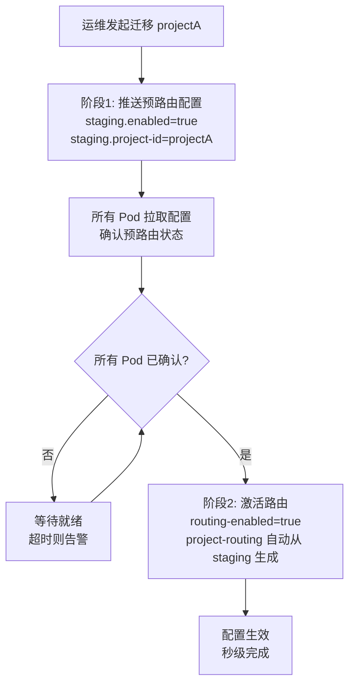

# MongoDB 分库 — 附录：补遗、头脑风暴与问题修复

> 主方案索引：[mongodb-node-sharding-routing.md](./mongodb-node-sharding-routing.md)  
> 模块化实施方案：[mongodb-node-sharding-modules.md](./mongodb-node-sharding-modules.md)

---

## 23. 方案补遗索引

本节汇总评审中发现、已在正文中补全的约束，便于实施时逐项核对。

| 编号 | 问题 | 补全位置 | 要点 |
| --- | --- | --- | --- |
| G-01 | `shard-routing` 部分迁移误路由 | §13.3、§10.2 | 与 `project-routing` 互斥，启动 fail-fast |
| G-02 | Default 僵尸副本生命周期不清 | §3.9.5 | ROUTED~CLEANUP 期间禁止操作 Default 迁出项目 |
| G-03 | 迁移期 `file_reference` decrement/GC 风险 | §3.18 | `migration.project-locks` + decrement 单次原则 |
| G-04 | 历史迁移策略收敛 | §1.6、§19.4 | 仅 `NONE`/`JOB_ONLY`；`mongodump` 仅用于备份恢复（§21），不作迁移策略 |
| G-05 | 散发查询静默丢数据 | §3.7、§11.2 | 默认 `STRICT`，失败返回错误 |
| G-06 | `deleteRepository` / Pipeline 跨实例 | §20.3 | 分步执行，不要求事务 |
| G-07 | Job/异步路径遗漏 | §3.19.2 | 改造清单 + 灰度门禁 |
| G-08 | `lastModifiedDate` 遗漏更新风险 | §3.15.7、§3.19.1 | 10/13 写路径遗漏更新；队列去重 + `$max` 双重防护 + 写路径审计 |
| G-10 | 连接池放大 | §4.1 | 实例数上限 + 连接数估算 |
| G-11 | NONE 模式禁止为终态 | §1.4.4 | 禁止作为项目最终状态；`max-duration-days` 自动过期 + `expiration-action: BLOCK` |
| G-12 | 双写期 CATCH_UP 竞态 | §3.15.7（已有） | 进入 `DUAL_WRITE` 时 `MigrationSyncJob` 中断 CATCH_UP 线程 |
| G-13 | 补偿队列无限增长 | §3.17.9（已有） | 三级熔断 |
| G-14 | `$max` 仅保护 `lastModifiedDate`，其他字段仍可被旧补偿覆盖 | §3.15.7 | 队列去重为主缓解 + 对账兜底 + 补全写路径 `lastModifiedDate` 为终极方案 |
| G-15 | `enqueuedAt`（`System.nanoTime()`）JVM 重启后重置 | §3.15.7 | 持久化为 `Long`；重启后残留任务按 `createdAt` 排序；`replaceOrAdd` 熔断时仍允许替换 |
| G-16 | 散发查询性能退化缺少量化分析 | §3.7.1 | RT 退化模型 + Default 瓶颈 + 流式合并 + 独立连接池 |
| G-17 | 僵尸副本无限停留 | §3.9.5 | `max-zombie-hours: 168` + 超时阻断后续迁移 + 磁盘冗余监控 |
| G-18 | `$inc` 合并去重存在消费竞态 | §3.15.7 | CAS 乐观锁：仅 `status=PENDING` 时合并；失败则追加新任务（幂等消费兜底） |
| G-19 | JOB_ONLY 断点续传依赖 `_id` 单调性 | §3.9.2 | INIT 阶段校验 `_id` 类型为 ObjectId；非 ObjectId 时改用 `createdDate` 断点 |
| G-20 | 缺少业务级监控指标 | §22 | 路由层/补偿队列/散发查询/双写/迁移状态/僵尸副本/连接池 7 类指标 + 告警分级 |
| G-21 | 通用框架反射路由键提取嵌套路径风险 | §19.4.2 | 递归字段查找 + 提取失败详细日志 + 短期 LRU 缓存 |
| G-22 | 连接池缺少优雅关闭策略 | §7.4 | 单实例独立超时关闭，不阻塞其他实例 |
| G-23 | 补偿任务入队失败无兜底 | §3.12.5、§3.17.9 | 入队失败 P0 告警；补偿消费者自带重试（MAX_RETRY=3），FAILED 后人工介入；三级熔断 hardLimit 直接拒绝，不绕过 |
| G-24 | 多 Pod 并发消费补偿队列幂等性 | §3.15.5 | `findAndModify` 分布式锁（status PENDING → PROCESSING）+ 幂等消费 |
| G-25 | MongoDB writeConcern/readConcern 未声明 | §20a | 要求 writeConcern=majority；INIT 校验 |
| G-26 | index build 与迁移并发阻塞 | §3.14a | 迁移期间 `freeze-ddl=true` 锁；索引创建必须在迁移前完成 |
| G-27 | MongoDB 驱动 retryableWrites 与双写交互 | §3.12.2 | 驱动自动重试可能导致重复写入；$inc 场景改用 findAndModify；异常表增加此场景 |
| G-28 | resumeToken 持久化失败恢复路径 | §3.9.2 | 双重持久化：MongoDB 主路径 + 本地文件降级 |
| G-29 | 回滚后补偿队列残留任务 | §3.11 | 回滚流程增加补偿队列清理步骤（按 projectId 删除 PENDING 任务） |
| G-30 | Default 主从切换期间补偿 spike | §3.12.2、§22 | 监控 `compensation.spike.count`；自动提升消费速率；异常表增加此场景 |
| G-32 | Default oplog 容量预检查 | §3.9.2、§20a | INIT 阶段校验 `local.oplog.rs` 窗口 ≥ `migration.min-oplog-hours`（默认 48h） |
| G-34 | 模式二分库前路由就绪 | §3.19.2、§10.5、§14 | P0 清单 + CI + 集成测试全通过；阻塞模式二迁移编排；模式一不受限 |
| G-40 | Job 多实例 Group 失败隔离 | §3.8.2 | `BatchQueryGroup`；单实例不可用跳过 Group |
| G-41 | 异步写路径 ThreadLocal 丢失 | §3.16、§3.19.2 D | 写操作显式 `projectId`；TTL 防御 |
| G-42 | 补偿消费后即时校验 | §25.2、M2 | 消费成功后 `_id`/关键字段 post-check |
| G-43 | 散发查询连接隔离 | §3.7.1 | 独立池，防占满业务读写池 |
| G-35 | `projectId` 唯一绑定 | §10.2 | 一 projectId 不得绑多个 Heavy |
| G-38 | `block_node` / `drive_node` 范围 | §1.2 | v1 不分库，留 Default |

**M7 上线前必查**（与 §3.19.3、§25.5 灰度门禁一致）：G-01、G-02、G-03、G-05、G-07、G-08、G-10、G-14、G-16、G-17、G-18、G-19、**G-24、G-25、G-26、G-34**（共 16 项，模式二）。

> **修复方案汇总**：§23 列问题、§24 列增强思路，**§25 给出分阶段落地修复方案**（实施顺序、验收标准、文件改动清单），实施时以 §25 为主索引。

---

## 24. 头脑风暴增强方案

本章汇总技术评审头脑风暴中发现的进一步增强点，作为对已有方案（§23 补遗索引 G-01~G-22）的防御深度补充。
每个问题独立列出，含问题描述、解决方案、优先级及建议落地阶段。

### 24.1 增强方案总览

| 编号 | 问题 | 严重度 | 发生概率 | 优先级 | 建议阶段 |
| --- | --- | --- | --- | --- | --- |
| E-01 | Zombie 副本缺少写入保护 | 🔴 致命 | 中 | P0 | M7 前 |
| E-03 | `lastModifiedDate` 遗漏更新应升级为 M7 强制项 | 🟡 严重 | 高 | P1 | M7 前 |
| E-04 | 全局版本号保护非 `lastModifiedDate` 字段 | 🟡 严重 | 低 | P1 | M8+ |
| E-05 | 双写期缺少旁路对账 | 🟡 严重 | 中 | P1 | M6 |
| E-06 | 配置热加载的跨 Pod 一致性窗口 | 🟡 严重 | 中 | P1 | M6 |
| E-07 | NONE 模式长期运行风险 | 🟡 严重 | 中 | P1 | M7 |
| E-08 | `$inc` 非幂等补偿的时序边界 | 🟢 中等 | 低 | P2 | M8+ |
| E-09 | ThreadLocal → TTL 迁移的不彻底性 | 🟢 中等 | 中 | P2 | M7 |
| E-10 | NodeCommonUtils 改造爆炸半径 | 🟢 中等 | 中 | P2 | M7 |
| E-11 | 散发查询深度分页拒绝的灰度策略 | 🟢 中等 | 高 | P2 | M6 |
| E-12 | 连接池线性放大与优雅关闭 | 🟢 中等 | 低 | P2 | M5 |
| E-13 | 应急回滚后缺少数据一致性快速验证 | 🟢 中等 | 中 | P2 | M6 |
| E-14 | CATCH_UP 暂停期间的 oplog 窗口保护 | 🟢 中等 | 低 | P2 | M6 |
| E-16 | 多 Pod 并发消费补偿队列幂等性 | 🟡 严重 | 中 | P1 | M7 前 |
| E-17 | MongoDB writeConcern/readConcern 配置缺失 | 🟡 严重 | 中 | P1 | M7 前 |
| E-18 | index build 与迁移并发阻塞 | 🟡 严重 | 低 | P1 | M7 前 |
| E-19 | MongoDB 驱动 retryableWrites 与双写交互 | 🟡 严重 | 低 | P1 | M7 前 |
| E-20 | resumeToken 持久化失败恢复路径 | 🟢 中等 | 低 | P2 | M6 |
| E-21 | 回滚后补偿队列残留任务清理 | 🟢 中等 | 中 | P2 | M6 |
| E-22 | Default 主从切换期间补偿 spike | 🟢 中等 | 中 | P2 | M7 |
| E-24 | Default oplog 容量预检查 | 🟢 中等 | 中 | P2 | M6 |

---

### 24.2 E-01：Zombie 副本缺少写入保护（P0）

**问题描述**（关联 G-02）：ROUTED 之后，若 Job 代码有 bug 或配置遗漏，未正确添加 `projectId NOT IN [ROUTED 项目]` 条件，会静默读写 Default 上的 zombie 副本。读 zombie 数据不更新 Heavy，写 zombie 数据造成静默数据分裂。

**解决方案**：在 `AbstractMongoDao` 基类层增加**写保护 Hook**。

```kotlin
// AbstractMongoDao.kt — 写操作入口处增加防御性检查
override fun determineMongoTemplate(collectionName: String, context: Any?): MongoTemplate {
    val ruleName = registry?.ruleNameByPrefix(collectionName) ?: return defaultTemplate
    val routingKey = extractRoutingKey(context) ?: return defaultTemplate

    // 写保护：若当前实例是 Default 且 projectId 已迁出，拒绝写入
    if (isWriteOperation() && isDefaultInstance() && isProjectRoutedOut(routingKey, ruleName)) {
        val msg = "WRITE_PROTECTION: Attempted to write zombie replica on Default. " +
                  "projectId=$routingKey, collection=$collectionName. " +
                  "This indicates a code bug or missing routing configuration."
        log.error(msg)
        alarm(msg)
        throw IllegalStateException(msg)  // fail-fast，禁止静默写入
    }

    return registry?.routeWrite(collectionName, FakeQuery(routingKey)) ?: defaultTemplate
}
```

**验收标准**：
- 集成测试：模拟迁出后 Job 对 Default 写入，验证抛出 `IllegalStateException`
- 单元测试：覆盖 `isProjectRoutedOut` 对已迁出/未迁出/迁移中三种状态的判断

---

### 24.4 E-03：`lastModifiedDate` 遗漏更新应升级为 M7 强制项（P1）

**问题描述**（关联 G-08）：代码审计发现 **10/13 写路径遗漏更新 `lastModifiedDate`**。当前方案依赖队列去重 + `$max` 双重防护，但 `$max` 仅保护 `lastModifiedDate`，若该字段本身不更新，防护完全失效。必须将补全 `lastModifiedDate` 从"建议"升级为"强制项"。

**解决方案**：逐文件修复，按优先级分三批。

| 优先级 | 写路径 | 影响面 | 修复方式 |
| --- | --- | --- | --- |
| P0 | `nodeDeleteUpdate`、move/copy 相关 | 高频 + 核心 | 立即修复 |
| P1 | `setNodeArchived`、`compressedNode` | 中频 | M7 前修复 |
| P2 | metadata 相关（create/update/delete） | 低频 | M7 前修复 |

**修复示例**：

```kotlin
// Before:
fun setNodeArchived(projectId: String, repoName: String, fullPath: String, archived: Boolean) {
    val update = Update().set("archived", archived)  // ❌ 遗漏 lastModifiedDate
    ...
}

// After:
fun setNodeArchived(projectId: String, repoName: String, fullPath: String, archived: Boolean) {
    val update = Update()
        .set("archived", archived)
        .set("lastModifiedDate", LocalDateTime.now())  // ✅ 补全
        .set("lastModifiedBy", SecurityContextHolder.getContext().authentication?.name ?: "system")
    ...
}
```

**验收标准**：
- 13 条写路径全部审计通过（grep 验证所有 `Update` 构造均含 `lastModifiedDate`）
- 集成测试模拟补偿乱序（旧 update 在业务更新之后消费），验证 `$max` 正确拒绝旧时间戳

---

### 24.5 E-04：全局版本号保护非 `lastModifiedDate` 字段（P1）

**问题描述**（关联 G-14）：`$max` 只保护 `lastModifiedDate` 不降级，其他 `$set` 字段（`size`、`metadata`、`archived` 等）仍可能被旧补偿覆盖。队列去重是主缓解，但不是 100% 防御。

**解决方案**：引入**补偿任务全局版本号**（M8+ 迭代）。

```kotlin
// 每个文档增加一个单调递增的全局版本号
// node_* 集合新增字段:
//   "__version": Long  // 每次写操作自增

// 写入时自增版本号
fun writeWithVersion(collectionName: String, query: Query, update: Update) {
    val versionUpdate = Update()
        .apply { update.updateObject.forEach { (k, v) -> this.set(k, v) } }
        .inc("__version", 1)         // 自增版本号
        .set("lastModifiedDate", now)

    val result = template.updateFirst(query, versionUpdate, collectionName)
    // 补偿任务记录此版本号
    return result to getCurrentVersion(collectionName, query)
}

// 补偿任务结构扩展
data class CompensationTask(
    // ... existing fields ...
    val docVersion: Long,   // 主路径写入时的文档版本号
)

// 补偿消费时：仅当副路径版本号 < docVersion 时才执行
fun retryUpdateWithVersion(task: CompensationTask) {
    val update = deserializeUpdate(task.update)

    // 条件式更新：仅当副路径版本号小于补偿任务的版本号时才执行
    val guardedUpdate = Update()
        .apply { update.updateObject.forEach { (k, v) -> this.set(k, v) } }
        .max("lastModifiedDate", task.doc?.get("lastModifiedDate"))
        .set("__version", task.docVersion)  // 同步版本号

    val query = Query(Criteria.where("_id").`is`(task.primaryKey)
        .and("__version").lt(task.docVersion))  // 版本号更旧才更新

    val result = template.updateFirst(query, guardedUpdate, task.collectionName)
    if (result.matchedCount == 0L) {
        // 副路径版本号已 >= 补偿版本号 → 说明已有更新数据，补偿被正确拒绝
        log.info("Compensation update skipped by version guard. _id={}, docVersion={}",
            task.primaryKey, task.docVersion)
    }
    markDone(task)
}
```

**权衡**：增加 `__version` 字段需要在所有写路径中更新版本号（改造范围类似 `lastModifiedDate` 补全）。若团队决定不引入版本号字段，则 E-03（`lastModifiedDate` 补全）完成后，`$max` 保护的可靠性会大幅提升。建议作为 M8+ 可选增强。

---

### 24.6 E-05：双写期缺少旁路对账（P1）

**问题描述**：双写期暂停 CATCH_UP 后，一致性完全依赖补偿队列。若补偿队列出现系统性延迟（Default 抖动、消费线程阻塞等），没有备用同步通道。且补偿队列的"健康"只能通过队列深度间接判断，无法直接验证 Heavy 与 Default 的数据是否一致。

**解决方案**：增加**双写期定期轻量对账**机制。

```kotlin
@Component
@ConditionalOnBean(MongoRoutingRegistry::class)
class DualWriteSidecarVerifier(
    private val defaultMongoTemplate: MongoTemplate,
    private val registry: MongoRoutingRegistry,
) {
    // 每 10 分钟执行一次（实现见 DualWriteSidecarVerifier.kt）
    @Scheduled(fixedDelay = 600_000)
    fun verify() {
        registry.allConfiguredProjectsByInstance("node").values.flatten()
            .filter { registry.isProjectInDualWrite("node", it) }
            .forEach { projectId ->
                // 抽样比对 Heavy vs Default，结果写入对账日志
                val heavyTemplate = registry.primaryTemplateByInstance("node", targetInstance(projectId))
                NodeReconciliationHelper.sampleAndCompare(projectId, defaultMongoTemplate, heavyTemplate)
            }
    }
}
```

**关键点**：
- 这是 count 级别的轻量对账，不影响性能
- 关注**差异扩大趋势**而非绝对值，避免双写期间的正常延迟触发误报
- 若连续 3 次对账差异持续扩大，告警升级为 P1，阻断切流

---

### 24.7 E-06：配置热加载的跨 Pod 一致性窗口（P1，v2 可选）

> **v1 决策**：不实现下文 `routing-staging` 两阶段提交。跨 Pod 一致性靠 §3.10「100% 实例部署」运维 SOP +
> Prometheus 指标 `bkrepo_mongo_routing_config_version` 监测（§25.3.3）。路由配置纯 Consul + RefreshScope；DB 仅 Job 编排，不参与热路径。

**问题描述**（关联 §10.1）：配置变更不是原子跨 Pod 的：

```
Pod-1: 已刷新 routing-enabled=true, projectA→heavy1
Pod-2: 尚未刷新 routing-enabled=false
```

这个窗口期内，同一 `projectA` 的请求可能走到不同实例。虽然双写缓解数据丢失，但读请求可能返回不一致结果。

**解决方案**（v2 可选）：配置推送改为**两阶段提交**模式。

```yaml
# 配置中心新增 staging 状态字段
spring.data.mongodb.multi-instance.rules.node:
  routing-staging:                    # 新增：预路由状态
    enabled: true                     # 第一阶段：所有 Pod 已收到预路由指令
    project-id: projectA
    target-instance: heavy1
  routing-enabled: false              # 实际路由尚未开启
  routing-state: DUAL_WRITE               # 双写先开启（Consul 运维手改）
  project-routing:
    # 暂不加入，等 staging 确认后自动生效
```

**两阶段流程**：



```kotlin
@Component
class RoutingActivationCoordinator(
    private val properties: MongoMultiInstanceProperties,
    private val instanceDiscovery: InstanceDiscovery,  // 获取所有 Pod 实例
) {
    fun confirmRoutingActivation(ruleName: String, projectId: String): Boolean {
        val staging = properties.rules[ruleName]?.staging ?: return false

        // 检查所有 Pod 是否都已拉取预路由配置
        val allPodsReady = instanceDiscovery.allPods().all { pod ->
            pod.getStagingConfig(ruleName)?.projectId == projectId
        }

        if (!allPodsReady) {
            log.info("Routing activation pending: not all pods confirmed staging for $projectId")
            return false
        }

        // 所有 Pod 就绪，激活路由
        configCenter.update(
            "spring.data.mongodb.multi-instance.rules.$ruleName.routing-enabled", true
        )
        configCenter.update(
            "spring.data.mongodb.multi-instance.rules.$ruleName.project-routing.$projectId",
            staging.targetInstance
        )
        log.info("Routing activated: $projectId → ${staging.targetInstance}")
        return true
    }
}
```

---

### 24.8 E-07：NONE 模式长期运行风险（P1）

**问题描述**（关联 G-11）：虽然设置了 30 天自动过期，但实际运维中：
- 30 天窗口可能被一再延期审批
- 散发查询永久双倍开销
- Default 磁盘无法释放
- 对账复杂度翻倍（需区分历史数据和新数据）

**解决方案**：NONE 模式增加"渐进式升级约束"。

```yaml
# 示例：node 规则下 NONE 模式渐进式告警升级（per-rule 配置）
spring.data.mongodb.multi-instance.rules.node:
  migration:
    mode: NONE
    none:
      max-duration-days: 30
      expiration-action: BLOCK
      # 新增：渐进式告警升级
      progressive-alert:
        - day: 7
          action: WARN      # 第 7 天：企微群提醒
        - day: 14
          action: WARN_ESCALATE  # 第 14 天：抄送技术负责人
        - day: 21
          action: PAGE     # 第 21 天：P1 告警
        - day: 30
          action: BLOCK    # 第 30 天：阻断 + 禁止延期
      # 新增：散发查询性能监控
      scatter-query-degradation-threshold: 3.0  # RT 退化超过 3x 时自动升级 NONE 为 P1 告警
```

```kotlin
// NONE 模式下的散发查询性能监控
fun checkScatterQueryDegradation(projectId: String) {
    val baseline = scatterMetricsStore.getBaseline(projectId)  // 迁移前基准
    val current = scatterMetricsStore.getCurrent(projectId)
    if (current.p99 > baseline.p99 * config.scatterQueryDegradationThreshold) {
        alarm("NONE模式散发查询退化: project=$projectId, baseline=${baseline.p99}ms, current=${current.p99}ms")
        autoPromoteNoneToP1(projectId)  // 自动升级告警优先级
    }
}
```

---

### 24.9 E-08：`$inc` 非幂等补偿的时序边界（P2）

**问题描述**（关联 G-18）：补偿任务对 `$inc` 的处理是"先查当前值再 `$set` 绝对值"，存在时序窗口：

```
T1: 补偿查当前 count=100，准备 $set count=105
T2: 业务又做了 $inc count=+3 → count=103
T3: T1 补偿执行 $set count=105，覆盖 T2 的 +3
```

**解决方案**：对 `$inc` 字段采用**增量意图 + 幂等标记**模式（M8+ 可选）。

```kotlin
// 补偿任务新增字段
data class CompensationTask(
    // ... existing fields ...
    val incOperations: Map<String, Number>? = null,  // 增量意图：{ "downloadCount": 5 }
    val incAppliedAt: Instant? = null,               // 增量最后一次成功应用的纳秒时间戳
)

fun retryUpdate(task: CompensationTask) {
    val incOps = task.incOperations ?: mapOf()
    if (incOps.isEmpty()) {
        // 无 $inc 操作，走标准路径
        executeStandardUpdate(task)
        return
    }

    // 方案：使用 $inc 直接执行，配合幂等标记防止重复
    val update = Update()
    incOps.forEach { (field, delta) -> update.inc(field, delta) }

    // 使用 findAndModify 实现条件式 $inc：仅当 incAppliedAt 未变时才执行
    val result = template.findAndModify(
        Query(Criteria.where("_id").`is`(task.primaryKey)
            .and("__inc_applied__").`is`(task.incAppliedAt)),  // 幂等门禁
        update,
        FindAndModifyOptions.options().returnNew(true),
        TNode::class.java,
        task.collectionName
    )

    if (result == null) {
        // 已被其他补偿任务消费，标记完成
        log.info("Compensation $inc skipped: already applied. _id={}", task.primaryKey)
        markDone(task)
        return
    }

    // 成功应用后更新 incAppliedAt 标记
    val newIncAppliedAt = Instant.now()
    template.updateFirst(
        Query(Criteria.where("_id").`is`(task.primaryKey)),
        Update().set("__inc_applied__", newIncAppliedAt),
        task.collectionName
    )
    markDone(task)
}
```

**权衡**：此方案需要在 `node_*` 文档中新增 `__inc_applied__` 元字段，权衡"字段污染"与"计数正确性"。如不接受新增字段，则保持 "先查后写" 模式，但需增加 `$inc` 字段变化的**连续监控**（对比 Heavy 与 Default 的计数字段差异）。

---

### 24.10 E-09：ThreadLocal → TTL 迁移的不彻底性（P2）

**问题描述**（关联 §3.16）：TTL 通过 `TtlRunnable` 包装线程池来传递上下文，但以下场景无法覆盖：
- **Kotlin 协程**的 `Dispatchers.Default` 等默认调度器不会被 TTL 自动包装
- **第三方库内部线程池**（如某 SDK 自建线程池）不经过 `TtlExecutors` 包装

**解决方案**：

**方案 A（协程场景）：使用 Kotlin CoroutineContext 传递路由上下文**

```kotlin
// 定义 CoroutineContext Element
class RoutingContextElement(
    val ruleName: String,
    val routingKey: String
) : AbstractCoroutineContextElement(RoutingContextElement) {
    companion object Key : CoroutineContext.Key<RoutingContextElement>
}

// 协程启动时注入
fun CoroutineScope.launchWithRouting(
    ruleName: String,
    projectId: String,
    block: suspend CoroutineScope.() -> Unit
): Job = launch(RoutingContextElement(ruleName, projectId)) {
    block()
}

// DAO 层读取
fun getRoutingKeyFromCoroutine(ruleName: String): String? {
    return coroutineContext[RoutingContextElement]?.let {
        if (it.ruleName == ruleName) it.routingKey else null
    }
}
```

**方案 B（第三方线程池场景）：运行时 Hook 检测**

```kotlin
// 在 node_* 写操作入口增加运行时检测
fun writeWithProtection(collectionName: String, context: Any?): MongoTemplate {
    val ruleName = registry.ruleNameByPrefix(collectionName)
    val routingKey = extractRoutingKey(context)

    if (routingKey == null) {
        // ThreadLocal 为空 — 可能经过未包装的线程池
        val stackTrace = Thread.currentThread().stackTrace
            .take(20)
            .joinToString("\n") { "  at ${it.className}.${it.methodName}(${it.fileName}:${it.lineNumber})" }
        log.error("Routing context lost. collection=$collectionName, stack:\n$stackTrace")
        alarm("路由上下文丢失: collection=$collectionName")

        // 尝试从协程上下文恢复（兜底）
        val coroutineKey = getRoutingKeyFromCoroutine(ruleName)
        if (coroutineKey != null) {
            log.info("Recovered routing key from coroutine context: $coroutineKey")
            return registry.routeWrite(collectionName, FakeQuery(coroutineKey))
        }

        throw IllegalStateException("Routing key extraction failed for write operation on $collectionName")
    }

    return registry.routeWrite(collectionName, FakeQuery(routingKey))
}
```

**关键**：方案 A 和方案 B 应作为 TTL 的**补充**而非替代，准则 1（显式传参）仍然是唯一可靠的兜底。

---

### 24.11 E-10：NodeCommonUtils 改造爆炸半径（P2）

**问题描述**（关联 §3.8.5）：从 `companion object` 静态方法改为实例方法，影响约 10+ 文件。测试代码中 `NodeCommonUtils.mongoTemplate = ...` 的直接赋值会全部失效。

**解决方案**：采用**渐进式迁移 + 过渡期兼容层**。

```kotlin
@Component
class NodeCommonUtils(
    private val routingRegistry: MongoRoutingRegistry,
    private val defaultTemplate: MongoTemplate,
) {
    companion object {
        // 过渡期：保留静态引用，委托给内部持有的实例
        @Volatile
        private var instance: NodeCommonUtils? = null

        // 设置实例（由 Spring 在 @PostConstruct 时调用）
        fun setInstance(inst: NodeCommonUtils) {
            instance = inst
        }

        // 保留旧 API，内部委托
        @Deprecated("Use injected NodeCommonUtils instance instead",
                     ReplaceWith("nodeCommonUtils"))
        lateinit var mongoTemplate: MongoTemplate
            get() = instance?.defaultTemplate
                ?: throw IllegalStateException("Not initialized")

        @Deprecated("Use injected NodeCommonUtils instance instead")
        fun findNodes(query: Query, key: String): List<TNode> =
            instance?.findNodes(query, key)
                ?: throw IllegalStateException("Not initialized")
    }

    @PostConstruct
    fun init() {
        Companion.setInstance(this)
    }
}
```

**迁移计划**：

| 阶段 | 行动 | 时间 |
| --- | --- | --- |
| Step 1 | 新建实例化 `NodeCommonUtils`，companion object 添加 `@Deprecated` 委托 | 当前迭代 |
| Step 2 | 逐个替换调用方为注入方式（每次 2~3 个文件） | 2 周 |
| Step 3 | 全部替换完成，删除 companion object 中的委托代码 | +2 周 |

---

### 24.12 E-11：散发查询深度分页拒绝的灰度策略（P2）

**问题描述**（关联 §3.7、§11.2）：文档决定拒绝 `offset > 10000` 的深度分页，但业务侧可能未准备好处理这个拒绝。直接上线 `STRICT` 拒绝模式可能导致功能不可用。

**解决方案**：增加"软拒绝"过渡期。

```yaml
spring.data.mongodb.multi-instance.rules.node:
  scatter-query:
    default-mode: STRICT
    deep-page:
      # 灰度阶段：先不拒绝，而是记录调用方和频率
      # 过渡期后切换为 REJECT
      mode: LOG_ONLY   # LOG_ONLY | REJECT
      transition-date: "2026-07-01"  # 自动切换日期
      max-offset: 10000
```

```kotlin
fun handleDeepPage(offset: Long, api: String, caller: String) {
    when (config.scatterQuery.deepPage.mode) {
        DeepPageMode.LOG_ONLY -> {
            // 记录但不拒绝
            deepPageLogger.warn("Deep page detected: api=$api, offset=$offset, caller=$caller")
            deepPageMetrics.record(api, caller, offset)  // 统计影响范围
            // 继续执行查询（可能很慢）
        }
        DeepPageMode.REJECT -> {
            throw DeepPageRejectedException(
                "Deep pagination rejected: offset=$offset > " +
                "max=${config.scatterQuery.deepPage.maxOffset}. " +
                "Please use cursor-based pagination or narrow your query scope."
            )
        }
    }
}

// 自动切换逻辑
@Scheduled(fixedDelay = 86400_000)  // 每天检查
fun checkTransition() {
    if (LocalDate.now() >= config.scatterQuery.deepPage.transitionDate
        && config.scatterQuery.deepPage.mode == DeepPageMode.LOG_ONLY) {
        log.info("Auto-transitioning deep page mode to REJECT")
        configCenter.update("scatter-query.deep-page.mode", "REJECT")
        alarm("Deep page mode auto-transitioned to REJECT. Check business readiness.")
    }
}
```

---

### 24.13 E-12：连接池线性放大与优雅关闭（P2）

**问题描述**（关联 G-10、G-22）：每增加一个 Heavy 实例，连接数线性放大。且当某 Heavy 实例需要关闭时，没有独立的优雅关闭策略，可能阻塞其他实例。

**解决方案**：单实例独立超时关闭。

```kotlin
@Component
class MongoTemplateLifecycleManager(
    private val templates: Map<String, MongoTemplate>,
) : DisposableBean {

    override fun destroy() {
        // 每个 MongoTemplate 独立关闭，单个超时不阻塞其他
        val executor = Executors.newFixedThreadPool(min(templates.size, 4))
        val futures = templates.map { (name, template) ->
            executor.submit<Unit> {
                try {
                    // 等待进行中的操作完成（最多 30s）
                    val client = getMongoClient(template)
                    client?.close()
                    log.info("MongoTemplate closed: $name")
                } catch (e: Exception) {
                    log.error("Failed to close MongoTemplate: $name", e)
                    // 不抛出，继续关闭其他实例
                }
            }
        }

        // 总超时 60s
        futures.forEach {
            try { it.get(30, TimeUnit.SECONDS) }
            catch (e: TimeoutException) { log.warn("MongoTemplate close timeout") }
        }
        executor.shutdown()
    }

    private fun getMongoClient(template: MongoTemplate): MongoClient? {
        return try {
            template.mongoDbFactory?.let { factory ->
                val field = SimpleMongoClientDbFactory::class.java
                    .getDeclaredField("mongoClient")
                field.isAccessible = true
                field.get(factory) as? MongoClient
            }
        } catch (e: Exception) {
            log.warn("Cannot access MongoClient via reflection", e)
            null
        }
    }
}
```

---

### 24.14 E-13：应急回滚后缺少数据一致性快速验证（P2）

**问题描述**（关联 §3.11）：回滚流程设计完整，但在紧急情况下，运维需要**快速判断回滚是否成功**——而不只是"配置已恢复"。

**解决方案**：增加**回滚后快速烟雾测试 API**。

```kotlin
@RestController
@RequestMapping("/api/migration/rollback-verify")
class RollbackVerificationController(
    private val defaultTemplate: MongoTemplate,
    private val registry: MongoRoutingRegistry,
) {
    @PostMapping("/{projectId}")
    fun verifyRollback(@PathVariable projectId: String): RollbackVerifyResult {
        val checks = mutableListOf<Check>()

        // 1. 验证路由配置已关闭（Consul：项目不在 project-routing 或 routing-enabled=false）
        checks.add(Check(
            "routing-disabled",
            !registry.isRoutingEnabled("node") || projectId !in registry.allKnownProjectIds("node"),
        ))

        // 2. 验证 Default 数据可读
        val defaultCount = defaultTemplate.count(
            Query(Criteria.where("projectId").`is`(projectId)),
            determineCollection(projectId)
        )
        checks.add(Check("default-readable", defaultCount > 0))

        // 3. 验证业务 API 可写
        try {
            val testNode = createTestNode(projectId)
            nodeService.createNode(testNode)
            nodeService.deleteNode(testNode.projectId, testNode.repoName, testNode.fullPath)
            checks.add(Check("business-write-ok", true))
        } catch (e: Exception) {
            checks.add(Check("business-write-ok", false, e.message))
        }

        val allPassed = checks.all { it.passed }
        return RollbackVerifyResult(
            projectId,
            if (allPassed) "OK" else "FAILED",
            null,
            checks
        )
    }
}
```

---

### 24.15 E-14：CATCH_UP 暂停期间的 oplog 窗口保护（P2）

**问题描述**（关联 G-12）：双写期暂停 CATCH_UP 后，若双写期过长（运维延误切流），CATCH_UP 的 resumeToken 可能超出 oplog 保留窗口，导致无法恢复。

**解决方案**：增加双写期的硬性时限 + oplog 窗口监控。

```yaml
compensation:
  dual-write:
    max-duration-hours: 24       # 双写期硬性上限
    oplog-window-warning: 0.8    # oplog 窗口消耗超过 80% 时告警
    expiration-action: FORCE_ROLLBACK  # 超时后强制回滚到 READY
```

```kotlin
@Component
class DualWriteDurationGuard(
    private val defaultMongoTemplate: MongoTemplate,
    private val registry: MongoRoutingRegistry,
    private val oplogMonitor: OplogWindowMonitor,
) {
    @Scheduled(fixedDelay = 600_000)  // 每 10 分钟
    fun checkDualWriteHealth() {
        val dualWriting = defaultMongoTemplate.find(
            Query(Criteria.where("state").`is`("DUAL_WRITE")),
            Document::class.java,
            "node_project_sync_state",
        )
        for (doc in dualWriting) {
            val projectId = doc.getString("projectId")
            if (!registry.isProjectInDualWrite("node", projectId)) continue
            val updatedAt = LocalDateTime.parse(doc.getString("updatedAt"))
            val duration = Duration.between(updatedAt, LocalDateTime.now())

            // 检查 oplog 窗口消耗
            val windowConsumed = oplogMonitor.windowConsumedRatio(doc.getString("resumeToken"))
            if (windowConsumed > 0.8) {
                alarm("CATCH_UP oplog window consumed ${windowConsumed * 100}% for " +
                      "project=$projectId. " +
                      "Dual-write duration=${duration.toHours()}h. " +
                      "Please complete routing cutover within " +
                      "${(1 - windowConsumed) * oplogMonitor.retentionHours}h.")
            }

            // 检查双写期超时
            if (duration.toHours() > config.dualWrite.maxDurationHours) {
                alarm("Dual-write exceeded max duration: ${duration.toHours()}h. " +
                      "FORCE_ROLLBACK triggered for project=$projectId")
                forceRollbackToReady(projectId)
            }
        }
    }
}
```

---

### 24.16 E-15：补偿任务入队失败无兜底（已评估，P0 降级）

**问题描述**（关联 G-23）：双写期 Heavy 主路径写入成功后，副路径 Default 同步写入失败 → 记录补偿任务 → 但**补偿任务本身的 MongoDB 写入也可能失败**（网络瞬断、集合不存在、磁盘满等）。此时 Heavy 已有数据、Default 无数据、补偿任务丢失 → **永久数据不一致**。

```text
T1: Heavy.insert 成功 → 返回 OK
T2: Default.insert 失败（网络瞬断）
T3: compensationQueue.enqueue(task)  ← 这一步也失败！
T4: 返回成功（Heavy 已成功），但 Default 无数据、无补偿记录
结果：Heavy/Default 永久不一致 ❌
```

**评估结论**：本地文件兜底方案（`CompensationFallbackWriter` + `CompensationFallbackRecovery`）经评审后删除，理由：

1. **伪前提**：补偿 DB 不可写但业务 DB 正常运行的场景极少见。分库前后 DB 一致性模型不变——DB 不可写时服务本就不正常，文件兜底不改变此事实。
2. **绕过熔断**：`hardLimit` 设计用于保护补偿队列不被撑爆，文件兜底将其短路，违背设计意图。
3. **运维不透明**：运维发现补偿 FAILED 后的处理路径与发现文件堆积后的处理路径等价——都是人工介入。文件仅增加排查复杂度。

**实际应对策略**：

- `enqueue()` 异常时打印 CRITICAL 日志 + P0 告警
- 补偿消费者自带重试机制（`MAX_RETRY=3`），重试耗尽后标记 `FAILED`
- `hardLimit` 熔断触发时直接拒绝入队，打印 CRITICAL 日志 + P0 告警
- 无论哪种路径最终都是 P0 告警 + 人工介入处理根因

**验收标准**：

- 集成测试：Mock 补偿队列 MongoDB 不可写，验证 CRITICAL 日志 + P0 告警触发
- 三级熔断（§3.17.9）硬限制触发时拒绝入队，不绕过

---

### 24.17 E-16：多 Pod 并发消费补偿队列幂等性（P1）

**问题描述**（关联 G-24）：§3.15.5 的补偿调度器使用 `@Scheduled` 定时拉取，多 Pod 环境下**可能同时拉取并消费同一条补偿任务**。虽然 §3.6.3 提到 insert 补偿幂等（`DuplicateKeyException` 忽略），但 update/delete 补偿并发执行两次仍有副作用：
- `update` 补偿的 `$set` + `$max` 并发执行可能导致字段值不确定
- `delete` 补偿并发执行无副作用（天然幂等）

**解决方案**：补偿任务消费使用 MongoDB `findAndModify` 分布式锁。

```kotlin
@Component
class CompensationConsumer(
    private val template: MongoTemplate,
    private val podId: String = UUID.randomUUID().toString(),
) {
    /**
     * 原子认领任务：status PENDING → PROCESSING，同 _id 仅一个 Pod 能成功
     */
    fun claimTask(ruleName: String): CompensationTask? {
        return template.findAndModify(
            Query(Criteria.where("status").`is`("PENDING")
                .and("ruleName").`is`(ruleName))
                .with(Sort.by(Sort.Direction.ASC, "createdAt")),
            Update()
                .set("status", "PROCESSING")
                .set("claimedBy", podId)
                .set("claimedAt", Instant.now()),
            FindAndModifyOptions.options().returnNew(true),
            CompensationTask::class.java,
            "node_dual_write_compensation"
        )
    }

    @Scheduled(fixedDelay = 100) // 高频轮询
    fun consume() {
        var task: CompensationTask?
        while (run { task = claimTask("node"); task != null }) {
            try {
                executeCompensation(task!!)
                markDone(task!!)
            } catch (e: Exception) {
                handleFailure(task!!, e)
            }
        }
    }
}
```

**僵死任务回收**：若某 Pod 崩溃后任务长期处于 `PROCESSING`，回收器定期扫描并重置：

```kotlin
@Scheduled(fixedDelay = 120_000) // 每 2 分钟
fun recoverStaleTasks() {
    val staleThreshold = Instant.now().minusSeconds(300) // 5 分钟未完成视为僵死
    template.updateMulti(
        Query(Criteria.where("status").`is`("PROCESSING")
            .and("claimedAt").lt(staleThreshold)),
        Update().set("status", "PENDING").unset("claimedBy").unset("claimedAt"),
        CompensationTask::class.java,
        "node_dual_write_compensation"
    )
}
```

**验收标准**：
- 集成测试：2 个 Pod 同时拉取同一补偿任务，验证仅 1 个 Pod 成功认领
- 僵死回收测试：模拟 Pod 崩溃 → 经过 TTL → 任务被其他 Pod 重新认领

---

### 24.18 E-17：MongoDB writeConcern/readConcern 配置缺失（P1）

**问题描述**（关联 G-25）：方案多处依赖"Default Primary 写入一定在 Secondary 上可见"，但**未声明各实例的 `writeConcern` 和 `readConcern` 强制配置**。

| 实例 | 当前隐含要求 | 风险 |
| --- | --- | --- |
| Default Primary | `writeConcern: 1`（默认） | Primary 写入 ack 后宕机 → 新 Primary 可能无此数据 → 数据丢失 |
| Heavy Primary | `writeConcern: 1`（默认） | 同上，主路径数据可能丢失 |
| 读 Secondary（散发查询） | `readConcern: local`（默认） | 可能读到已回滚的数据（Primary failover 后） |

**解决方案**：统一要求所有实例的 writeConcern 和 readConcern，INIT 阶段校验。

```yaml
spring.data.mongodb:
  # 全局 writeConcern 要求（所有业务写入）
  write-concern: majority    # 写入被多数节点确认后才返回成功
  # 双写路径强制 majority（补偿可适当放宽但建议一致）
  dual-write:
    write-concern: majority

  multi-instance:
    rules:
      node:
        instances:
          heavy1:
            uri: mongodb://heavy1:27017/bkrepo?w=majority&readConcernLevel=majority
```

**INIT 阶段校验**：

```kotlin
fun validateWriteConcern(template: MongoTemplate, instanceName: String): ValidationResult {
    val adminDb = template.mongoDbFactory?.getMongoDatabase("admin")
        ?: return ValidationResult.fail("Cannot access admin db")

    // 检查副本集配置
    val rsConfig = adminDb.runCommand(Document("replSetGetConfig", 1))
    val members = rsConfig.get("config", Document::class.java)
        ?.getList("members", Document::class.java)

    // 检查 writeConcern: majority 是否可达
    val majorityWriteConcern = adminDb.runCommand(Document(mapOf(
        "ping" to 1,
        "writeConcern" to Document("w", "majority")
    )))

    return if (majorityWriteConcern.getDouble("ok") == 1.0) {
        ValidationResult.ok("writeConcern=majority verified")
    } else {
        ValidationResult.fail("writeConcern=majority not satisfiable. " +
            "Ensure replica set has ≥3 members and all are healthy. " +
            "Note: majority requires ${(members?.size ?: 0) / 2 + 1} healthy nodes.")
    }
}
```

**约束矩阵**：

| 操作类型 | writeConcern | readConcern | 原因 |
| --- | --- | --- | --- |
| 业务写入（insert/update/delete） | **majority** | — | 防止 Primary failover 数据丢失 |
| 双写副路径写入 | **majority** | — | 同上，确保 Default 副路径数据可靠 |
| 补偿任务写入 | majority（推荐） | — | 补偿任务本身不能丢失 |
| 业务读取（Primary） | — | **majority**（推荐）或 local | majority 保证不读到回滚数据 |
| 对账/VERIFY 读取 | — | **majority** | 对账必须基于已提交数据 |
| 散发查询 | — | local（可接受） | 性能优先，最终一致即可 |

**验收标准**：
- 所有 MongoDB URI 显式包含 `w=majority`
- INIT 阶段校验 majority writeConcern 可达
- 集成测试：模拟 Primary failover → 验证写入不丢失

---

### 24.19 E-18：index build 与迁移并发阻塞（P1）

**问题描述**（关联 G-26）：MongoDB 前台建索引会阻塞所有读写操作。如果运维在迁移过程中对 Heavy 或 Default 执行 `createIndex`（或某些自动重建索引的场景），将导致：
- 双写期 Heavy 写入阻塞 → 业务写入超时 → 主路径失败
- Default 读取阻塞 → 散发查询超时

**解决方案**：迁移锁中增加 `freeze-ddl`，迁移期间禁止 DDL 操作。

```yaml
spring.data.mongodb.multi-instance.rules.node:
  migration:
    project-locks:
      freeze-default-node-mutation: true
      freeze-gc: true
      freeze-physical-delete: true
      freeze-ddl: true            # 新增：禁止对涉及实例执行 DDL
      freeze-ddl-instances:       # 指定哪些实例受保护
        - default
        - heavy1
```

```kotlin
@Component
class MigrationDdlGuard(
    private val migrationGate: MigrationGate,
    private val registry: MongoRoutingRegistry,
) {
    /**
     * 在执行任何 DDL 操作（createIndex/dropIndex/compact 等）前调用
     * @throws DdlBlockedException 如果目标实例在迁移中
     */
    fun ensureDdlAllowed(instanceName: String, projectId: String? = null) {
        val rule = registry.props.rules["node"] ?: return
        if (!rule.migration.projectLocks.freezeDdl) return

        val protectedInstances = rule.migration.projectLocks.freezeDdlInstances
        if (instanceName in protectedInstances && migrationGate.isGcFrozen()) {
            val blockedProjects = registry.allKnownProjectIds("node")
                .filter { migrationGate.isProjectGcFrozen(it) }
                .joinToString(",")
            throw DdlBlockedException(
                "DDL operation blocked on instance=$instanceName. " +
                    "Active migrations: [$blockedProjects]. " +
                    "Wait for all migrations to complete (CLEANED) or contact DBA."
            )
        }

        if (projectId != null && migrationGate.isProjectGcFrozen(projectId)) {
            throw DdlBlockedException(
                "DDL blocked for project=$projectId (migration in progress)"
            )
        }
    }
}
```

**SOP 约束**：
- 所有索引创建必须在迁移开始前完成
- 迁移期间（INITIAL_SYNC → CLEANUP）禁止对涉及实例执行任何 DDL
- 索引缺失 → INIT 阶段 fail-fast（已有），修复后重新触发迁移

---

### 24.20 E-19：MongoDB 驱动 retryableWrites 与双写交互（P1）

**问题描述**（关联 G-27）：MongoDB 4.2+ 驱动默认开启 `retryableWrites`。驱动层会在网络错误时**自动重试写操作**，对双写路径产生隐蔽影响：

```text
场景 A（正常）：
  T1: 驱动发起 write(Heavy) → 网络超时
  T2: 驱动自动重试 write(Heavy) → 成功
  T3: 应用层收到成功 → 同步写 Default
  → 结果正常 ✅

场景 B（ack丢失）：
  T1: 驱动发起 write(Heavy) → MongoDB 已写入但 ack 丢失 → 驱动判为超时
  T2: 驱动自动重试 write(Heavy) → 对于 insert: DuplicateKeyException（被驱动吞掉）
      对于 $inc: 会再次 +inc → 计数重复 ❌
  T3: 应用层不知情（驱动返回成功），同步写 Default
  → $inc 操作可能被重复计数 ❌
```

**解决方案**：

1. **审计所有 `$inc` 调用点**，改为 `findAndModify` 确保原子性：

```kotlin
// Before（非幂等，retryableWrites 可能导致重复计数）:
template.updateFirst(query, Update().inc("downloadCount", 1), collectionName)

// After（原子 findAndModify，即使重试也只执行一次）:
template.findAndModify(
    query,
    Update().inc("downloadCount", 1),
    FindAndModifyOptions.options().returnNew(true).upsert(true),
    TNode::class.java,
    collectionName
)
```

2. **双写层感知重试**：如果 `findAndModify` 改造不现实，也可在双写方法中关闭 retryableWrites：

```kotlin
// 仅双写路径关闭驱动重试（业务层已有重试逻辑）
fun dualWriteInsert(doc: TNode, heavyTemplate: MongoTemplate): WriteResult {
    val heavyTemplateNoRetry = MongoTemplate(
        heavyTemplate.mongoDbFactory,
        heavyTemplate.converter.apply {
            // 通过 MongoClientSettings 关闭 retryableWrites
        }
    )
    // ...
}
```

3. **异常场景表增加**：在 §3.12.2 增加 "驱动 retryableWrites 导致重复写入" 场景。

**验收标准**：
- 全量审计：grep 所有 `Update().inc()` 调用点
- 集成测试：模拟网络超时重试 → 验证 $inc 不重复

---

### 24.21 E-20：resumeToken 持久化失败恢复路径（P2）

**问题描述**（关联 G-28）：§3.9.2 约束要求 `resumeToken` 在 `INITIAL_SYNC` 开始前持久化。持久化到本地文件，如果写入失败 CATCH_UP 将没有起点。

**解决方案**：本地文件持久化。

```kotlin
fun captureResumeToken(projectId: String, collectionName: String): BsonDocument {
    val changeStream = defaultTemplate.getCollection(collectionName).watch()
    val firstEvent = changeStream.iterator().tryNext()
        ?: throw IllegalStateException("Change Stream returned no events")

    val token = firstEvent.resumeToken
        ?: throw IllegalStateException("resumeToken is null")

    // 持久化到本地文件
    val backupPath = Paths.get("/data/bkrepo/resume_tokens")
    Files.createDirectories(backupPath)
    val backupFile = backupPath.resolve("${projectId}_${System.currentTimeMillis()}.json")
    try {
        Files.writeString(backupFile, token.toJson())
        log.info("resumeToken persisted to LOCAL FILE: $backupFile. projectId={}", projectId)
    } catch (e: Exception) {
        log.error("resumeToken persistence to LOCAL FILE failed: $backupFile", e)
        alarm(P0, "resumeToken 本地文件持久化失败: $backupFile")
    }

    changeStream.close()
    return token
}
```

**恢复路径**：INITIAL_SYNC 完成前，如果当前内存中没有 resumeToken，从本地文件目录查找并恢复。

---

### 24.22 E-21：回滚后补偿队列残留任务清理（P2）

**问题描述**（关联 G-29）：§3.11 回滚策略中，DUAL_WRITE 阶段回滚（`routing-state=OFF`）后，补偿队列中可能残留该项目的 PENDING 任务。ROUTED 之后回滚 = 反向迁移，不在此讨论范围。
- 已入队的 UPDATE/DELETE 补偿任务尚未消费
- 这些任务后续被消费时，会在 Default 上执行与回滚后状态不一致的操作

**解决方案**：回滚流程中增加补偿队列清理步骤。

```kotlin
fun rollbackFromDualWrite(projectId: String) {
    // 1. 关闭路由和双写
    disableRouting(projectId)
    disableDualWrite(projectId)

    // 2. 清空该项目相关的所有 PENDING 补偿任务
    val deleted = compensationQueue.deleteByProjectIdAndStatus(projectId, CompensationStatus.PENDING)
    log.info("Rollback: cleared {} pending compensation tasks for projectId={}", deleted, projectId)
    if (deleted > 0) {
        alarm("回滚清理了 $deleted 条补偿任务，projectId=$projectId，请确认不影响数据一致性")
    }

    // 3. 保留 PROCESSING 状态的任务（等待其消费完成后自然结束）
    //    这些任务已经在执行中，中断可能导致更复杂的状态

    // 4. 恢复 CATCH_UP（如果回滚到 READY）
    if (shouldResumeCatchUp) {
        resumeChangeStream(projectId)
    }
}
```

**验收标准**：
- 回滚演练增加补偿队列清理步骤验证
- 清理日志包含被清理的任务 ID 列表（可追溯）

---

### 24.23 E-22：Default 主从切换期间补偿 spike（P2）

**问题描述**（关联 G-30）：Default Primary 发生 failover（短暂不可用 → 自动选举，通常 10~30 秒），在此期间：
- 所有双写的 Default 副路径同步写入会失败
- 补偿队列会在短时间内**积压大量任务**（几乎所有双写都失败）

**解决方案**：监控 + 自适应消费速率。

```kotlin
@Component
class CompensationSpikeDetector(
    private val compensationMetrics: CompensationMetrics,
    private val compensationScheduler: CompensationScheduler,
) {
    private val spikeThreshold = 100  // 每分钟入队超过此值视为 spike

    @Scheduled(fixedDelay = 60_000)
    fun detectSpike() {
        val enqueueRate = compensationMetrics.getEnqueueRatePerMinute()
        if (enqueueRate > spikeThreshold) {
            log.warn("Compensation SPIKE detected: enqueue=$enqueueRate/min. " +
                     "Possible Default failover or network issue.")
            alarm(P1, "补偿 spike: 入队速率 $enqueueRate/min")

            // 自动提升消费速率
            compensationScheduler.boostConsumption(
                extraThreads = 4,
                duration = Duration.ofMinutes(10)
            )
        }
    }
}
```

**新增监控指标**：

| 指标 | 说明 | 告警阈值 |
| --- | --- | --- |
| `compensation.spike.count` | 入队速率突增次数 | > 0 立即告警 |
| `compensation.enqueue.rate.per.min` | 每分钟补偿入队数 | > 100/min P1 告警 |

---

---

### 24.25 E-24：Default oplog 容量预检查（P2）

**问题描述**（关联 G-32）：如果 Default 实例的 oplog 大小不足以覆盖 INITIAL_SYNC 的持续时间（可能数小时），则 CATCH_UP 启动时会立即超出 oplog 窗口 → INIT_FAILED → 迁移无法推进。

**oplog 最小容量计算公式**：

```
INITIAL_SYNC 预估耗时 ≈ 目标项目文档数 / (batch_size × 单批速率)
= 130M / (500 × ~10ms) ≈ 2600 秒 ≈ 43 分钟

oplog 最小保留时间 = INITIAL_SYNC 预估耗时 × 2（安全冗余）
= 43 分钟 × 2 = 86 分钟 ≈ 1.5 小时
```

**建议 oplog 保留窗口 ≥ 2 小时**（对应 ~50GB 以上的 oplog，取决于写入速率）。

**解决方案**：INIT 阶段增加 oplog 容量预检查。

```kotlin
fun validateOplogCapacity(template: MongoTemplate, estimatedSyncHours: Double): ValidationResult {
    val localDb = template.mongoDbFactory?.getMongoDatabase("local")
        ?: return ValidationResult.fail("Cannot access local db")

    // 获取 oplog 信息
    val oplogStats = localDb.runCommand(Document("collStats", "oplog.rs"))
    val oplogSizeMB = oplogStats.getInteger("size", 0) / (1024 * 1024)
    val oplogMaxSizeMB = oplogStats.getInteger("maxSize", 0) / (1024 * 1024)

    // 估算 oplog 保留时间（小时）
    val writeRatePerHour = estimateWriteRatePerHour(template) // 从 recent oplog 推算
    val retentionHours = oplogSizeMB.toDouble() / (writeRatePerHour * AVG_OPLOG_ENTRY_SIZE_MB)

    val requiredHours = estimatedSyncHours * 2.0 // 2x 安全冗余

    return if (retentionHours >= requiredHours) {
        ValidationResult.ok("oplog retention=${retentionHours}h >= required=${requiredHours}h")
    } else {
        ValidationResult.fail(
            "oplog retention=${retentionHours}h < required=${requiredHours}h. " +
            "Please increase oplog size to at least " +
            "${(requiredHours * writeRatePerHour * AVG_OPLOG_ENTRY_SIZE_MB).toInt()}MB. " +
            "Current oplog size: ${oplogMaxSizeMB}MB."
        )
    }
}
```

**约束**：
- INIT 阶段 oplog 保留窗口 < 2× 预估同步时间 → **不进入 INITIAL_SYNC**（fail-fast）
- 运维收到 oplog 不足告警 → 扩大 oplog 后重新触发迁移

---

### 24.26 与补遗索引的关联映射（续）

| 增强编号 | 关联补遗编号 | 关系 |
| --- | --- | --- |
| E-01 | G-02 | 同一问题（僵尸副本）的写侧防御增强 |
| E-03 | G-08、G-14 | 将 `lastModifiedDate` 从"建议补全"升级为"M7 强制项" |
| E-04 | G-14 | `$max` 以外的增强：引入全局版本号 |
| E-05 | G-12 | 双写期除补偿队列外的第二道对账 |
| E-06 | 新增 | 配置热加载原子性，无对应 G 编号 |
| E-07 | G-11 | NONE 模式的渐进式约束增强 |
| E-08 | G-18 | `$inc` 合并去重的补充方案 |
| E-09 | 新增 | TTL 覆盖不彻底的补充方案 |
| E-10 | G-07 | 降低改造爆炸半径的过渡方案 |
| E-11 | G-05 | 散发查询深度分页的灰度策略 |
| E-12 | G-10、G-22 | 连接池优雅关闭的工程实现 |
| E-13 | 新增 | 回滚验证，无对应 G 编号 |
| E-14 | G-12 | 双写期 oplog 窗口保护的时限约束 |
| E-16 | G-24 | 多 Pod 消费幂等性——分布式锁认领 |
| E-17 | G-25 | writeConcern/readConcern 强制配置 + INIT 校验 |
| E-18 | G-26 | index build 阻塞防护——迁移期 freeze-ddl |
| E-19 | G-27 | retryableWrites 重复写入——findAndModify 替代 $inc |
| E-20 | G-28 | resumeToken 双重持久化——本地文件降级 |
| E-21 | G-29 | 回滚后补偿队列清理——避免残留任务污染 |
| E-22 | G-30 | Default failover 补偿 spike——自适应消费速率 |
| E-24 | G-32 | oplog 容量预检查——迁移前 fail-fast |

---

## 25. 问题修复完整方案

本章汇总技术评审（§23 补遗索引、§24 头脑风暴增强）中发现的问题，给出**分阶段落地修复方案**。本章为方案设计文档，不涉及代码实现；实施时以本章为主索引，逐项对照 §25.5 灰度门禁验收。

### 25.1 实施总览

按 **M5 框架加固 → M6 业务闭环 → M7 灰度门禁** 三阶段落地，与现有里程碑（§16）对齐。


| 阶段 | 交付物 | 阻塞关系 |
| --- | --- | --- |
| M5 | `common-mongo` 框架加固（写保护、补偿可靠性） | 阻塞 M6 双写灰度 |
| M6 | `metadata-service` + `biz-job` 业务改造 | 阻塞 M7 首个大项目 |
| M7 | 运维 SOP + 演练报告 + §25.5 全部通过 | 阻塞生产切流 |

**与 §23 / §24 的映射**

| 优先级 | 关联编号 | 修复章节 |
| --- | --- | --- |
| P0 | G-02、G-08、G-24；E-01 | §25.2 |
| P1 | G-07、G-16、G-25；E-03、E-05、E-06、E-16、E-17 | §25.3 |
| P2 | G-14、G-27；E-04、E-08、E-09 | §25.4、§25.7 |
| 补充决策 | 全局查询审计、metadata 边界、项目回迁 | §25.4 |

---

### 25.2 P0 修复（阻塞双写灰度；实现模块见 [modules §17](./mongodb-node-sharding-modules.md#17-p0-能力归属表)）

#### 25.2.1 G-08 / E-03：`lastModifiedDate` 写路径补全

**问题**：§3.19.1 审计发现 10/13 写路径遗漏 `lastModifiedDate`，导致补偿 `$max` 防护失效、对账 `lastModifiedDate` 对比失真。

**修复策略**：**集中兜底 + 逐点修复**，避免遗漏新增写路径。

**① `NodeQueryHelper` 增加统一工具方法**

```kotlin
object NodeQueryHelper {
    /** 为任意 Update 注入 lastModifiedDate（及可选 lastModifiedBy） */
    fun touchLastModified(update: Update, operator: String? = null): Update

    /** nodeDeleteUpdate 必须包含 lastModifiedDate */
    fun nodeDeleteUpdate(operator: String, deleteTime: LocalDateTime = now()): Update
}
```

**② `NodeDao` 覆写写方法，自动注入 `lastModifiedDate`（兜底）**

对 `updateFirst` / `updateMulti` / `findAndModify` 在调用基类前统一 `touchLastModified(update)`，覆盖所有经 DAO 的 update 路径。

**③ 逐点修复（与 §3.19.1 对齐）**

| 写路径 | 修复方式 |
| --- | --- |
| `NodeDao.setNodeArchived` | `touchLastModified(update)` |
| `NodeArchiveSupport.archiveNode` / `restoreNode` | 改用 `NodeQueryHelper.update(operator)` 或 `touchLastModified` |
| `NodeCompressSupport.compressedNode` / `uncompressedNode` | 同上 |
| `MetadataServiceImpl.deleteMetadata` | `updateMulti` 前 `touchLastModified` |
| `MetadataServiceImpl.saveMetadata` | `nodeDao.save` 前设置 `node.lastModifiedDate = now()` |
| `NodeMoveSupport` / `NodeCopySupport` move/copy 相关 | 所有 `updateFirst` 走 `touchLastModified` |
| `DeletedNodeCleanupJob` 清理 | 物理删除标记前 `touchLastModified` |

**④ CI 静态检查门禁**

禁止 `metadata-service` 中 node 写路径构造不含 `lastModifiedDate` 的裸 `Update()`（白名单：`NodeQueryHelper` 内部）。

**验收标准**：

- 集成测试：模拟补偿 update 晚于业务 update，验证新数据不被旧补偿覆盖
- §3.19.3 / §25.5 第 8 项打勾（13/13 写路径）

---

#### 25.2.2 E-01 / G-02：Zombie 副本写保护

**问题**：ROUTED 之后，Job bug 或配置遗漏导致对 Default 上僵尸副本静默读写，造成数据分裂（§24.2）。

**修复位置**：`AbstractMongoDao.executePrimaryWrite` 入口，覆盖 insert / save / remove / updateFirst / updateMulti / upsert / findAndModify 全部写操作。

**逻辑**：

```text
IF 目标模板是 Default
   AND projectId 已迁出（status ∈ {ROUTED, CLEANUP_*, CLEANED}）
   AND 非 DUAL_WRITE 状态
THEN fail-fast 抛 IllegalStateException + P1 告警
     （metrics: zombie_write_blocked_total++）
```

**`MongoRoutingRegistry` 新增方法**：

| 方法 | 语义 |
| --- | --- |
| `isRouted(ruleName, projectId)` | `routing-state=ROUTED` + 项目在 `project-routing` 中（纯 Consul） |
| `isProjectRoutedOut(ruleName, projectId)` | 别名，等同 `isRouted` |
| `isProjectInDualWrite(ruleName, projectId)` | `routing-state=DUAL_WRITE` + 项目在 `project-routing` 中（纯 Consul） |

> **注意**：`isRouted` / `isProjectRoutedOut` 仅看 Consul，**不读** `mongo_migration_sync_state.phase`。Tier-Biz 组内尚未开始迁移的项目应 **不在** `project-routing` 中，读写仍走 Default。

> **与 §3.9.5 的关系**：§3.9.5 依赖 Job 层 `projectId NOT IN` 过滤（读侧防御）；本节在 DAO 基类层增加写侧 fail-fast（§24.2 E-01），形成读写双侧防御。

**验收标准**：

- 集成测试：项目 ROUTED 后向 Default 写同一 projectId，断言 `IllegalStateException`
- §25.5 第 14 项打勾

---

#### 25.2.3 E-15 / G-23：补偿入队失败兜底

**问题**：Heavy 主路径成功 → Default 副路径失败 → 补偿入队也失败 → Heavy/Default 永久不一致（§24.16）。

**评估结论**：本地文件兜底方案经评审后删除（详见 §24.16）。实际应对策略如下：

**修复**：`MongoDualWriteCompensationService.enqueue` 入队失败时打印 CRITICAL 日志 + P0 告警，补偿消费者自带重试（`MAX_RETRY=3`），`hardLimit` 熔断直接拒绝。

```text
try {
    mongoTemplate.insert(compensationTask)
} catch (enqueueEx) {
    log.error("CRITICAL: compensation enqueue failed")
    // ponytail: 补偿消费者自带重试（MAX_RETRY=3），FAILED 后 P0 告警 + 人工介入
}
```

**与三级熔断（§3.17.9）联动**：`replaceOrAdd` 替换已有 `_id` 任务时不计队列深度；`hardLimit` 触发时直接拒绝入队，不绕过熔断保护。

**验收标准**：

- 集成测试：Mock 补偿队列 MongoDB 不可写，验证 CRITICAL 日志 + P0 告警

---

#### 25.2.5 G-24 / E-16：多 Pod 补偿消费幂等

**问题**：多 Pod `@Scheduled` 并发拉取同一条补偿任务，update 补偿并发执行可能导致字段值不确定（§24.17）。

**修复**：消费前 `findAndModify` 原子认领（`PENDING → PROCESSING`），同 `_id` 仅一个 Pod 成功。

```text
claimTask():
  findAndModify(
    query: { status: PENDING },
    update: { status: PROCESSING, claimedBy: podId, claimedAt: now },
    sort: { createdAt: ASC },
    returnNew: true
  )
```

`PROCESSING` 超时（默认 5min）由巡检任务重置为 `PENDING`，防 Pod 崩溃卡死。

**验收标准**：§25.5 第 9、10 项（claimTask 幂等 + replaceOrAdd 去重）

---

#### 25.2.6 G-18：补偿 `replaceOrAdd` + CAS 合并

**问题**：同 `_id` 多次入队导致队列膨胀；`$inc` 合并时旧任务已被消费产生竞态（§3.15.7）。

**修复**：

1. 入队按 `_id`（或 `routingKey + docId`）去重，`replaceOrAdd` 保留最新任务
2. CAS：仅当旧任务 `status = PENDING` 时执行合并；失败则追加新任务（幂等消费兜底）
3. 补偿 replay 时 update 附加 `$max: { lastModifiedDate: <original> }`（§3.15.7）

**与三级熔断交互**：`replaceOrAdd` 替换不增加队列深度；硬限制熔断时仍允许替换（§3.15.7）。

---

### 25.3 P1 修复（M6，阻塞首个大项目）

#### 25.3.1 G-07 / E-10：Job 与异步路径改造

**Job 改造清单**（§5.2.3 + §3.19.2）：

| 类别 | 组件 | 验收标准 |
| --- | --- | --- |
| 直接写 node | §5.2.3 所列 7+ Job | 全部改用 `NodeMongoOperations(projectId)` |
| 间接写 node | `ExpiredNodeMarkupJob` 等 | 确认经 `NodeDao` 路由生效 |
| 静态工具类 | `NodeCommonUtils` 约 10+ 调用方 | 改为注入实例；`workPool` 用 `TtlExecutors` 包装 |
| 异步边界 | `@Async` / `CompletableFuture` / 协程 | 显式传 `projectId` 或 TTL 传递 |
| 散发查询 | `NodeScatterQueryService` | 默认 `STRICT` 模式 |
| 迁移锁 | `DeletedNodeCleanupJob`、GC Job | 读取 `migration.project-locks` |
| 跨实例事务 | §20.3 | `deleteRepository`、Pipeline 清理分步执行 |

**`NodeCommonUtils` 改造原则**（§24.11 E-10）：

- 禁止静态持有 `MongoTemplate`
- 写操作通过 `NodeMongoOperations.withProject(projectId) { ... }`
- 自建线程池必须 `TtlExecutors.getTtlExecutorService(...)` 包装

**异步边界三层防御**（§3.16）：

| 层级 | 机制 | 可靠性 |
| --- | --- | --- |
| ① 显式传参 | `NodeMongoOperations(projectId)` | 唯一全覆盖 |
| ② TTL | `TransmittableThreadLocal` + `TtlRunnable` | 覆盖大部分线程池 |
| ③ 运行时检测 | 写操作缺 `projectId` 时 fail-fast 告警 | 兜底 |

**验收**：每个 Job 独立 PR + 灰度单 Job 放量；集成测试验证写回目标实例正确。

---

#### 25.3.2 E-05：双写期旁路对账

**问题**：切流门禁仅依赖补偿队列清零，无独立抽样验证（§24.6）。

**方案**：双写期间每 10 分钟对 `DUAL_WRITE` 项目按 `_id` 随机抽样（默认 100 条），对比 Heavy vs Default 文档一致性。

```text
DualWriteSidecarVerifier（@Scheduled 每 10min）:
  FOR EACH project IN status=DUAL_WRITE:
    sample = randomSample(projectId, limit=100)
    FOR EACH doc IN sample:
      IF heavy.findById(doc.id) != default.findById(doc.id):
        recordDiff + alarm(P1)
```

**切流门禁增强**：`DUAL_WRITE → ROUTED` 要求：

1. 目标项目状态 ≥ `READY`，`mongo_*_sync_failed` 已清零
2. 补偿队列深度 = 0（该项目或全局，按策略）
3. **最近一次旁路对账结果 `passed == true`**（手动触发后检查，E-05）
4. **100% Pod** 已部署路由代码且 `routing-enabled=true`（**运维 SOP**：`kubectl rollout status`）
5. `max-concurrent-dual-write` 未超限
6. 模式二额外要求 G-34 已通过

**验收标准**：§25.5 第 16 项打勾

---

#### 25.3.3 E-06：配置热加载跨 Pod 一致性

**问题**：配置推送有实例间秒级延迟，部分实例已路由、部分未路由，短暂双写/单写混乱（§24.7）。

**方案**：

```yaml
spring.data.mongodb.multi-instance:
  config-version: 42           # 每次路由变更递增，供运维对账
  min-config-version: 42       # G-34 本地就绪探测（M5-03）参考值
```

```text
每个实例启动 / @RefreshScope 刷新后上报 Prometheus Gauge：
  bkrepo_mongo_routing_config_version{rule="node", service="generic"} 42

GET /routing/readiness → M5-03: localVersion >= minConfigVersion（本实例）
  → 仅需任抽一个实例验证 G-34 P0 清单完整性，无需逐实例调用

进入 DUAL_WRITE 前（运维 SOP，非代码自动门禁）:
  发布系统确认所有实例已完成部署并启动
  Prometheus: bkrepo_mongo_routing_config_version < $minConfigVersion  # 为空 → 全集群就绪
```

> **v1 决策**：不实现 MongoDB 心跳表 / 集群版本自动门禁。配置热加载的跨实例一致性通过 **Prometheus 指标上报** 监测：每个实例自主上报本地 `config-version`，运维一次 PromQL 查询即可获取全集群版本分布，无需逐实例调 HTTP 接口。配合 §3.10 发布 SOP。

配合 §3.10：进入 `DUAL_WRITE` 前运维确认 100% 新实例已部署完成。

---

#### 25.3.4 G-25 / E-17：writeConcern 强制校验

**问题**：方案依赖「写入成功一定在 Secondary 可见」（散发查询场景），但未文档化为强制实例配置（§20a、§24.18）。

**URI 标准**：

```text
# 业务读写（Primary）
mongodb://host/bkrepo?w=majority&readConcernLevel=majority
```

**INIT 阶段校验**（`MigrationSyncJob` INIT）：

| 检查项 | 不通过动作 |
| --- | --- |
| 副本集 ≥ 3 健康节点 | INIT_FAILED |
| `writeConcern: majority` 可达（probe insert） | INIT_FAILED |
| Default / Heavy 大版本一致（推荐 6.0+） | INIT_FAILED |
| oplog 保留窗口 ≥ 2× INITIAL_SYNC 预估耗时（§20a.3、E-24） | INIT_FAILED |

**验收标准**：§25.5 第 15 项打勾

| 措施 | 实现 | 优先级 |
| --- | --- | --- |
| 实例级超时硬限制 | 单实例 `Future.get(scatter-timeout-ms)`，默认 3s | 🔴 必须 |
| 流式合并去重 | `scatterFind` 返回 `Sequence`，分页惰性归并，避免 OOM | 🟡 推荐 |
| 散发查询独立连接池 | `scatterMongoTemplate` 专用 Bean | 🟡 推荐 |
| Default `NOT IN` 白名单切换 | `routedOut.size > 20` 改 `projectId IN remaining`（§3.7.2） | 🟡 推荐 |

监控指标见 §3.7.1、§22。

---

### 25.4 补充决策（评审新发现场景）

#### 25.4.1 全局无 `projectId` 查询审计

当前仅 `pageBySha256` / `listBySha256` 走散发读（§3.7）。全量审计结论：

| 方法 | 是否需散发 | 处理 |
| --- | --- | --- |
| `NodeDao.pageBySha256` | ✅ 已改造 | — |
| `NodeDao.listBySha256` | ✅ 已改造 | — |
| `RNodeDao.pageBySha256` | ⚠️ 需对齐 | M6 同步改造 Reactive 路径 |
| `NodeSearchServiceImpl` | ❌ 查询含 `projectId` | 无需散发 |
| 其他 `pageWithoutShardingKey` 调用 | 仅 sha256 两处 | 审计通过 |

**门禁**：CI / Code Review 禁止新增无 `projectId` 的 `node_*` 跨分表查询。

---

#### 25.4.2 `metadata` 存储边界

| 数据 | 存储位置 | 分库决策 |
| --- | --- | --- |
| node 元数据 | 嵌入 `TNode.metadata` 字段 | **随 `node_*` 一起迁移**，无需独立路由 |
| `metadata_label` | Default，`projectId` 索引 | **留在 Default**（数据量小，迁出项目仍可访问） |

---

#### 25.4.3 项目回迁 SOP（补充 §3.11）

迁出后若需将项目从 Heavy 回迁 Default：

```text
1. 进入维护窗口，停止该项目写入
2. MigrationSyncJob 反向同步：Heavy → Default（JOB_ONLY 策略）
3. 对账通过后关闭 project-routing
4. 分批清理 Heavy 侧该项目数据
5. 恢复写入，验证 Job 扫描条件
```

回迁与迁出共用状态机，数据流向反转；双写期主路径临时切回 Default（与 §1.3.1 模式二方向相反，仅回迁场景使用）。

---

#### 25.4.4 `package_*` 未来分库预留

M8+ 前仅在 `MongoMultiInstanceProperties` 预留 `package` 规则条目（§3.5 示例），**不启用路由**。启用前须重审 §20.3.3 全部 `@Transactional` 方法。

---

#### 25.4.5 P2 项处理策略

| 编号 | 问题 | 策略 | 阶段 |
| --- | --- | --- | --- |
| E-04 / G-14 | 非 `lastModifiedDate` 字段被旧补偿覆盖 | 引入全局 `docVersion` 字段（§24.5） | M8+ |
| E-08 / G-27 | `$inc` 非幂等补偿 | 改 `findAndModify` 原子增量；审计 `retryableWrites`（§24.20 E-19） | M7 前评估，M8 改造 |
| E-09 | TTL 在 ForkJoinPool / 虚拟线程失效 | 准则 1 显式传参兜底（§3.16） | 持续 |

---

### 25.5 M7 灰度验收门禁（完整版）

在 §3.19.3 原有 11 项基础上扩展为 **17 项**（含 G-34），M7 首个大项目迁移前必须全部通过。

| # | 检查项 | 验证方法 | 责任 |
| --- | --- | --- | --- |
| 1 | 双写决策 per-project（§3.5.1） | 单测 `isDualWriteEnabled` 各状态矩阵 | 开发 |
| 2 | 进入 DUAL_WRITE 前 100% 新 Pod（§3.10） | K8s rollout status + 配置版本 | 运维 |
| 3 | 双写期迁出项目读 Default Primary | 集成测试写 Heavy 读 Default | 开发 |
| 4 | `shard-routing` 与 `project-routing` 冲突 fail-fast（§13.3） | 启动测试非法配置 | 开发 |
| 5 | 迁出项目 Job 扫描 Default 时 `projectId` 过滤生效（§3.7.2） | 灰度 Job 日志检查执行计划 | 开发 |
| 6 | `migration.project-locks` 迁移全程 `freeze-gc=true` | 迁移期 GC Job 跳过日志 | 开发 |
| 7 | 散发查询 `STRICT` 部分实例失败时返回错误（§3.7） | Mock 单实例超时，断言抛错 | 开发 |
| 8 | **13/13 写路径更新 `lastModifiedDate`**（§3.19.1、§25.2.1） | CI 静态检查 + 乱序补偿测试 | 开发 |
| 9 | **补偿多 Pod claimTask 幂等**（G-24 / §25.2.5） | 2 Pod 并发认领同任务，仅 1 成功 | 开发 |
| 10 | 补偿队列同 `_id` 去重 `replaceOrAdd` 生效（§3.15.7、§25.2.6） | 同 `_id` 连续入队，队列深度 = 1 | 开发 |
| 11 | 补偿 update `lastModifiedDate` 使用 `$max` 保护（§3.15.7） | 旧补偿不降级时间戳测试 | 开发 |
| 12 | **freeze-ddl 迁移期拦截**（G-26 / §3.14a） | 迁移期 createIndex 抛 `DdlBlockedException` | 开发 |
| 13 | 连接池总量未超 MongoDB `maxConnections` 阈值（§4.1） | `db.serverStatus().connections` < 70% | 运维 |
| 14 | **Zombie 写保护**（§25.2.2、E-01） | ROUTED 后写 Default 抛 `IllegalStateException` | 开发 |
| 15 | **writeConcern majority INIT 校验**（§25.3.4、E-17） | INIT 阶段校验通过 | 运维 |
| 16 | **旁路对账零差异**（§25.3.2、E-05） | 连续 3 轮抽样对账零差异 | 开发 |
| 17 | **G-34 路由就绪**（§3.19.2、§10.5） | `GET /routing/readiness` 全绿；P0 清单 100% | 开发 |

**M7 上线判定**：上表 17 项全部通过 + 模式一（oplog）已稳定运行 ≥ 2 周 + 小项目试点完整走通状态机（§3.9.1）。

---

### 25.6 文件改动清单（实施参考）

> 本章为方案设计，下列文件清单供实施阶段对照，不在本章落地代码。

| 模块 | 文件 | 改动概要 |
| --- | --- | --- |
| `common-mongo` | `AbstractMongoDao.kt` | Zombie 写保护 Hook |
| `common-mongo` | `MongoRoutingRegistry.kt` | `isProjectRoutedOut` / `isProjectInDualWrite` |
| `common-mongo` | `MongoDualWriteCompensationService.kt` | 入队 + `claimTask` + `replaceOrAdd` |
| `common-mongo` | `CompensationHealthController.kt` | **新增** 健康检查 API |
| `metadata-service` | `NodeQueryHelper.kt` | `touchLastModified` + `nodeDeleteUpdate` 修复 |
| `metadata-service` | `NodeDao.kt` | update 方法兜底注入 |
| `metadata-service` | `NodeArchiveSupport.kt` / `NodeCompressSupport.kt` | 使用 `touchLastModified` |
| `metadata-service` | `MetadataServiceImpl.kt` | save/delete 补 `lastModifiedDate` |
| `metadata-service` | `NodeMoveCopySupport.kt` 等 | 逐点修复 |
| `metadata-service` | `DualWriteSidecarVerifier.kt` | **新增** 旁路对账 |
| `biz-job` | §5.2.3 所列 7+ Job | `NodeBatchQueryHelper` + `NodeMongoOperations` |
| `biz-job` | `NodeCommonUtils.kt` | 去静态化 + TTL 线程池 |

---

### 25.7 风险残余与接受条件

| 残余风险 | 缓解 | 是否可接受 |
| --- | --- | --- |
| `$inc` 非幂等补偿（E-08） | 改 `findAndModify` 原子增量 | M8+ 前评估 |
| ThreadLocal 在虚拟线程失效（E-09） | 准则 1 显式传参兜底 | ✅ 接受 |
| 散发查询 RT 随实例数退化（G-16） | 控制 Heavy ≤ 5，独立连接池 | ✅ 接受（STRICT 可重试） |
| Default 已清理后 Heavy 故障 | 只能从备份恢复，RTO < 4h（§21） | ✅ 接受（运维 SLA） |

---

### 25.8 与 §24 增强方案的落地映射

| §24 编号 | §25 落地章节 | 落地阶段 |
| --- | --- | --- |
| E-01 | §25.2.2 | M5 |
| E-03 | §25.2.1 | M6 |
| E-05 | §25.3.2 | M6 |
| E-06 | §25.3.3 | M6 |
| E-16 | §25.2.5 | M5 |
| E-17 | §25.3.4 | M6 |
| E-04 | §25.4.5 | M8+ |
| E-08 | §25.4.5 | M7 评估 / M8 改造 |
| E-09 | §25.3.1 | M6（显式传参）/ M7（TTL） |
