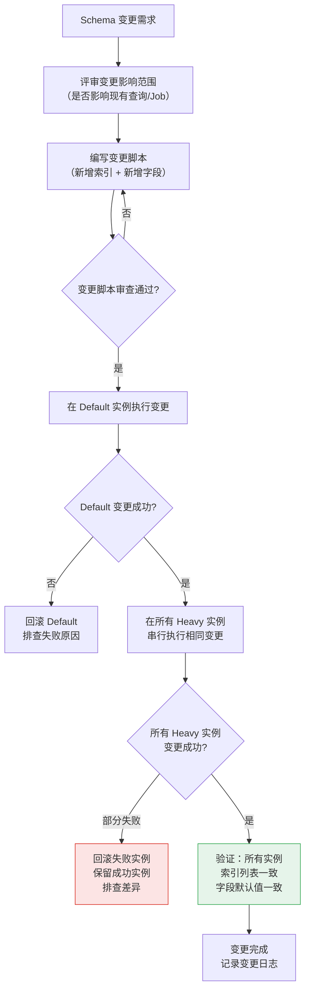
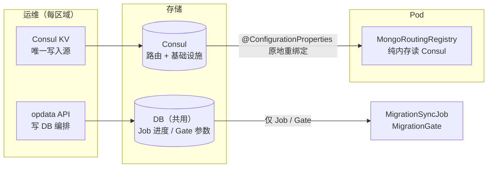
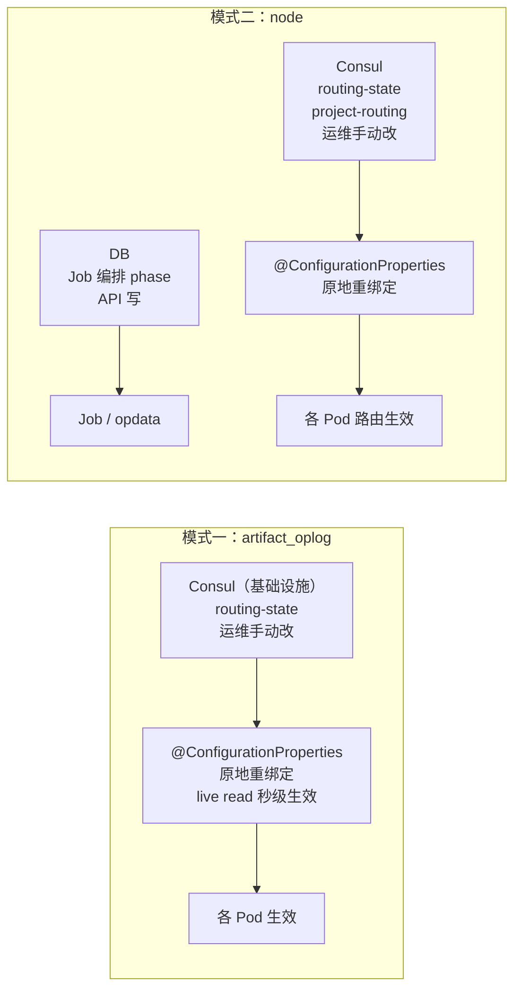
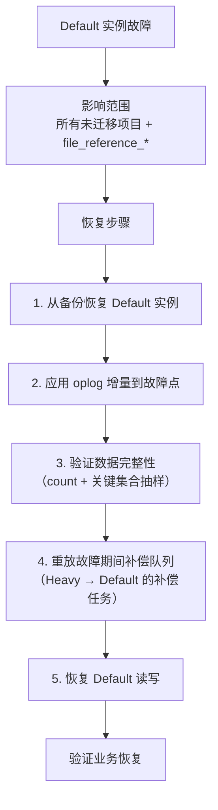
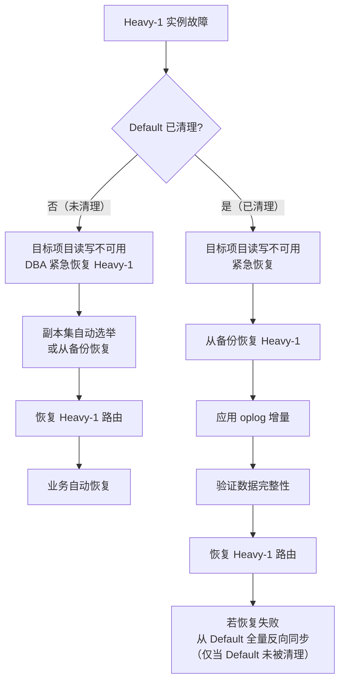

# MongoDB 分库 — 基础设施与运维

> 主方案索引：[mongodb-node-sharding-routing.md](./mongodb-node-sharding-routing.md)  
> 模块化实施方案：[mongodb-node-sharding-modules.md](./mongodb-node-sharding-modules.md)（M1/M8）

---

## 7. 连接池管理

## 7. 连接池管理

多实例架构下，每个 `MongoTemplate` 维护独立连接池。
需要控制总连接数，防止应用侧或 MongoDB 侧连接耗尽。

### 7.1 连接池配置

```yaml
spring:
  data:
    mongodb:
      # 全局连接池默认值
      connection-pool:
        max-size: 100            # 单实例最大连接数
        min-size: 10             # 单实例最小连接数
        max-wait-time: 5000      # 获取连接最大等待时间 ms
        max-connection-idle-time: 60000
```

### 7.2 连接数估算

| 场景 | 实例数量 | 单实例连接池 | 应用 Pod 数 | 总连接数 |
| --- | --- | --- | --- | --- |
| 初始（仅 Default + Offload） | 2 | 100 | 10 | 2000 |
| 扩展到 3 个 Heavy | 5 | 100 | 10 | 5000 |
| 扩展到 3 个 Heavy（缩池） | 5 | 50 | 10 | 2500 |

每新增一个实例，需评估 MongoDB 端 `maxIncomingConnections` 是否充足。
Heavy 实例仅服务少数项目，连接池可适当缩小。

### 7.3 连接池观测与参数变更

**参数变更**：连接池参数通过 Consul 配置，变更后 **滚动重启 Pod** 生效。MongoDB Java driver 不支持运行时改 pool size，不做动态重建。

**连接泄漏 / 等待告警**（`ConnectionPoolMonitor`）：

```kotlin
@Component
class ConnectionPoolMonitor(private val meterRegistry: MeterRegistry) {
    @Scheduled(fixedDelay = 60_000)
    fun checkConnectionPools() {
        // 读 Micrometer mongodb.driver.pool.* 指标（MongoMetricsConnectionPoolListener）
        meterRegistry.find("mongodb.driver.pool.waitqueuesize").gauges().forEach { /* 告警 */ }
    }
}
```

多实例 `MongoClient` 创建时挂载 `MongoMetricsConnectionPoolListener`，与 Default 实例指标口径一致。

**跨实例连接池隔离**：

每个实例的连接池完全独立，一个实例的连接池耗尽不应影响其他实例：

| 隔离维度 | 保障机制 |
| --- | --- |
| 连接池实例 | 每个 `MongoTemplate` 持有独立的 `MongoClient` 和连接池 |
| 超时隔离 | 单实例连接超时不应阻塞其他实例的连接获取 |
| 故障隔离 | 单实例不可用时，其连接快速失败（`serverSelectionTimeoutMS=5000`），不耗尽应用线程 |

> **关键约束**：严禁在应用代码中缓存或复用跨实例的 `MongoClient` / `MongoTemplate`，必须通过 `MongoRoutingRegistry` 按路由获取。

### 7.4 连接池优雅关闭

多实例架构下，应用关闭时需要同时关闭多个 `MongoClient`。若某个实例不可达（如 Heavy 已故障），`MongoClient.close()` 可能被连接超时阻塞，进而阻塞整个关闭流程。

**分层关闭策略**：

```kotlin
@Component
class MongoClientShutdownHandler(
    private val registry: MongoRoutingRegistry,
) : DisposableBean {

    override fun destroy() {
        val shutdownTimeout = Duration.ofSeconds(30)  // 总关闭超时
        val perInstanceTimeout = Duration.ofSeconds(5) // 单实例关闭超时

        val allClients = registry.allMongoClients()  // 从所有 MongoTemplate 中提取 MongoClient 并去重

        // 阶段 1：并发关闭所有实例，单实例超时 5s
        val futures = allClients.map { client ->
            CompletableFuture.runAsync {
                try {
                    client.close()
                } catch (e: Exception) {
                    log.warn("Failed to gracefully close MongoClient: ${e.message}")
                }
            }
        }

        try {
            CompletableFuture.allOf(*futures.toTypedArray())
                .get(shutdownTimeout.toMillis(), TimeUnit.MILLISECONDS)
        } catch (e: TimeoutException) {
            log.error("MongoClient shutdown timed out after ${shutdownTimeout.toSeconds()}s. " +
                "Unclosed clients: ${futures.filter { !it.isDone }.size}")
            // 不阻塞 JVM 退出，由 OS 回收连接
        }
    }
}
```

**关闭顺序**：

| 顺序 | 操作 | 原因 |
| --- | --- | --- |
| 1 | 停止接收新请求（readiness probe 失败） | 排空在途请求 |
| 2 | 等待在途请求完成（graceful shutdown period，默认 30s） | 避免请求中断 |
| 3 | 关闭各实例 `MongoClient`（并发，单实例 5s 超时） | 释放连接池 |
| 4 | JVM 退出 | — |

**故障场景**：

| 场景 | 行为 |
| --- | --- |
| 所有实例正常 | 全部优雅关闭，连接池归还 |
| 某 Heavy 实例不可达 | 该实例关闭超时 5s 后跳过，不阻塞其他实例关闭 |
| 全部实例超时 | 总超时 30s 后强制退出，OS 回收 TCP 连接 |
| Default 实例不可达 | 同单实例超时，但建议等待（Default 关闭优先级高于 Heavy） |

---


## 8. 索引管理

## 8. 索引管理

### 8.1 索引同步策略

**索引创建分为两层**：

| 层级 | 时机 | 目标实例 | 方式 |
| --- | --- | --- | --- |
| 启动时 | `@PostConstruct` | Default（主实例） | `ShardingMongoDao.ensureIndex()` 为全量分表建索引 |
| 首次写入 | `insert` / `save` 入口 | Default + Heavy（按路由） | `ShardingMongoDao.ensureIndex(entity)` 按 `writeTemplates` 路由到目标实例 lazy 建索引 |

**lazy ensureIndex 机制**：

```text
insert(entity) / save(entity)
  → ensureIndex(entity)
    → writeTemplates(collectionName, entity)  ← 按 entity.projectId 路由到 Default/Heavy
    → 在路由到的实例上 ensureIndex（Guava Cache 去重，首次写入后缓存 1 天）
  → super.insert/save  ← 正常写入
```

**关键行为**：

- **Heavy 实例无需预先手动建索引**：首次项目数据写入 Heavy 时自动创建。
- **INITIAL_SYNC 自动建索引**：`MigrationSyncJob` 全量同步的 `insert` 走 `ShardingMongoDao.insert(entity)`，首次写入时触发 Heavy 索引创建。索引在 INITIAL_SYNC 阶段即完成，DUAL_WRITE 前已就绪。
- **projectId 热加载后首次写入**：无重启，写入自动触发 Heavy 索引创建。
- **性能**：Guava Cache（200 条，1 天过期）确保同分表同索引仅检查一次；cache hit 后零开销。
- **幂等**：`ensureIndex` 是 MongoDB 幂等操作，索引已存在时几乎无开销。
- **`freeze-ddl` 豁免**：lazy ensureIndex 是迁移流程的内部机制，**不受 `freeze-ddl` 约束**（与 `MonthRangeShardingMongoDao` 行为一致）。外部 DDL（手动 `createIndex`/`dropIndex`）仍被 `freeze-ddl` 拦截。

迁移前检查清单（简化）：

```text
迁移前检查清单：
1. 确认应用启动日志中 Default 实例索引创建完成（搜索 "Ensure [N] index for sharding collection"）
2. 验证 Heavy 实例连接正常（无需预建索引——首次写入自动创建）
3. INIT 校验阶段会自动对比索引列表，缺失仅输出日志不阻塞
```

### 8.2 索引一致性校验

`MigrationSyncJob` 在 `INIT` 阶段自动对比源和目标的索引列表，
缺失索引时**输出差异日志但不阻断**（首次写入时由 `ShardingMongoDao.ensureIndex(entity)` 自动创建）。

Offload 实例同理：`OplogMongoConfiguration` 初始化时校验
`artifact_oplog_*` 索引与主实例一致。

### 8.3 Schema 变更管理（多实例同步）

多实例架构下，当 `node_*` 集合需要新增字段或修改索引时，
必须确保 **Default 和所有 Heavy 实例的 Schema 同时一致**，否则会导致：

| 场景 | 风险 |
| --- | --- |
| 新索引仅在 Default 创建 | Heavy 实例查询不走索引，性能骤降 |
| 新字段仅在 Heavy 可用 | 散发查询合并时字段缺失导致 NPE |
| Default 和 Heavy 索引不一致 | 相同查询在不同实例的执行计划不同，结果不可预期 |

**变更流程**：



**强制规则**：

| 规则 | 说明 |
| --- | --- |
| **先 Default，后 Heavy** | Default 是基准，变更先在 Default 验证通过后再推到 Heavy |
| **所有实例必须一致** | 任一实例变更失败时，必须回滚或修复到一致状态 |
| **变更期间禁止迁移** | Schema 变更期间暂停所有项目迁移（SyncJob） |
| **索引创建使用 `background: true`** | 避免阻塞业务读写 |
| **变更记录留痕** | 记录变更时间、操作人、变更内容、各实例状态到 `schema_change_log` 集合 |

**新增字段的默认值处理**：

当 `node_*` 新增可选字段时，存量文档的默认值由应用层处理，而非 MongoDB：

```kotlin
// ✅ 正确：应用层处理默认值
data class TNode(
    val projectId: String,
    val fullPath: String,
    val newField: String = "default_value"  // Kotlin 默认值
)

// ❌ 错误：依赖 MongoDB $set 默认值（Default 和 Heavy 可能不一致）
```

> **注意**：MongoDB 本身是 schema-less 的，不会因字段缺失而报错。
> 但应用层的查询条件、排序、聚合管道可能依赖某些字段的存在性。
> 变更前务必排查所有对该集合的查询代码路径。

---


## 9. 监控与告警

## 9. 监控与告警

> 完整指标定义、告警分级、看板设计见 **§22**。本节为概述，不重复 §22 内容。

### 9.1 核心监控维度

| 维度 | 关键指标 | 说明 |
| --- | --- | --- |
| 路由正确性 | `routing.hit.rate` | 项目是否命中正确实例 |
| 补偿队列 | `compensation.queue.depth` | 最重要单一指标：趋势 = 副路径状态，清零 = 数据追平 |
| 双写健康 | `dual_write.primary.fail.count` + `dual_write.secondary.fail.count` | 主/副路径写入是否正常 |
| 实例可用性 | `instance.availability` + `connection.pool.active` | 连接池耗尽或实例不可达 |
| 门禁状态 | `migration.freeze.*`、`migration.write_concern.valid`、`compensation.health.status` | §25.5 强制门禁的运行时状态 |
| 版本一致性 | `config.version` | 进入 DUAL_WRITE 前确认全集群配置一致 |

---


## 10. 配置管理

## 10. 配置管理

### 10.1 配置热加载

项目路由配置变更（新增 / 移除 `project-routing` 条目、`routing-state` 切换）支持通过
Spring Cloud 配置中心动态刷新，无需重启应用、无需重建连接池。

实现要求：
- 路由配置由 `MongoMultiInstanceProperties`（`@ConfigurationProperties` 绑定）承载；
  `DefaultMongoRoutingRegistry` 在每次 `resolve()` 调用时 **live 读取** `properties.rules[ruleName]`，
  因此 `routing-state` / `project-routing` 等 A 类配置变更经 Consul 原地重绑定后秒级生效。
- **禁止**为 `mongoRoutingRegistry` Bean 添加 `@RefreshScope`：该 Bean 持有全部
  `MongoClient` 连接池，刷新会销毁并重建整个 Registry（连带所有连接池重建），导致切流期间全量连接抖动。
- 新增实例（`instances` 新增条目，B 类）需要滚动重启，
  因为 `MongoClient` 连接池在启动期一次性建好（`buildPrimaryTemplates()`）。

### 10.2 配置校验

应用启动时执行以下校验，不通过则 fail-fast：

| 校验项 | 规则 |
| --- | --- |
| 项目唯一性 | 同一 `projectId` 不得出现在多个 `project-routing` 条目 |
| 分片唯一性 | 同一分片编号不得出现在多个 `shard-routing` 条目 |
| 实例引用有效性 | `project-routing` 和 `shard-routing` 引用的 instance 必须在 `instances` 中存在 |
| **shard/project 互斥** | 若某 `projectId` 已在 `project-routing` 中，其哈希分表集合 **不得** 同时出现在 `shard-routing` 中（**fail-fast**，见 §13.3） |
| 实例数上限 | Heavy 实例数 ≤ 10 | 超限启动失败 |

### 10.3 配置管理（Consul 路由 + DB 编排）

#### 10.3.1 设计原则

**双写入源、职责分离**（DB 跨区域共用、Consul 各区域隔离）：

| 存储 | 配置类别 | 写入方 | 读者 | 热路径 |
|------|----------|--------|------|--------|
| **Consul**（每区域一份） | `instances.*`、`routing-state`、`project-routing`、`shard-routing`、`business-routing`、`migration.*`、`scatter-query.*`、`compensation.*`、`config-version` | **仅运维/用户** | Registry 内存 | **是** |
| **DB** `mongo_migration_sync_state` | `phase`、Job 断点、`strategy`、审计字段 | opdata API / Job | Job、opdata 面板 | **否** |
| **DB** `mongo_routing_config` | `max-concurrent-dual-write`、`freeze-ddl` | opdata API | MigrationGate（低频） | **否** |

**核心原则**：
- **路由决策只读 Consul**：`MongoRoutingRegistry` 从 `MongoMultiInstanceProperties` 内存读取，node 热路径 **0 DB**
- **代码/API 禁止写 Consul**：迁移 API 只写 DB（编排进度）；运维按 SOP 手动改 Consul
- **DB 不进路由**：`mongo_migration_sync_state` 不参与 `resolveWriteRoute`；避免共用 DB 导致跨区路由串扰
- **Pod 一致性**：同区域所有 Pod 读同一 Consul KV，`@ConfigurationProperties` 原地重绑定秒级对齐；`bkrepo_mongo_routing_config_version` 对账

#### 10.3.2 配置读写流程



#### 10.3.3 与现有机制

| 机制 | 说明 |
|------|------|
| `MongoMultiInstanceProperties` | 从 Consul 绑定，基础设施 + **全部路由表** |
| `MongoRoutingRegistry` | 只读 properties；`isProjectInDualWrite` = `routing-state=DUAL_WRITE` ∧ `projectId ∈ project-routing` |
| `mongo_migration_sync_state` | API/Job 写；**不驱动路由** |
| `mongo_routing_config` | Gate 低频读；`scatter-query` 以 Consul 为准 |

#### 10.3.4 模式二迁移 SOP（API + Consul 分工）

| 步骤 | API（DB） | 运维（Consul） |
|------|-----------|----------------|
| binding | `POST /migration/binding` | — |
| 开迁前置 | — | 确认 §3.20.4 前置清单（G-34、100% 部署、config-version 等） |
| 开启双写 | — | 加 `project-routing`；`routing-state=DUAL_WRITE`（**先于 start**） |
| 启动同步 | `POST /migration/start` | — |
| 历史同步 | Job 读 DB 断点 | Consul 保持 `DUAL_WRITE` |
| 切流 | `POST /migration/route`（DB phase + 返回 Consul 建议） | `routing-state=ROUTED` + `config-version++` + `routing-effective-at` |
| 清理 | `POST /migration/cleanup`（须 effective ROUTED） | 完成后删 `project-routing` 条目 |
| 回滚 | `POST /migration/rollback` | `routing-state=OFF`；删 `project-routing` |

> op admin 页面展示 DB 编排状态，并**提示**下一步 Consul 操作项；不自动写 Consul。

### 10.4 两种模式的配置操作指南

本节将 §10.1~§10.3 的通用配置机制与两种模式的**具体操作步骤**关联起来，作为快速索引。

#### 10.4.1 模式一（artifact_oplog 整体迁移）配置操作速查

| 操作 | 配置通道 | 生效方式 | 详细步骤 |
|------|----------|----------|----------|
| 首次部署规则 + 实例 URI | Consul 直写 | **滚动重启** | §2.10.2 |
| 开启双写 (`routing-state=DUAL_WRITE`) | **运维手动改 Consul** | **热加载** | §2.10.3 |
| 执行历史数据 dump/restore | 不涉及配置变更 | — | §2.10.4 |
| 切流 (`routing-state=ROUTED` + `routing-effective-at`) | **运维手动改 Consul** | **热加载** | §2.10.4 |
| 清理 Default 数据 | 不涉及配置变更 | — | §2.10.6 |
| 紧急回滚 (`routing-state=OFF`) | **运维手动改 Consul** | **热加载** | §2.10.8 |

> 模式一为 `routing-type: NONE`，不涉及 `project-routing`。`routing-state` 全生命周期仅切换 1~2 次，运维手动在 Consul 中修改即可。op admin 页面展示当前 `routing-state` 并提示运维下一步操作。

#### 10.4.2 模式二（node 项目级路由）配置操作速查

| 操作 | 配置通道 | 生效方式 | 详细步骤 |
|------|----------|----------|----------|
| 首次部署规则 + 实例 URI（Consul bootstrap） | Consul 直写 | **滚动重启** | §3.20.2 |
| 添加迁移项目（binding） | **API → DB** | @ConfigurationProperties 原地重绑定（秒级 live read） | §3.20.3 |
| 开迁前置检查 | — | 运维 SOP | §3.20.4 前置清单 |
| 开启双写 + 项目路由 | **运维 → Consul** `project-routing` + `routing-state=DUAL_WRITE` | 热加载 | §3.20.4（**先于 start**） |
| 启动历史同步 | `POST /migration/start` + Job | DB 断点 | §3.20.5 |
| 项目切流 | **API → DB**；**运维 → Consul** `ROUTED` + `routing-effective-at` + `config-version++` | 热加载；到点后自动 ROUTED | §3.20.6 |
| 清理 Default 副本 | Job + API | — | §3.20.7 |
| 单项目回滚 | **API → DB**；**运维 → Consul 回滚** | 热加载 | §3.20.10 |
| 全局紧急回滚（`routing-state=OFF`） | **运维手动改 Consul** | **热加载** | §3.20.10 |

> 模式二：`project-routing` / `routing-state` 由运维在 **本区域 Consul** 维护；API 只写 DB 编排状态。DB 跨区共用，**路由不进 DB**。

#### 10.4.3 两种模式的配置操作差异总结



| 对比维度 | 模式一 | 模式二 |
|----------|--------|--------|
| 配置变更频率 | 极低（全生命周期 1~2 次） | 高（逐项目增量，数十~数百次） |
| Consul 配置 | `instances.*.uri`、`routing-state` | `instances.*.uri`、`routing-state` |
| DB 配置 | 无 | Job 编排（`phase`、断点）；**不进路由** |
| 运维操作方式 | Consul 直接修改 | API 写 DB + **运维改 Consul**（`project-routing` / `routing-state`） |
| 审计粒度 | Consul 变更日志（Key 级）+ DB 变更日志 | Consul 变更日志 + DB audit log |
| 回滚粒度 | 全局（`routing-state=OFF`） | 全局 + 单项目 |

### 10.5 迁移运维 API（opdata 编排层）

Consul 存全部路由配置（运维唯一写入源）。下列 API 只写 DB 编排状态，**不写 Consul、不驱动路由**。

| API | 说明 |
|---|---|
| `POST /migration/binding` | 声明迁移单元；指定 `historicalSyncStrategy`、Tier-Key/Biz；**写入 DB** `mongo_migration_sync_state` |
| `POST /migration/start` | PENDING → INITIAL_SYNC；**写入 DB** `phase` |
| `POST /migration/route` | 补偿门禁 + 旁路对账后 **写入 DB** `phase=ROUTED`（前置：Consul `routing-state=DUAL_WRITE` + Job 已推进 `DUAL_WRITE`） |
| `POST /migration/cleanup` | ROUTED → `CLEANUP_READY`（`MigrationSyncJob.doCleanup` 删完置 `CLEANED`） |
| `POST /migration/rollback` | 回滚；按 projectId 清理 PENDING 补偿任务（G-29）；**写入 DB** `phase=ROLLBACK` |
| `POST /migration/verify` | 触发全量 DUAL_WRITE 项目旁路对账（E-05） |
| `POST /migration/verify/{ruleName}/{projectId}` | 触发指定项目旁路对账（E-05） |
| `GET /migration/status` | 见下方 **StatusResponse** schema |
| `GET /compensation/stats` | 补偿队列积压 |
| `GET /compensation/health/{ruleName}` | 补偿队列健康（M2 逻辑，§25.2.3） |
| `GET /routing/readiness` | **G-34** 就绪：运行时 **INFRA + M5** 检查（`RoutingReadinessAggregator`）；P0 静态探针由 CI 验证（modules §8.1） |
| `POST /migration/rollback-verify/{projectId}` | 回滚后烟雾测试（E-13 / §24.14） |
| `GET /config/routing` | 查询 Gate 参数（`max-concurrent-dual-write`；`freeze-ddl` 字段已废弃，仅审计） |
| `PUT /config/routing` | 更新 Gate 参数，**写入 DB** `mongo_routing_config`（`freeze-ddl` 不生效，见 P1-05） |

上述 API 在 op admin 分库迁移页面展示；Gate 参数经 `GET/PUT /config/routing` 管理，Consul 路由变更见页面 SOP 提示。
**G-34 阻塞语义**

| 操作 | 模式一（oplog） | 模式二（node） |
|---|---|---|
| `POST /migration/binding` | 允许 | G-34 未通过 → `409 ROUTING_READINESS_BLOCKED` |
| `POST /migration/start` | 允许 | 同上 |

**`GET /migration/status` — StatusResponse**

| 字段 | 类型 | 说明 |
| --- | --- | --- |
| `projectId` / `ruleName` / `phase` | string | 迁移状态 |
| `targetInstance` | string? | 目标实例名 |
| `syncFailedCount` | long | `mongo_*_sync_failed` 未处理条数 |
| `compensationPendingCount` | long? | 该项目补偿队列 PENDING 数 |
| `lastError` / `updatedAt` | string? | 最近错误与时间 |

---


## 11. 散发查询性能约束

## 11. 散发查询性能约束

### 11.1 问题

`pageBySha256` 等无 `projectId` 的查询需散发到所有实例，
实例数增长会线性增加延迟和资源消耗。

### 11.2 约束

| 约束项 | 要求 |
| --- | --- |
| **最大 Heavy 实例数** | **硬性上限 10 个**（超过需架构评审），建议日常 ≤ 5 |
| 最大并发散发实例数 | 与实例数一致，并行查询 |
| 单实例查询超时 | 3s（`STRICT` 模式：超时视为失败；`DEGRADE` 模式：该实例结果视为空） |
| 总查询超时 | 5s |
| 默认完整性模式 | `STRICT`（§3.7） |
| 结果合并策略 | 按 `_id` 去重，按原始排序字段归并排序 |
| 分页限制 | 散发查询仅支持首页或小批量，不支持深度分页（offset > 10000） |
| 结果集上限 | 合并后最多返回 1000 条，超过则截断并告警 |

### 11.3 优化方向

- 维护 `sha256 → projectId` 的轻量索引表（`file_reference_*` 已有），
  先查索引表定位项目，再精确路由到对应实例，避免散发。
- 高频散发查询考虑异步预聚合。


## 12. 容量规划

## 12. 容量规划

### 12.1 Heavy 实例规格参考

| 维度 | 估算依据 | 参考值 |
| --- | --- | --- |
| 磁盘 | 目标项目 node 数据量 × 2.5（含索引 + 预留） | projectA 45GB → 112GB 磁盘 |
| 内存 | 热索引大小（`totalIndexSize`）+ WiredTiger cache | 索引 8GB → 16GB 内存 |
| CPU | 与 Default 同 QPS 下对比，单项目 CPU 占比 | 4~8 核起步 |
| IOPS | 写入 TPS × 平均文档大小 | 根据压测调整 |

### 12.2 扩容触发条件

| 指标 | 阈值 | 动作 |
| --- | --- | --- |
| 磁盘使用率 | > 70% | 扩容磁盘 |
| WiredTiger cache 命中率 | < 95% | 扩内存 |
| CPU 利用率持续 | > 70% | 扩 CPU 或拆分项目到新实例 |

---


## 13. shard-routing 与 project-routing 交互

## 13. shard-routing 与 project-routing 交互

### 13.1 优先级

```text
project-routing > shard-routing > Default
```

当 `node_188` 整分片迁出（**仅** `shard-routing`，无 `project-routing`）时：

- 该集合所有项目的读写：命中 `shard-routing` → heavy1

当 `node_188` **部分项目**迁出（**仅** `project-routing`）时：

- projectA 的读写：命中 `project-routing` → heavy1
- projectD 的读写：未命中 → **Default**（不得配置 `shard-routing`）

### 13.2 使用场景

| 场景 | 配置方式 | 示例 |
| --- | --- | --- |
| 单项目迁出 | 仅 `project-routing` | projectA → heavy1，projectB/C 留 Default |
| 整分片迁出 | 仅 `shard-routing` | `node_65: heavy2`，该分片所有项目一起迁 |
| **禁止** | 两者同时作用于同一分表集合 | projectA 在 `project-routing` 且 `node_188` 在 `shard-routing` |

### 13.3 部分迁移互斥校验（fail-fast）

**问题**：若 `project-routing` 配置了 projectA（哈希到 `node_188`），同时 `shard-routing` 配置了 `node_188: heavy1`，则未迁出的 projectD 查询会误路由到 heavy1，但数据仍在 Default → **静默读空/写错实例**。

**启动校验规则**（`MongoRoutingRegistry.validateOnStartup`）：

```kotlin
// 对每个 projectId ∈ project-routing：
//   collectionName = "{collectionPrefix}{hash(projectId)}"
//   若 collectionName ∈ shard-routing → 抛出 IllegalStateException
```

| 校验结果 | 动作 |
| --- | --- |
| 冲突 | 启动失败，日志输出冲突的 projectId 与 collectionName |
| 通过 | 正常启动 |

**运维 SOP**

1. 部分项目迁移：**只加** `project-routing`，不加 `shard-routing`。
2. 整分片迁移：**只加** `shard-routing`，不加该分片内项目的 `project-routing`。
3. 大项目迁出后，若曾用 `shard-routing` 做临时兜底，**必须删除** `shard-routing` 条目后再加 `project-routing`。

---


## 15. 安全性

## 15. 安全性

### 15.1 认证与连接管理

| 关注点 | 方案 |
| --- | --- |
| 实例认证 | 所有实例启用 SCRAM-SHA-256 认证，独立账号密码 |
| 连接串敏感信息 | 密码存储在配置中心加密字段，禁止明文写入 YAML 或代码仓库 |
| 最小权限 | 业务账号仅授予 `readWrite`；迁移工具额外授予 `backup`/`restore` |
| SSL/TLS | 生产环境所有实例间通信启用 TLS |

### 15.2 网络隔离

| 场景 | 策略 |
| --- | --- |
| Default 与 Heavy 实例 | 同 VPC，安全组限制仅允许应用 Pod 访问 |
| Heavy 实例之间 | 无需互访，各实例独立 |
| mongodump/restore | 仅限运维跳板机或 CI/CD Pipeline 执行 |
| Change Stream | 应用到 Default 的长连接，防火墙需放行 |

### 15.3 审计

| 审计项 | 实现方式 |
| --- | --- |
| 路由配置变更 | 配置中心变更记录（谁、何时、改了什么） |
| 项目迁移操作 | Consul 变更日志 + Job 日志记录发起人、时间、状态变更 |
| Default 数据清理 | 清理脚本日志，记录清理范围和文档数量 |
| 连接串修改 | 配置中心审计日志 |

---


## 16. 测试策略

## 16. 测试策略

### 16.1 测试分层

| 层级 | 测试内容 | 执行方式 |
| --- | --- | --- |
| 单元测试 | 路由决策逻辑（`MongoRoutingRegistry` / `DefaultMongoRoutingRegistry`） | 覆盖 3.6.2 路由决策矩阵所有分支 |
| 单元测试 | projectId 提取逻辑 | 覆盖顶层、`$and`、`$or`（预期失败）、空条件 |
| 单元测试 | `NodeBatchQueryHelper` 分组生成 | 验证 NOT IN / IN 条件正确 |
| 集成测试 | 双写 + 补偿全流程 | 模拟专属实例不可用，验证补偿任务生成和消费 |
| 集成测试 | 迁移状态机全流程 | 跑完 INIT → CLEANED 所有状态 |
| 集成测试 | Job 散发读写 | 验证 Default 排除已迁出项目、Heavy 只处理迁入项目 |
| 集成测试 | 散发查询合并 | 验证去重、排序、超时降级 |
| E2E 测试 | 完整迁移一个项目 | 从配置到同步到切流到清理，全流程 |

### 16.2 压测方案

| 场景 | 方法 | 关注指标 |
| --- | --- | --- |
| 分库前基线 | 记录 Default 主从库 QPS、P99、CPU | 作为对比基准 |
| 分库后 Default | 迁出大项目后重新压测 | CPU 和 P99 应显著下降 |
| Heavy 实例写入 | 模拟大项目写入 TPS | 验证 Heavy 规格是否满足 |
| 散发查询 | N 个实例并发查询 | P99 随实例数增长的退化曲线 |
| 双写期吞吐 | 双写开启后对比单写 | 写延迟增加量是否可接受 |

### 16.3 混沌测试

| 场景 | 操作 | 预期结果 |
| --- | --- | --- |
| Heavy 主库宕机（双写期） | kill Heavy primary | **迁出项目写入 fail-fast**；读仍可走 Default Primary；恢复后业务重试 |
| Heavy 主库宕机（单写期） | kill Heavy primary | 目标项目读写不可用；DBA 紧急恢复 Heavy |
| Heavy 从库宕机 | kill Heavy secondary | 散发查询受影响（Heavy 实例不可达）；业务读不受影响 |
| Default 从库宕机 | kill Default secondary | 散发查询受影响（Default 实例不可达） |
| 网络分区（应用与 Heavy） | iptables drop | 超时后 fail-fast 或补偿 |
| Change Stream 中断 | 重启 Default primary | resumeToken 恢复或 REBUILD |
| 配置中心不可用 | 停止配置中心 | 使用本地缓存继续服务 |

### 16.4 回滚演练

每个迁移阶段至少执行一次回滚演练：

| 阶段 | 演练内容 | 验收标准 |
| --- | --- | --- |
| 双写期回滚 | `routing-state=OFF` | 业务秒级恢复，Default 数据完整，无丢失 |
| ROUTED 回滚（未清理） | §25.4.3 反向迁移 | Heavy→Default 同步 + 对账通过，非一键操作 |
| 清理中回滚 | 停止清理 + 反向同步 | 反向同步后对账通过 |
| Heavy 故障（DUAL_WRITE） | kill Heavy primary | 迁出项目写 fail-fast；读仍走 Default Primary |
| Heavy 故障（ROUTED） | kill Heavy primary | 迁出项目读写 fail-fast；**禁止**自动切 Default；DBA 恢复 Heavy（§3.11.2） |
| Heavy 永久损毁（ROUTED，Default 未清理） | 人工灾难决策 | 接受 RPO 丢失 ROUTED 期间增量后 `routing-state=OFF`；Heavy 可读须先反向 SYNC |

---


## 18. 成本分析

## 18. 成本分析

### 18.1 新增资源成本

| 实例 | 规格参考 | 成本级别 | 说明 |
| --- | --- | --- | --- |
| Offload 实例（副本集） | 4C8G + 500GB SSD × 3 节点 | 低 | 大磁盘低计算，存储为主 |
| Heavy-1（副本集） | 8C32G + 200GB SSD × 3 节点 | 中 | projectA 130M 文档，索引内存需求高 |
| Heavy-2（副本集） | 4C16G + 100GB SSD × 3 节点 | 中 | projectB + C 规模较小 |

### 18.2 成本对比

| 方案 | 一次性成本 | 月度增量 | 效果 |
| --- | --- | --- | --- |
| **分库（本方案）** | 开发 ~14 周 | 2~3 Heavy + 1 Offload 实例 | 完全隔离 + 磁盘释放 |
| 主实例提升规格 | 0 | 高规格实例差价 | 短期缓解，不解决隔离 |
| 增加从库 | 0 | 额外从库成本 | 仅缓解读，不解决写和隔离 |

### 18.3 运维成本增量

| 维度 | 变化 |
| --- | --- |
| 实例数量 | 从 1 套副本集增加到 4~5 套 |
| 备份策略 | 每个实例独立备份，备份存储量增加 |
| 监控告警 | 告警规则从 1 套扩展到 N 套，需统一看板 |
| 故障响应 | Heavy 实例故障需独立响应流程 |
| 升级维护 | MongoDB 版本升级需逐实例滚动 |

---


## 19. 框架通用化演进

## 19. 框架通用化演进

### 19.1 现状与问题

当前实现中，`node_*` 和 `artifact_oplog_*` 的路由逻辑**各自封装为一套独立组件**，类名、配置前缀、Bean 名全部硬绑定到具体业务语义：

| 组件 | Node 实现 | Oplog 实现 | 是否可复用 |
| --- | --- | --- | --- |
| 配置类 | `NodeMongoRoutingProperties`（前缀 `node-routing`） | `OplogMongoProperties`（前缀 `spring.data.mongodb.oplog`） | ✗ |
| 路由注册表 | `NodeMongoRoutingRegistry` | 无（直接注入 template） | ✗ |
| Bean 配置 | `NodeMongoRoutingConfiguration` | `OplogMongoConfiguration` | ✗ |
| 写操作接口 | `NodeMongoOperations` | 无 | ✗ |
| ThreadLocal | `NodeRoutingContext` | 无 | ✗ |
| 散发查询 | `NodeScatterQueryService` | 无 | ✗ |
| Job 分组 | `NodeBatchQueryHelper` | 无 | ✗ |
| DAO 钩子 | `AbstractMongoDao.determineMongoTemplate(collectionName, context)` | 同左 | **✓ 已通用** |

若未来 `package_*` 或其他集合需要同样的路由/迁移能力，目前需要**整套复制一遍**，维护成本线性增长。

### 19.2 通用化目标

提取一套**与业务集合无关**的多实例路由框架，新增集合的路由只需：

- **整体迁移型**（如 `artifact_oplog_*`）：仅加配置条目，**零 DAO 改动**。
  框架在 `AbstractMongoDao` 基类自动按集合名前缀路由，`OperateLogDao` 不需要覆写任何方法。
- **项目路由型**（如 `node_*`、未来 `package_*`）：仅加配置条目，`AbstractMongoDao` 基类通过集合名前缀匹配规则，
  并用反射从 Query/实体中提取路由键字段（默认 `projectId`），**零 DAO 改动**。
- 无需新增任何 Properties / Registry / Configuration 类，也无需任何 DAO 子类继承。

### 19.3 通用配置模型

```yaml
spring:
  data:
    mongodb:
      multi-instance:
        rules:
          node:                          # 规则名，任意字符串
            routing-type: project        # project | collection | none
            routing-key-field: projectId # 从 Query/Entity 提取路由键的字段名
            routing-state: OFF
            migration:
              historical-sync-strategy: JOB_ONLY
              sync-job:
                batch-size: 500
                parallel-projects: 3
              max-concurrent-dual-write: 1
            instances:
              heavy1:
                uri: mongodb://heavy1-primary:27017/bkrepo
            project-routing:
              - projects: "projectA"
                instance: heavy1
            shard-routing:
              - shards: "188"
                instance: heavy1
          artifact-oplog:
            routing-type: none           # 整体迁移：集合名匹配前缀即自动路由，无需改 DAO
            collection-prefix: "artifact_oplog_"  # 匹配此前缀的集合全部路由到下方实例
            routing-state: OFF
            migration:
              historical-sync-strategy: NONE
            instances:
              oplog:
                uri: mongodb://oplog-primary:27017/bkrepo
          package:                       # 未来扩展，仅需增加此段配置
            routing-type: project
            routing-key-field: projectId
            routing-state: OFF
            migration:
              historical-sync-strategy: JOB_ONLY
            instances:
              heavy2:
                uri: mongodb://heavy2-primary:27017/bkrepo
```

### 19.4 通用组件设计

#### 19.4.1 统一配置类

```kotlin
@ConfigurationProperties(prefix = "spring.data.mongodb.multi-instance")
data class MongoMultiInstanceProperties(
    val rules: Map<String, RoutingRule> = emptyMap()
) {
    data class RoutingRule(
        val routingType: RoutingType = RoutingType.PROJECT,
        val routingKeyField: String = "projectId",
        /** routing-type=NONE 时使用：匹配此前缀的集合名自动路由到本规则的唯一实例 */
        val collectionPrefix: String = "",
        val dualWrite: Boolean = false,
        /** per-rule 迁移配置：每条规则独立设置迁移模式 */
        val migration: MigrationConfig = MigrationConfig(),
        val instances: Map<String, InstanceConfig> = emptyMap(),
        val projectRouting: Map<String, String> = emptyMap(),  // projectId → instanceName
        val shardRouting: Map<String, String> = emptyMap(),    // collectionName → instanceName
    )
    /**
     * per-rule 迁移配置。
     * historicalSyncStrategy：NONE（不迁历史）/ JOB_ONLY（SyncJob 迁历史）
     */
    data class MigrationConfig(
        /** NONE / JOB_ONLY */
        val historicalSyncStrategy: String = "NONE",
        val syncJob: SyncJobConfig = SyncJobConfig(),
        val none: NoneConfig = NoneConfig(),
        /** 同时进行双写的项目数上限（仅 PROJECT 路由类型有效） */
        val maxConcurrentDualWrite: Int = 1,
        /** 僵尸副本在 Default 上存活超过该小时数则阻断迁移（G-17） */
        val maxZombieHours: Int = 72,
        val projectLocks: ProjectLocksConfig = ProjectLocksConfig(),
        /** oplog 窗口下限（小时），INIT 校验用（G-32） */
        val minOplogHours: Int = 48,
    )
    data class SyncJobConfig(
        val batchSize: Int = 500,
        val parallelProjects: Int = 3,
        val retryCount: Int = 3,
    )
    data class NoneConfig(
        val maxDurationDays: Int = 30,
        val expirationAction: String = "BLOCK",
        val scatterQueryMerge: Boolean = true,
        val dedupKey: String = "_id",
    )
    data class ProjectLocksConfig(
        val freezeGc: Boolean = true,
        val freezeDdl: Boolean = true,
        val freezeDdlInstances: List<String> = emptyList(),
        val freezePhysicalDelete: Boolean = true,
    )
    data class InstanceConfig(
        val uri: String,
        val secondaryUri: String = "",
        val fallbackBeforeCleanup: Boolean = false,
    )
    enum class RoutingType {
        PROJECT,    // 按 routingKeyField 提取路由键，再查 projectRouting / shardRouting
        COLLECTION, // 按集合名直接查 shardRouting
        NONE        // 整体迁移：collectionPrefix 匹配即路由，不需要路由键，不需要改 DAO
    }
}
```

#### 19.4.2 统一路由注册表

`MongoRoutingRegistry` 统一处理两种路由类型，全部由 `AbstractMongoDao` 基类钩子自动调用，**无需任何 DAO 改动**：

```kotlin
// MongoMultiInstanceConfiguration 中 @Bean 构造（普通单例，非 @RefreshScope）
class DefaultMongoRoutingRegistry(
    private val properties: MongoMultiInstanceProperties,
    private val poolMetricsListener: MongoMetricsConnectionPoolListener? = null,
) : MongoRoutingRegistry, DisposableBean {
    // prefixIndex 仅缓存 collectionPrefix→ruleName（构造时排序）
    // primaryTemplates 由 buildPrimaryTemplates() 在启动期一次性建好（每个 instance 一个 MongoClient）
    // RoutingRule（routing-state / project-routing 等）从 properties live 读（A 类热加载）
    private val prefixIndex: List<Pair<String, String>> = ...

    /**
     * 集合前缀路由（NONE + PROJECT 均走此方法）。
     * - routing-type=NONE：直接返回唯一实例 Primary
     * - routing-type=PROJECT：从 context 提取路由键后查 projectRouting / shardRouting
     * 由 AbstractMongoDao 基类钩子统一调用，DAO 零改动。
     */
    fun routeWrite(collectionName: String, context: Any?): MongoTemplate? {
        val (_, ruleName) = prefixIndex
            .firstOrNull { collectionName.startsWith(it.first) } ?: return null
        val rule = properties.rules[ruleName] ?: return null
        return when (rule.routingType) {
            RoutingType.NONE -> {
                val instanceName = rule.instances.keys.firstOrNull() ?: return null
                primaryTemplates[ruleName]?.get(instanceName)
            }
            RoutingType.PROJECT, RoutingType.COLLECTION -> {
                val routingKey = extractKey(context, rule.routingKeyField)
                    ?: MongoRoutingContext.get(ruleName)
                val instanceName = rule.projectRouting[routingKey]
                    ?: rule.shardRouting[collectionName]
                    ?: return null
                primaryTemplates[ruleName]?.get(instanceName)
            }
        }
    }

    fun routeRead(collectionName: String, context: Any?): MongoTemplate? {
        val (_, ruleName) = prefixIndex
            .firstOrNull { collectionName.startsWith(it.first) } ?: return null
        val rule = properties.rules[ruleName] ?: return null
        return when (rule.routingType) {
            RoutingType.NONE -> {
                val instanceName = rule.instances.keys.firstOrNull() ?: return null
                primaryTemplates[ruleName]?.get(instanceName)
            }
            RoutingType.PROJECT, RoutingType.COLLECTION -> {
                val routingKey = extractKey(context, rule.routingKeyField)
                    ?: MongoRoutingContext.get(ruleName)
                val instanceName = rule.projectRouting[routingKey]
                    ?: rule.shardRouting[collectionName]
                    ?: return null
                primaryTemplates[ruleName]?.get(instanceName)
            }
        }
    }

    /**
     * 按 (Class identity, fieldName) 缓存 Field 对象，避免每次实体操作重复调用 getDeclaredField。
     * 每个实体类在应用生命周期内仅反射一次（首次），后续全部走 Field.get() 调用。
     * 总内存占用 < 30KB（路由规则数 × 实体类数 × ~200B）。
     */
    private val fieldCache = ConcurrentHashMap<String, Field?>()

    /** 从 Query 或实体反射提取路由键字段值，支持嵌套路径（如 "metadata.projectId"） */
    private fun extractKey(context: Any?, field: String): String? = when (context) {
        is Query -> extractFromQueryObject(context.queryObject, field)
        null -> null
        else -> {
            val cacheKey = "${System.identityHashCode(context.javaClass)}:$field"
            val cachedField = fieldCache.getOrPut(cacheKey) {
                runCatching {
                    context.javaClass.getDeclaredField(field).also { it.isAccessible = true }
                }.getOrNull()
            }
            cachedField?.let {
                runCatching { it.get(context) as? String }.getOrNull()
            }
        }
    }

    /**
     * 从 Query 的 queryObject 中递归提取字段值，支持嵌套路径。
     * 例如：field="projectId" → queryObject["projectId"]
     *       field="metadata.projectId" → queryObject["metadata"]["projectId"]
     * 同时处理 $and/$or 组合中的字段提取（取第一个匹配值）。
     */
    private fun extractFromQueryObject(queryObject: Document, fieldPath: String): String? {
        // 1. 直接顶级字段匹配
        if (fieldPath.contains('.')) {
            // 嵌套路径：递归查找
            val parts = fieldPath.split('.', limit = 2)
            val nested = queryObject[parts[0]]
            if (nested is Document) return extractFromQueryObject(nested, parts[1])
            if (nested is Map<*, *>) return (nested[parts[1]] as? String)
            return null
        } else {
            queryObject[fieldPath]?.let { return it as? String }
        }

        // 2. $and 组合：遍历子条件
        (queryObject["\$and"] as? List<*>)?.forEach { sub ->
            if (sub is Document) {
                extractFromQueryObject(sub, fieldPath)?.let { return it }
            }
        }

        // 3. $or 组合：取第一个匹配值（可能不准确，记录日志）
        (queryObject["\$or"] as? List<*>)?.forEach { sub ->
            if (sub is Document) {
                extractFromQueryObject(sub, fieldPath)?.let { value ->
                    log.warn("Extracted routing key '{}' from \$or clause, may be inaccurate. queryObject={}", fieldPath, queryObject)
                    return value
                }
            }
        }

        return null
    }

    /**
     * 路由键提取结果缓存。
     * 对同一 Query 对象的 hashCode 做短期 LRU 缓存，减少高频反射开销。
     * 缓存仅在单次请求内有效（使用 WeakHashMap + ThreadLocal），不跨请求共享。
     */
    private val extractionCache = object : LinkedHashMap<Int, String?>(128, 0.75f, true) {
        override fun removeEldestEntry(eldest: MutableMap.MutableEntry<Int, String?>?) = size > 256
    }

    fun extractKeyCached(queryObject: Document, field: String): String? {
        val cacheKey = queryObject.hashCode() * 31 + field.hashCode()
        return extractionCache.getOrPut(cacheKey) { extractFromQueryObject(queryObject, field) }
    }

    fun routedProjectIds(ruleName: String): Set<String> =
        properties.rules[ruleName]?.projectRouting?.keys ?: emptySet()

    fun ruleNameByPrefix(collectionName: String): String? =
        prefixIndex.firstOrNull { collectionName.startsWith(it.first) }?.second?.first

    // 返回 instanceName → MongoTemplate，供 MongoBatchQueryHelper 按实例分组查询
    fun allPrimaryTemplates(ruleName: String): Map<String, MongoTemplate> =
        primaryTemplates[ruleName] ?: emptyMap()

    fun allPrimaryTemplates(ruleName: String): Map<String, MongoTemplate> =
        primaryTemplates[ruleName] ?: emptyMap()
}
```

#### 19.4.2b `AbstractMongoDao` 基类钩子

`determineMongoTemplate(collectionName, context)` 默认实现调用 `routeWrite`，覆盖 NONE 和 PROJECT 两种类型，**所有 DAO 自动获得路由能力，无需继承任何中间基类**：

```kotlin
// AbstractMongoDao.kt
@Autowired(required = false)
private var routingRegistry: MongoRoutingRegistry? = null

open fun determineMongoTemplate(collectionName: String, context: Any? = null): MongoTemplate {
    // 基类统一处理：集合前缀匹配 → 按类型路由（NONE 直接路由，PROJECT 提取 key 后路由）
    routingRegistry?.routeWrite(collectionName, context)?.let { return it }
    // 未命中任何规则：回退到子类覆写或 Default
    return determineMongoTemplate()
}
```

效果对比：

| 场景 | 当前实现 | 通用框架 |
| --- | --- | --- |
| `artifact_oplog_*` 整体迁移 | `OperateLogDao` 覆写 + `OplogMongoConfiguration` | **仅加配置条目，零代码改动** |
| 新增 `audit_log_*` 整体迁移 | 新建 Properties + Configuration + DAO 覆写 | **仅加配置条目，零代码改动** |
| `node_*` 项目路由 | `NodeDao` 手动注入 Registry + 覆写路由逻辑 | **仅加配置条目，零代码改动** |
| 新增 `package_*` 项目路由 | 再复制一套 node 的改造 | **仅加配置条目，零代码改动** |

#### 19.4.3 统一 ThreadLocal 上下文

使用 `TransmittableThreadLocal`（TTL）替代普通 `ThreadLocal`，配合 `TtlExecutors` 包装的线程池，
可自动跨线程池传递路由上下文，避免静默路由丢失（详见 3.16 节）。

```kotlin
import com.alibaba.ttl.TransmittableThreadLocal

object MongoRoutingContext {
    // TransmittableThreadLocal：提交任务到 TtlExecutors 包装的线程池时自动 capture + replay
    private val store = ConcurrentHashMap<String, TransmittableThreadLocal<String?>>()

    fun set(ruleName: String, key: String) =
        store.getOrPut(ruleName) { TransmittableThreadLocal() }.set(key)

    fun get(ruleName: String): String? = store[ruleName]?.get()

    fun clear(ruleName: String) = store[ruleName]?.remove()

    inline fun <T> withRoutingKey(ruleName: String, key: String, block: () -> T): T {
        set(ruleName, key)
        return try { block() } finally { clear(ruleName) }
    }
}
```

依赖：`com.alibaba:transmittable-thread-local`（TTL），Maven Central 可用，无侵入性。

#### 19.4.4 可选扩展基类（仅非标准场景使用）

**绝大多数 DAO 不需要继承此类**。基类钩子通过反射已能处理标准 `projectId` 字段。

仅当路由键提取逻辑无法用反射覆盖时（如路由键需要组合计算、或字段名动态变化），
才继承此类并覆写 `extractRoutingKey`：

```kotlin
// 仅在反射无法满足时使用
abstract class AbstractCustomRoutingMongoDao<E> : HashShardingMongoDao<E>() {

    @Autowired(required = false)
    private var registry: MongoRoutingRegistry? = null

    override fun determineMongoTemplate(collectionName: String, context: Any?): MongoTemplate {
        // 先走标准基类逻辑（反射提取）
        registry?.routeWrite(collectionName, context)?.let { return it }
        // 再尝试子类自定义提取逻辑
        val ruleName = registry?.ruleNameByPrefix(collectionName) ?: return super.determineMongoTemplate()
        val key = extractRoutingKey(context) ?: MongoRoutingContext.get(ruleName)
            ?: return super.determineMongoTemplate()
        return registry?.routeWrite(collectionName, FakeQuery(key)) ?: super.determineMongoTemplate()
    }

    /** 子类实现非标准路由键提取 */
    protected abstract fun extractRoutingKey(context: Any?): String?
}
```

**标准场景不需要任何 DAO 改动**，新集合只加配置条目即可接入路由。

### 19.5 通用写操作接口（替代 NodeMongoOperations）

```kotlin
interface MongoRoutingOperations {
    fun remove(ruleName: String, routingKey: String, query: Query, collectionName: String): DeleteResult
    fun updateFirst(ruleName: String, routingKey: String, query: Query, update: Update, collectionName: String): UpdateResult
    fun updateMulti(ruleName: String, routingKey: String, query: Query, update: Update, collectionName: String): UpdateResult
    fun upsert(ruleName: String, routingKey: String, query: Query, update: Update, collectionName: String): UpdateResult
    fun bulkOps(ruleName: String, routingKey: String, collectionName: String): BulkOperations
}
```

### 19.6 通用 BatchQueryHelper

```kotlin
@Component
class MongoBatchQueryHelper(
    private val registry: MongoRoutingRegistry,
    private val properties: MongoMultiInstanceProperties,
) {
    fun buildGroups(ruleName: String, collectionNames: List<String>): List<BatchQueryGroup> {
        val rule = properties.rules[ruleName]
            ?: return listOf(BatchQueryGroup(defaultTemplate, collectionNames))
        // instanceName → Set<projectId>（每个实例只承载自己的项目子集）
        val instanceProjects: Map<String, Set<String>> = rule.projectRouting
            .entries.groupBy({ it.value }, { it.key })
            .mapValues { it.value.toSet() }
        val allRoutedProjects: Set<String> = instanceProjects.values.flatten().toSet()

        return buildList {
            // Default 实例：排除所有已路由出去的项目
            add(BatchQueryGroup(
                mongoTemplate = defaultTemplate,
                collectionNames = collectionNames,
                criteriaCustomizer = { q ->
                    if (allRoutedProjects.isNotEmpty())
                        q.addCriteria(Criteria.where("projectId").nin(allRoutedProjects))
                    else q
                }
            ))
            // 每个 Heavy 实例：只查该实例自己承载的项目子集，而非全部已路由项目
            registry.allPrimaryTemplates(ruleName).forEach { (instanceName, tmpl) ->
                val projects = instanceProjects[instanceName] ?: return@forEach
                if (projects.isEmpty()) return@forEach
                add(BatchQueryGroup(
                    mongoTemplate = tmpl,
                    collectionNames = collectionNames,
                    criteriaCustomizer = { q ->
                        q.addCriteria(Criteria.where("projectId").`in`(projects))
                    }
                ))
            }
        }
    }
}
```

### 19.7 迁移路径

现有实现不需要立即重构，可在下一个大版本迭代时按以下顺序推进：

| 阶段 | 内容 | 影响范围 |
| --- | --- | --- |
| P1 | 新建通用框架（Properties / Registry / Context / DAO 基类），与现有 Node/Oplog 实现并存 | 新增文件，不改动已有代码 |
| P2 | `NodeDao` 移除手写路由逻辑（由基类自动接管）；原 per-业务 `NodeMongoRouting*` / `OplogMongo*` 组件已由通用 `DefaultMongoRoutingRegistry` / `MongoMultiInstanceProperties` 统一替代 | Node 模块及相关测试 |
| P3 | `OperateLogDao` 接入通用框架，废弃 `OplogMongoProperties` / `OplogMongoConfiguration` | Oplog 相关 DAO 及配置 |
| P4 | 新业务集合（如 `package_*`）直接使用通用框架，**仅加配置条目，零代码改动** | 仅新增配置条目 |

**P1 和 P2 可在当前里程碑之外独立推进，不阻塞 M1~M8 的分库迁移计划。**

---


## 20. 跨实例事务边界审计

## 20. 跨实例事务边界审计

### 20.1 问题

以下操作也可能涉及跨实例写入，
需逐一审计并确认分库后的事务安全性：

#### 20.1.1 跨项目 moveNode

`moveNode` 允许 src/dst **不同 `projectId`**。分库后若路由到不同 MongoDB 实例：

- **写入**：`doCreate(dst)` 经 `NodeDao` 路由至 dst 所在实例；src 软删经 `nodeDao.updateFirst` 路由至 src 实例
- **顺序**：先建 dst、后删 src（无跨副本集 `@Transactional`）
- **失败语义**：dst 已创建但 src 删除失败时，两端可能短暂共存，需运维对账或重试删除

| 操作 | 涉及集合 | 分库后位置 | 事务方式 | 风险 |
| --- | --- | --- | --- | --- |
| `createNode` | `node_*` + `file_reference_*` | Heavy + Default | 同步写入，无跨实例事务 | — |
| `moveNode` | `node_*`（src + dst） | 可能跨 Heavy 实例 | 先建后删，无跨实例事务 | 见上 |
| `copyNode` | `node_*` + `file_reference_*` | Heavy + Default | 同步写入，无跨实例事务 | — |
| `createPackage` | `package_*` + `package_version_*` | Default（未分库） | `@Transactional` | ✅ 未分库，不涉及 |
| `deleteRepository` | `repository_*` + `node_*`（级联删除） | Default + Heavy | 分步执行 | 已解决（§20.3.1） |

### 20.2 审计规则

所有 `@Transactional` 方法必须具备以下之一：

| 条件 | 说明 |
| --- | --- |
| 只涉及 Default 实例的集合 | 未分库集合，事务自然有效 |
| 只涉及同一 Heavy 实例的集合 | 同实例内事务有效 |
| 已改造为补偿模式 | 跨实例写入改为补偿 + 最终一致（如 file_reference） |

### 20.3 跨实例操作改造方案（已闭合）

#### 20.3.1 `deleteRepository` 级联删除

`DeletedRepositoryCleanupJob` 当前逻辑：先 `updateMulti` 标记 `node_*` 为 deleted，再 `count` node，为 0 时删 `repository`（均在 Job 内分步，无跨副本集事务）。

分库后：

| 集合 | 位置 | 改造 |
| --- | --- | --- |
| `repository` | Default | 保持 `mongoTemplate.remove` |
| `node_*` | Heavy（迁出项目） | 已改造为 `nodeMongoOperations.updateMulti(projectId, ...)` |

**约束**：`repository` 删除与 `node` 标记删除 **不要求原子性**——node 未清完时仓库保留，下周期 Job 重试。若 `count` 需跨实例汇总（迁出项目 node 在 Heavy），`count` 必须走 `routedMongoTemplate(projectId)` 而非 Default。

**验收**：迁出项目仓库删除时，node count 查 Heavy，repository 删 Default，对账 Job 验证无孤儿 repository。

#### 20.3.2 Pipeline 清理

`PipelineArtifactCleanupJob` 调用 `nodeService.deleteBeforeDate()` → `NodeDao` 路由层写 `node_*`；`artifact_oplog` 追加由 `OperateLogService` 写 Offload 实例（模式一整体路由）。

| 步骤 | 实例 | 一致性要求 |
| --- | --- | --- |
| 删除 node | Heavy（迁出项目） | 主操作 |
| 追加 oplog | Offload 实例 | 审计日志，**最终一致即可** |

#### 20.3.3 `package` 未来分库

`package_*` 分库后需重新评估 `createPackage` 等 `@Transactional` 方法，提前在 `MongoMultiInstanceProperties` 预留 `package` 规则条目（§3.5 示例）。

### 20.4 Code Review 强制检查项

在分库改造的 Code Review 阶段，对所有 `@Transactional` 方法强制检查：

1. 涉及的每个集合在分库后是否仍在同一 MongoDB 实例。
2. Job 写 `node_*` 是否显式传入 `projectId`。

---


## 20a. MongoDB 实例配置标准

## 20a. MongoDB 实例配置标准

### 20a.1 问题

方案多处依赖"MongoDB 写入成功一定在 Secondary 上可见"以及"oplog 保留窗口足够覆盖迁移周期"等假设，但未将这些约束文档化为强制性实例配置标准。

### 20a.2 writeConcern 强制要求

| 参数 | 要求 | 原因 |
| --- | --- | --- |
| `writeConcern` | **`majority`**（所有业务写入） | Primary failover 时不丢已确认写入 |
| `readConcern`（业务读） | **`majority`**（推荐）或 `local` | `majority` 保证不读到已回滚的数据；`local` 性能更好但对账/VERIFY 阶段必须用 `majority` |

> **现网行为**：不配置 `readPreference`，MongoDB 驱动默认将所有读写发到 Primary。方案保持此行为——业务读始终走 Primary，强一致无复制延迟。散发查询（fan-out）等弱一致性场景如需走 Secondary，job 服务在 Consul `config/job/` 覆写 URI 追加 `readPreference=secondaryPreferred` 即可。

**URI 示例**：

```
# 业务读写（Primary，现网默认行为，不指定 readPreference）
mongodb://default-primary:27017,default-secondary:27017/bkrepo?w=majority&readConcernLevel=majority

# 散发查询专用连接（可选配置 Secondary 卸流，弱一致性可接受）
# 默认走 instances.*.uri（Primary）；如需走 Secondary，覆写 URI 加 readPreference=secondaryPreferred
mongodb://default-secondary1:27017,default-secondary2:27017/bkrepo?w=majority&readConcernLevel=majority&readPreference=secondaryPreferred
```

**INIT 阶段校验**（§24.18 E-17 详细实现）：验证副本集 ≥ 3 个健康节点，`writeConcern: majority` 可达。不满足 → INIT_FAILED。

### 20a.3 oplog 最小容量要求

```
oplog 最小保留时间 ≥ INITIAL_SYNC 预估耗时 × 2（安全冗余）

INITIAL_SYNC 预估耗时 ≈ 目标项目文档数 / (batch_size × 单批速率)
= 130M docs / (500 × ~10ms) ≈ 2600 秒 ≈ 43 分钟

→ oplog 最小保留时间 ≈ 43 分钟 × 2 = 86 分钟 ≈ 1.5 小时
→ 建议配置 ≥ 2 小时（写入速率高时需更大，如 ≥ 50GB）
```

| 参数 | 建议值 | 说明 |
| --- | --- | --- |
| `oplogSizeMB` | ≥ 50GB | 对于写入密集实例 |
| oplog 保留窗口 | ≥ 2 小时 | 覆盖 INITIAL_SYNC 完整周期 + 安全边际 |
| INIT 阶段校验 | 保留窗口 < 2× 预估时间 → fail-fast | 防止迁移中途 INIT_FAILED |

### 20a.4 MongoDB 版本要求

| 实例角色 | 最低版本 | 推荐版本 | 说明 |
| --- | --- | --- | --- |
| Default | 4.4 | **6.0+** | 6.0+ 支持 Change Stream pre-image |
| Heavy | 4.4 | **6.0+** | 功能一致性 |
| Oplog | 4.4 | 6.0 | 降级可接受 |
| 补偿队列存储 | 4.4 | 6.0 | 不依赖高级特性 |

**版本不一致风险**：如果 Default 是 4.4 而 Heavy 是 6.0，行为差异（如索引构建算法、聚合管道行为）可能导致迁移期间 Manifest 不一致。

**建议**：所有实例统一到相同大版本（推荐 6.0+），INIT 阶段校验版本一致性。

### 20a.5 Change Stream pre-image 启用

MongoDB 6.0+ 支持 `changeStreamPreAndPostImages` 选项（集合级别），允许 Change Stream delete 事件携带被删文档的完整快照。

```
db.createCollection("node_0", { changeStreamPreAndPostImages: { enabled: true } })
```

| 启用范围 | 建议 |
| --- | --- |
| 全部 256 张 `node_*` 表 | **推荐**（或在迁移开始时动态启用到目标项目所在分片） |
| 仅迁移中的集合 | 可接受（降低存储开销，但增加运维复杂度） |

**不启用的降级路径**（已实现）：CATCH_UP 收到 delete 事件 → 查 Heavy 确认归属 → 找不到则标记 `VERIFY_REQUIRED` → 对账兜底。

### 20a.6 retryableWrites 审计要求

MongoDB 驱动默认开启 `retryableWrites`（4.2+）。对幂等操作（insert/updateFirst）影响有限，但对 `$inc` 操作可能导致重复计数（§24.20 E-19）。

**强制审计**：所有 `Update().inc()` 调用点必须在 M7 前改为 `findAndModify`（原子增量）或评估是否可接受重复计数的业务影响。

### 20a.7 迁移期间 DDL 禁止

迁移期间（INITIAL_SYNC → CLEANUP）禁止对涉及实例执行 DDL 操作（createIndex/dropIndex/compact/convertToCapped 等）。

```yaml
migration.project-locks:
  freeze-ddl: true
  freeze-ddl-instances:
    - default
    - heavy1
```

DDL 操作阻塞所有读写，详情见 §24.19 E-18。索引相关操作必须在迁移前完成。

---


## 21. 灾难恢复（DR）

## 21. 灾难恢复（DR）

### 21.1 问题

多实例架构下，灾难恢复的复杂度从 1 个实例扩展到 N 个实例。
需明确各实例的备份/恢复策略和恢复顺序。

### 21.2 备份策略

| 实例 | 备份方式 | 频率 | 保留周期 | 说明 |
| --- | --- | --- | --- | --- |
| Default | 全量备份（mongodump）+ oplog 增量备份 | 全量每日 / oplog 持续 | 30 天 | 最高优先级——承载所有未迁移项目 |
| Heavy-1 | 全量备份（mongodump）+ oplog 增量备份 | 全量每日 / oplog 持续 | 14 天 | 承载已迁出的核心项目 |
| Heavy-2..N | 全量备份 + oplog 增量 | 全量每日 / oplog 持续 | 14 天 | 承载已迁出项目 |
| Oplog | 全量备份 | 每周 | 30 天 | 审计日志，可容忍更长的 RPO |

### 21.3 恢复流程

**场景 1：仅 Default 实例故障**



**场景 2：仅 Heavy 实例故障**



**场景 3：Default + Heavy 同时故障（灾难级）**

| 恢复顺序 | 实例 | 原因 |
| --- | --- | --- |
| 1 | Default | 所有未迁移项目的权威数据源；`file_reference_*` 的唯一存储 |
| 2 | Heavy（按项目优先级） | 核心项目优先恢复 |
| 3 | Oplog | 审计日志，对业务影响最小 |

**恢复时间目标（RTO）和恢复点目标（RPO）**：

| 实例 | RTO（恢复时间目标） | RPO（恢复点目标） | 说明 |
| --- | --- | --- | --- |
| Default | < 4 小时 | < 1 小时（oplog 增量） | 最高优先级 |
| Heavy（DUAL_WRITE 期） | < 30 分钟 | 0（Default 主路径有全量副本） | DBA 恢复 Heavy，读仍走 Default |
| Heavy（ROUTED，未清理 Default） | < 30 分钟 | **ROUTED 期间增量可能丢失** | DBA 恢复 Heavy；**禁止**业务层 fallback Default（§3.11.2） |
| Heavy（Default 已清理） | < 4 小时 | < 1 小时（oplog 增量） | 需从备份恢复 |
| Oplog | < 24 小时 | < 7 天 | 审计日志可容忍更低的 RPO |

### 21.4 恢复后的数据一致性校验

恢复完成后必须执行以下校验：

| 校验项 | 方法 | 通过标准 |
| --- | --- | --- |
| 恢复实例 count 与备份元数据一致 | `db.collection.count()` vs 备份记录 | 差异 < 0.01% |
| 路由配置与数据一致 | 确认 `project-routing` 引用的实例已恢复 | 所有路由可达 |
| 补偿队列可消费 | 恢复后消费几条补偿任务验证 | 消费成功率 100% |
| 索引完整性 | 与 §8.2 相同的索引校验 | 索引列表完全一致 |
| 业务烟雾测试 | 执行核心 API 的读写操作 | 全部通过 |

### 21.5 DR 演练计划

| 频率 | 演练内容 | 验收标准 |
| --- | --- | --- |
| 每季度 | Heavy 实例故障（DUAL_WRITE / ROUTED 分场景） | DUAL_WRITE：写 fail-fast、读 Default 可用；ROUTED：fail-fast 后 DBA 恢复 |
| 每半年 | Default 实例故障恢复 | 4 小时内完成恢复 |
| 每年 | 全量灾难恢复（Default + Heavy） | 按 RTO/RPO 完成 |

### 21.6 运维手册要求

必须交付以下文档：

| 文档 | 内容 |
| --- | --- |
| 实例拓扑图 | 所有实例的连接串、节点角色、规格 |
| 备份恢复 SOP | 各实例的备份恢复命令、步骤、校验方法 |
| 故障应急手册 | 按故障类型分级响应（P0/P1/P2），明确升级路径和联系人 |
| 回滚手册 | 各阶段回滚步骤（已覆盖 §3.11） |

---


## 22. 监控指标

## 22. 监控指标

精简原则：**只保留会触发实际运维动作的指标**，能从一个指标推导出的不重复，代码层保证的不监控。

### 22.1 路由层指标

| 指标 | 类型 | 说明 | 告警阈值 |
| --- | --- | --- | --- |
| `routing.hit.rate` | Gauge | 按 `ruleName` 的路由命中率（命中项目路由 / 总路由查询数） | < 80% 告警（可能配置缺失） |
| `routing.context.lost.count` | Counter | 写操作路由上下文丢失次数（ThreadLocal 为空） | > 0 P0 告警 |

### 22.2 补偿队列指标

| 指标 | 类型 | 说明 | 告警阈值 |
| --- | --- | --- | --- |
| `compensation.queue.depth` | Gauge | 补偿队列深度（按 `ruleName`） | > 500 告警，> 1000 阻断切流 |
| `compensation.failed.count` | Counter | 补偿最终失败次数（达重试上限） | > 0 P0 告警 |
| `compensation.postcheck.mismatch` | Counter | G-42 字段级 post-check 不一致次数（陈旧补偿写脏的可感知点） | > 0 P1 告警，任务升级 FAILED 阻断切流 |

> queue.depth 是最关键的单一指标：趋势上升 = 副路径异常，持续>0 = 数据不一致窗口，>1000 = 阻断切流。消费速率、重试次数、P99 延迟等均可从 depth 时间线推导，不单独上报。

### 22.3 散发查询指标

| 指标 | 类型 | 说明 | 告警阈值 |
| --- | --- | --- | --- |
| `scatter.query.rt_p99` | Histogram | 散发查询端到端延迟 P99 | > 2s 告警 |
| `scatter.query.partial.count` | Counter | 部分实例失败导致的降级返回次数 | > 0 告警 |
| `scatter.merge.oom.count` | Counter | 合并阶段 OOM 次数 | > 0 P0 告警 |

### 22.4 双写与数据一致性指标

| 指标 | 类型 | 说明 | 告警阈值 |
| --- | --- | --- | --- |
| `dual_write.primary.fail.count` | Counter | 双写主路径写失败次数 | > 0 告警 |
| `dual_write.secondary.fail.count` | Counter | 双写副路径写失败次数（触发补偿） | > 100/min 告警 |
| `reconciliation.mismatch.count` | Gauge | 对账发现的差异文档数 | > 0 P1 告警 |
| `reconciliation.last.passed` | Gauge | 最近对账是否通过（1=通过, 0=未通过）, 按 ruleName + projectId | = 0 阻断切流 |

### 22.5 迁移状态指标

| 指标 | 类型 | 说明 | 告警阈值 |
| --- | --- | --- | --- |
| `migration.project.status` | Gauge | 按 phase 的项目数分布 | —（看板概览） |
| `migration.none.duration.days` | Gauge | NONE 模式运行天数 | > `max-duration-days` 告警 |

### 22.6 僵尸副本与清理指标

| 指标 | 类型 | 说明 | 告警阈值 |
| --- | --- | --- | --- |
| `zombie.replica.count` | Gauge | Default 上僵尸副本的项目数 | > 0 时持续监控 |
| `zombie.replica.max_age_hours` | Gauge | 最老僵尸副本的停留时间 | > `max-zombie-hours` 告警 |
| `cleanup.error.count` | Counter | 清理过程中错误次数 | > 0 告警 |

### 22.7 连接池与实例健康指标

| 指标 | 类型 | 说明 | 告警阈值 |
| --- | --- | --- | --- |
| `connection.pool.active` | Gauge | 各实例活跃连接数 | > maxSize * 0.9 告警 |
| `instance.availability` | Gauge | 实例可达性（1=可达, 0=不可达） | = 0 P0 告警 |
| `instance.replication.lag.seconds` | Gauge | 从库复制延迟 | > 10s 告警 |

### 22.8 配置版本与部署一致性指标

| 指标 | 类型 | 说明 | 告警阈值 |
| --- | --- | --- | --- |
| `config.version` | Gauge | 各实例当前 `config-version`（按 rule + service） | < `min-config-version` 告警 |

> §3.10 进入 `DUAL_WRITE` 前，PromQL `config_version < $minConfigVersion` 为空即全集群就绪。

### 22.9 迁移门禁状态指标

以下指标直接对应 §25.5 强制门禁，从"检查一次就过"变为运行时持续可观测：

| 指标 | 类型 | 说明 | 对应门禁 |
| --- | --- | --- | --- |
| `migration.freeze.gc.active` | Gauge | GC 冻结是否生效（0/1） | §25.5 #6 |
| `migration.freeze.ddl.active` | Gauge | DDL 冻结是否生效（0/1） | G-26 |
| `dual_write.concurrent.project.count` | Gauge | 当前双写的项目数 | §3.5.1 |
| `dual_write.limit` | Gauge | `max-concurrent-dual-write` 上限值 | §3.5.1 |
| `migration.write_concern.valid` | Gauge | writeConcern majority INIT 校验是否通过（0/1） | §25.5 #15 |
| `compensation.health.status` | Gauge | 补偿健康状态（1=healthy, 0=unhealthy）, 按 ruleName | — |

### 22.10 监控看板设计

| 看板 | 核心指标 | 受众 |
| --- | --- | --- |
| 路由概览 | 命中率、上下文丢失 | 开发 |
| 补偿队列 | 队列深度、最终失败数 | 开发/运维 |
| 双写与对账 | 主副路径失败、对账差异、对账通过状态 | 开发/运维 |
| 迁移全景 | 项目状态分布、NONE 天数、门禁状态（freeze/writeConcern/health） | 运维 |
| 实例健康 | 活跃连接、可达性、复制延迟、config-version | 运维 |
| 僵尸副本 | 僵尸项目数、最大停留时间 | 运维 |

### 22.11 告警分级

| 级别 | 条件 | 响应时间 |
| --- | --- | --- |
| P0 紧急 | 实例不可用、路由上下文丢失 > 0、补偿最终失败 > 0、merge OOM > 0 | 5 分钟内 |
| P1 严重 | 补偿队列深度 > 1000、对账差异 > 0、主路径写失败 > 0、`compensation.postcheck.mismatch` > 0 | 15 分钟内 |
| P2 警告 | 路由命中率 < 80%、连接池活跃 > 90%、僵尸副本超时、NONE 过期、writeConcern 无效、freeze 未生效 | 1 小时内 |
| P3 通知 | 迁移 phase 变更、清理完成、配置版本落后 | — |

---

