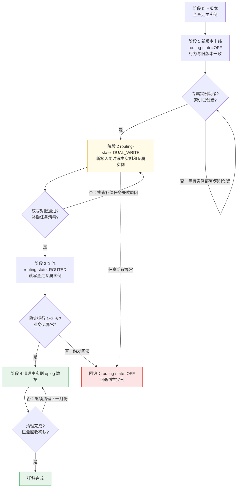
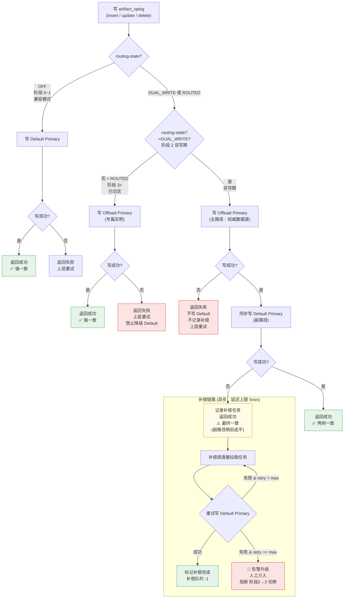
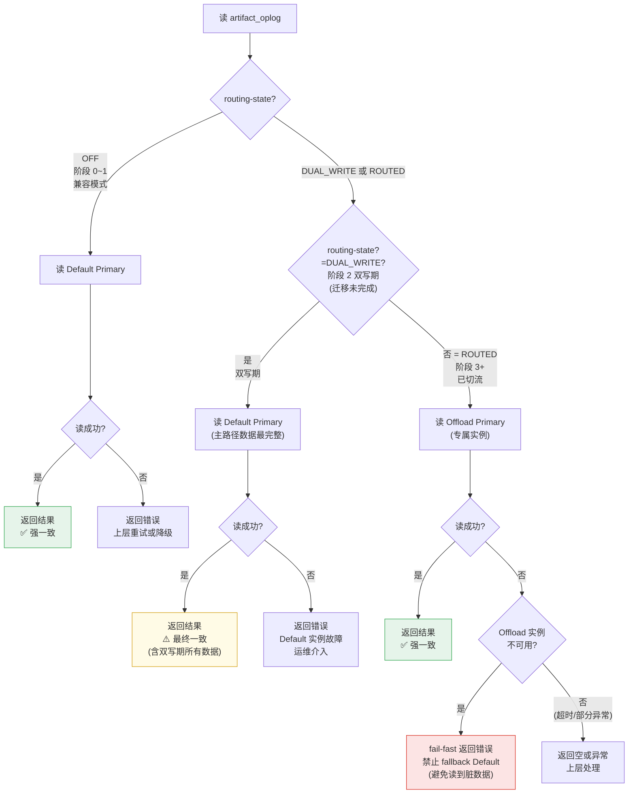
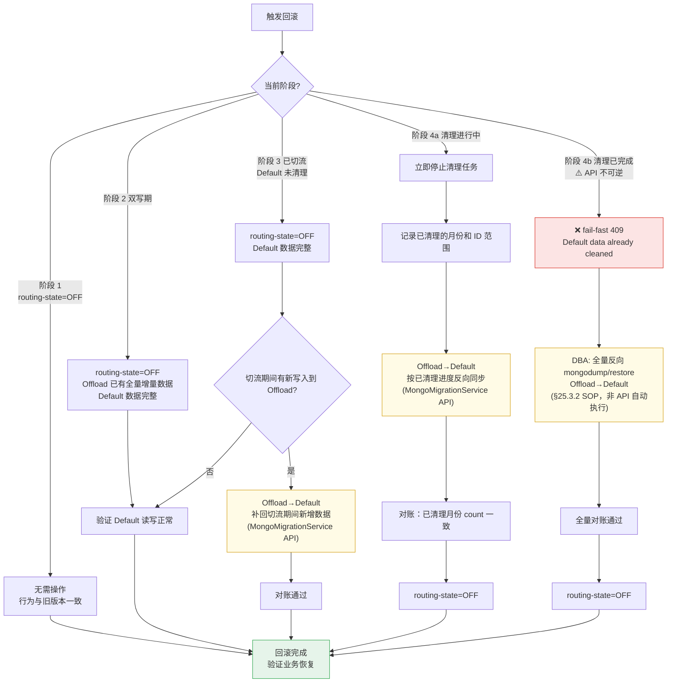
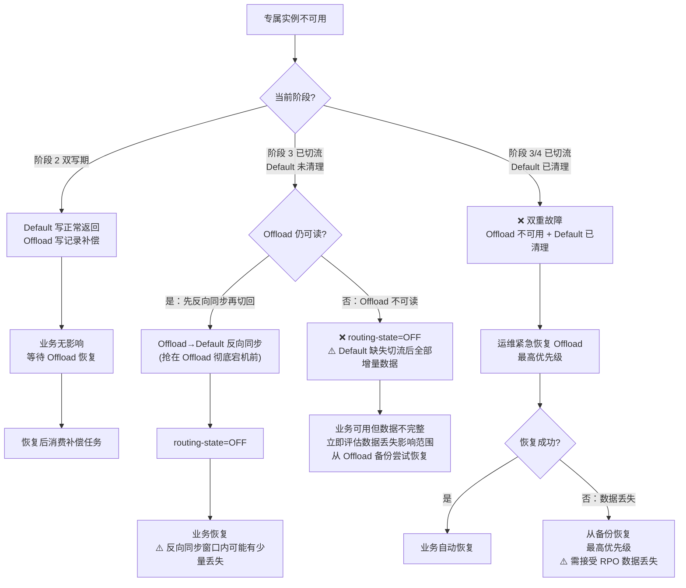

# MongoDB 分库 — 模式一：集合族整体迁移（artifact_oplog）

> 主方案索引：[mongodb-node-sharding-routing.md](./mongodb-node-sharding-routing.md)  
> 模块化实施方案：[mongodb-node-sharding-modules.md](./mongodb-node-sharding-modules.md)（M3）

---

## 2. 模式一：集合族整体迁移

### 2.1 适用场景

- 整个集合族（如 `artifact_oplog_*`）可以作为整体搬离主实例。
- 集合内数据不需要按 `projectId` 做二次路由，同实例内所有文档统一存储。
- 目标是释放主实例的磁盘压力，对低成本实例（大磁盘、低计算规格）友好。
- 迁移后该集合族的读写全部走新实例，旧实例不再承载该数据。

典型场景：

- `artifact_oplog_*`：操作日志，追加写为主，按时间范围查询，已有月度分表。
- 未来其他非业务核心的日志/统计类集合。

### 2.2 配置模型

通用框架下，模式一**只需一段配置，零 DAO / Service 改动**。
`AbstractMongoDao` 基类会自动匹配 `collection-prefix`，将所有 `artifact_oplog_*` 集合的读写路由到 Offload 实例（详见 §19.4.2b）。

```yaml
spring:
  data:
    mongodb:
      uri: mongodb://main-primary:27017/bkrepo      # Default 主实例（不变）
      multi-instance:
        rules:
          artifact-oplog:
            routing-type: none                       # 整体迁移，不需要路由键
            collection-prefix: "artifact_oplog_"    # 匹配此前缀的集合自动路由
            routing-state: OFF                       # OFF / DUAL_WRITE / ROUTED
            migration:
              historicalSyncStrategy: NONE           # 默认；append-only 日志不迁历史
            instances:
              oplog:
                uri: mongodb://oplog-primary:27017/bkrepo
```

回滚开关：删除或注释 `artifact-oplog` 规则条目，所有 `artifact_oplog_*` 自动回退到 Default 实例，无需重启（配置热加载）。

### 2.3 DAO / Service 改造

**无需任何改动。**

`OperateLogDao`、`ROperateLogDao`、`OperateLogServiceImpl`、`ActiveProjectService` 等均不需要修改。
路由完全由 `AbstractMongoDao` 基类的集合前缀匹配逻辑承载。

### 2.4 迁移总流程



各阶段准入/准出条件：

| 阶段 | 准入条件 | 准出条件 | 可回滚 |
| --- | --- | --- | --- |
| 0→1 | 新版本代码合入 | 部署完成，功能回归通过 | 是 |
| 1→2 | 专属实例部署完成、索引创建完成、连接验证通过 | `routing-state=DUAL_WRITE` 生效 | 是 |
| 2→3 | 双写期 count 对账通过、补偿队列清零 | `routing-state=ROUTED` 生效 | 是 |
| 3→4 | 稳定运行 1~2 天、业务无告警 | 主实例 oplog 数据清理完成 | 清理前是 |
| 4→完成 | 清理完成、磁盘回收确认 | - | 需反向同步 |

### 2.5 双写期读写流程

#### 2.5.1 写流程



| 阶段 | 路由状态 | 写入目标 | 一致性语义 | 失败处理 |
| --- | --- | --- | --- | --- |
| 0~1 兼容 | routing-state=OFF | Default Primary | 强一致 | 上层重试 |
| 2 双写 | routing-state=DUAL_WRITE | Offload Primary → 同步写 Default Primary | 最终一致（补偿≤5min） | 主路径失败→直接返回失败；副路径失败→补偿兜底 |
| 3+ 切流 | routing-state=ROUTED | Offload Primary | 强一致 | 上层重试，禁止降级 Default |

#### 2.5.2 读流程



| 阶段 | 路由状态 | 读取目标 | 一致性语义 | 故障处理 |
| --- | --- | --- | --- | --- |
| 0~1 兼容 | routing-state=OFF | Default Primary | 强一致 | Default 故障→业务中断 |
| 2 双写 | routing-state=DUAL_WRITE | Default Primary | 最终一致（完整） | Default 故障→业务中断；Offload 故障不影响读 |
| 3+ 切流 | routing-state=ROUTED | Offload Primary | 强一致 | Offload 故障→fail-fast，禁止 fallback |

#### 2.5.3 补偿原则

| 场景 | 处理 | 原因 |
| --- | --- | --- |
| 主实例（Offload）写失败 | 直接返回失败，不写 Default，不记录补偿 | 主实例是双写期的权威数据源 |
| 主实例写成功、Default 写失败 | 记录补偿任务，业务返回成功 | 不影响业务；补偿任务消费后数据最终一致 |
| 补偿任务重试成功 | 标记补偿完成，清除任务 | 正常恢复路径 |
| 补偿任务重试达到上限 | 告警人工介入，禁止切流 | 防止数据不一致状态下切换路由 |
| 补偿队列未清零 | 阻断阶段 2→3 流转 | 确保 Default 数据完整后才安全切流 |

### 2.6 历史数据迁移（可选）

> **artifact_oplog 默认策略 `NONE`**：不迁移 Default 历史到 Offload（详见 §2.11）。
> 如需合规审计等场景迁移历史月份集合，显式设置 `historicalSyncStrategy: JOB_ONLY`，
> 通过 **MongoMigrationService API**（`POST /migration/historical-sync/{ruleName}`）手动触发，
> 非定时轮询；按月份逐批同步，迁移期间该月集合为只读（无新写入），无需双写。

### 2.7 对账

| 对账项 | 方法 |
|---|---|
| 文档数量 | `count()` 对比主实例和专属实例 |
| 最新写入 | 按 `createdDate` 范围抽样 |
| 双写补偿 | 补偿任务队列清零 |
| 历史月份 | 各月 `count()` 一致后标记完成 |

### 2.8 回滚策略



#### 2.8.1 回滚可逆性分级总览

| 阶段 | API 可逆 | 数据修复方式 | 风险 |
| --- | --- | --- | --- |
| 1（OFF） | ✅ 无需操作 | — | 无 |
| 2（DUAL_WRITE） | ✅ 自动 | 无需（Default 上有全量数据） | 低 |
| 3a（ROUTED，Default 未清理，无新增写） | ✅ 自动 | 无需 | 低 |
| 3b（ROUTED，Default 未清理，有新写入） | ⚠️ 配置自动 + API 手动 | Offload→Default 反向同步增量 | 中 |
| 4a（CLEANUP_READY，清理进行中） | ⚠️ 配置自动 + API 手动 | 停止清理 + 按进度反向同步 | 中 |
| **4b（CLEANED，清理已完成）** | **❌ fail-fast 409** | 灾难恢复：全量反向同步（§25.3.2） | **高** |

> **关键结论**：只有阶段 4b（`CLEANED`）API 回滚不可用。一旦 Default 上 artifact_oplog 数据已清理完毕、磁盘已回收，API 回滚接口返回 409，后续须走灾难恢复 SOP（§25.3.2）。因此 **ROUTED → CLEANUP_READY 的推进须经充分的稳定运行观察期（建议 ≥ 1 周）**，确认无需回滚后再执行清理。

#### 2.8.2 模式一 API 回滚实现（A+C+D）

| 阶段 | 代码行为 | 数据修复 |
| --- | --- | --- |
| 1~3a（PENDING ~ ROUTED，Default 未清理） | 自动：`routing-state=OFF`、删 `project-routing`、清补偿、置 `ROLLBACK` | 无需 |
| 3b（ROUTED 后 Offload 有新写入） | 配置回滚 + 文档提示 | MongoMigrationService API 反向同步新增数据 |
| 4a（`CLEANUP_READY`） | 配置回滚 + 停止清理 | MongoMigrationService API 按已清理进度反向同步 |
| 4b（`CLEANED`） | **fail-fast 409**：`Default data already cleaned` | 灾难恢复 SOP（§25.3.2） |

> A=可逆阶段自动配置回滚；C=不可逆阶段 API 拦截；D=反向同步交 MongoMigrationService API（灾难恢复见 §25.3.2）。

#### 2.8.1 专属实例不可用时的应急处理

**回滚动机**：ROUTED 后回滚的唯一触发条件是 **Offload 实例自身发生灾难性故障且短期无法恢复**（如磁盘阵列损坏、副本集多数节点宕机、误删数据且无备份）。此时 Offload 已无法提供服务，切回 Default 是恢复可用性的唯一手段。

**数据代价**：切回 Default 意味着 **丢失所有 ROUTED 期间写入 Offload 的新数据**（Default 已停写）。如果 Offload 仍可读，回滚前应先执行 Offload→Default 反向同步（§2.8 流程图 C4B 路径）；如果 Offload 已不可读，则该部分数据永久丢失。



> **核心结论**：阶段 3 的「Default 未清理」≠「Default 数据完整」。切流后 Default 已停写，回退到 Default 必然缺失切流期间增量。只有在「Offload 短期可恢复但需要让业务先跑起来」的场景下，才值得接受这个缺口切回 Default。

#### 2.8.1a 回滚决策矩阵

| 场景 | 回滚到 Default 有意义? | 理由 |
| --- | --- | --- |
| Offload 从库延迟高/主库慢 | ❌ 不应该回滚 | 等 Offload 自愈，比丢失数据代价小 |
| Offload 副本集多数宕机，短期可恢复 | ⚠️ 视 RTO 决定 | 业务中断时间 vs 数据丢失量权衡 |
| Offload 磁盘损坏，数据永久丢失 | ✅ **唯一合理回滚** | Offload 已无恢复可能，Default 至少保有切流前全量数据 |
| 业务 bug 导致 Offload 写入脏数据 | ❌ 不应回滚 | 应该在 Offload 上修复数据，而非切回 Default |
| ROUTED 后发现迁移决策错误 | ❌ 不应回滚 | 应计划性反向迁移（MongoMigrationService API），非紧急回滚 |

### 2.9 异常场景穷举

#### 2.9.1 写入阶段异常

| 场景 | 阶段 | 自动恢复 | 处理方式 | 业务影响 |
| --- | --- | --- | --- | --- |
| Offload 写失败 | 双写期 | 否 | 返回失败，不写 Default，上层业务重试 | 单次写失败 |
| Offload 写成功、Default 写失败 | 双写期 | 否（异步补偿） | 记录补偿任务，异步重试 | 无 |
| Offload 写成功、Default 超时 | 双写期 | 否（异步补偿） | 等同 Default 写失败，记录补偿 | 无 |
| Offload 写失败 | 切流后 | 否 | fail-fast 返回失败，运维排查 | 该集合族写不可用 |

#### 2.9.2 读取阶段异常

| 场景 | 阶段 | 自动恢复 | 处理方式 | 业务影响 |
| --- | --- | --- | --- | --- |
| Offload 从库不可用 | 切流后 | 否 | fail-fast，不 fallback Default | 该集合族读不可用 |
| Offload 从库延迟高 | 切流后 | 否 | 查询超时后返回错误，等从库追上 | 查询超时 |
| Default 从库不可用 | 双写期/切流前 | 否 | Default 主从故障，运维处理 | 全局读不可用 |

#### 2.9.3 历史数据迁移阶段异常（可选，仅启用 `historicalSyncStrategy: JOB_ONLY` 时适用）

| 场景 | 自动恢复 | 处理方式 | 业务影响 |
| --- | --- | --- | --- |
| 同步 Job 执行中主实例负载高 | 否 | 暂停同步，错峰执行或降低批次大小 | 主实例性能下降 |
| 同步写入 Offload 失败（网络中断） | 是 | 断点续传重试，已完成月份不受影响 | 无（迁移延迟） |
| Offload 实例磁盘不足 | 否 | 扩容专属实例磁盘后重试 | 无（迁移延迟） |
| 对账校验不通过 | 否 | 清除该月目标数据，重新触发同步 | 无（迁移延迟） |
| 迁移期间主实例当月集合有意外写入 | 是 | 双写机制已覆盖当月新数据，仅历史只读月份需同步 | 无 |

#### 2.9.4 补偿任务异常

| 场景 | 自动恢复 | 处理方式 | 业务影响 |
| --- | --- | --- | --- |
| 补偿任务重试 3 次仍失败 | 否 | 告警升级，人工排查原因（网络/权限/数据冲突） | 无（数据不一致风险） |
| 补偿任务队列积压 > 1000 条 | 否 | 告警，暂停切流计划，排查专属实例状态 | 无（切流阻断） |
| 补偿调度器自身宕机 | 是（进程重启后从任务表恢复） | 重启后从任务表恢复，继续消费 | 补偿延迟 |
| 补偿写入产生数据冲突（duplicate key） | 否 | 记录冲突详情，人工核查是否需要覆盖 | 无 |

#### 2.9.5 清理阶段异常

| 场景 | 自动恢复 | 处理方式 | 业务影响 |
| --- | --- | --- | --- |
| 主实例清理中磁盘告警 | 否 | 暂停清理，扩容主实例后继续 | 无 |
| 清理误删非目标数据 | 否 | 清理脚本严格按集合名过滤，出错时停止并从备份恢复 | 潜在数据丢失 |
| 清理过程中专属实例故障 | 否 | 立即停止清理，优先恢复专属实例 | 无（清理暂停） |
| 清理后发现还需要回滚 | 否 | 按 2.8 回滚策略执行反向同步 | 回滚耗时长 |

#### 2.9.6 配置与部署异常

| 场景 | 自动恢复 | 处理方式 | 业务影响 |
| --- | --- | --- | --- |
| routing-state 误设为非 OFF（专属实例未就绪） | 否 | 立即回退配置为 OFF，验证业务恢复 | oplog 读写失败 |
| routing-state 误切为 ROUTED（迁移未完成） | 否 | 重新切回 DUAL_WRITE，补偿期间差异 | 专属实例数据缺失 |
| 专属实例连接串配置错误 | 否 | 启动时连接校验失败，修正配置重启 | 启动失败 |
| 新旧实例并存时配置不一致 | 否 | 发布系统确认 100% 实例一致后恢复；持续不一致则立即回滚 `routing-state=OFF` | 部分请求路由错误 |

### 2.10 完整配置流程

本节描述模式一从零到迁移完成的**完整配置操作序列**，涵盖每条配置的存储位置、生效方式、以及各阶段的验证方法。

#### 2.10.1 配置分层概览

```
┌──────────────────────────────────────────────────────────────┐
│                    Consul（启动级 & 热加载级）                  │
│  ┌─────────────────────────────────────────────────────────┐ │
│  │ 启动级（变更需滚动重启）:                                   │ │
│  │   rules.artifact-oplog.instances.oplog.uri               │ │
│  │   rules.artifact-oplog.collection-prefix                 │ │
│  │   rules.artifact-oplog.routing-type                     │ │
│  ├─────────────────────────────────────────────────────────┤ │
│  │ 热加载级（@RefreshScope，秒级生效）:                        │ │
│  │   rules.artifact-oplog.routing-state                     │ │
│  └─────────────────────────────────────────────────────────┘ │
└──────────────────────────────────────────────────────────────┘
```

> **说明**：模式一为 `routing-type: NONE`（整体迁移），不涉及 `project-routing`/`shard-routing`。`routing-state` 由**运维手动在 Consul 中修改**（变更频率极低，每条规则仅需切换 1~2 次），op admin 页面展示当前状态并提示运维下一步操作。应用**不写 Consul**。

#### 2.10.2 阶段 0 → 1：首次部署（Consul Bootstrap）

**操作**：在 Consul 中创建 `artifact-oplog` 规则配置并部署新版本代码。

```yaml
# Consul Key: spring.data.mongodb.multi-instance
spring:
  data:
    mongodb:
      uri: mongodb://default-primary:27017/bkrepo       # Default 主实例（不变）
      multi-instance:
        rules:
          artifact-oplog:
            routing-type: none                           # 整体迁移，不需要路由键
            collection-prefix: "artifact_oplog_"         # 匹配此前缀的集合自动路由
            routing-state: OFF                           # 阶段 1 不开启路由（运维手动在 Consul 中管理）
            migration:
              historicalSyncStrategy: NONE               # 默认；append-only 日志不迁历史
            instances:
              oplog:
                uri: mongodb://oplog-primary:27017/bkrepo         # ← 启动级
```

**生效方式**：

| 属性 | 生效方式 | 说明 |
|------|----------|------|
| `instances.*.uri` | **滚动重启** | 新增 `MongoTemplate` Bean，必须重启才能创建连接池 |
| `collection-prefix` / `routing-type` | **滚动重启** | 规则元数据变更，影响 `prefixIndex` 初始化排序 |
| `routing-state` | **热加载** | `@RefreshScope` 秒级生效，由运维手动在 Consul 中修改 |

**验证**：

```bash
# 1. 确认所有实例已部署完成（发布系统确认）
# 2. 确认 Offload 实例可连通（从任意实例内执行）
# 查看实例日志，搜索 "MongoDB connection" 确认无连接错误

# 3. 确认路由未生效（routing-enabled=false）
# 在业务日志中搜索 "routing.*artifact-oplog"，应无路由命中日志

# 4. 确认 artifact_oplog_* 读写仍在 Default
# 对比 Default 实例的 mongostat / slow query log，oplog 集合读写在 Default 上可见
```

#### 2.10.3 阶段 1 → 2：开启双写

**前置条件**（全部满足后方可操作）：

- [ ] Offload 专属实例部署完成、副本集 ≥ 3 健康节点
- [ ] Offload 实例索引已创建（与 Default 一致，见 §8）
- [ ] 从实例内 `mongo --host oplog-primary` 连接验证通过
- [ ] 所有实例已完成部署

**操作**：运维在 Consul 中修改 `routing-state=DUAL_WRITE`。

```yaml
# 修改 Consul 中以下属性：
spring.data.mongodb.multi-instance:
  rules.artifact-oplog.routing-state: DUAL_WRITE
```

**生效方式**：**热加载**，无需重启。Consul 修改后各实例在 `@RefreshScope` 刷新周期内（默认 3s）自动感知。等待 ≥ 30s 确保全部 Pod 感知新配置后，再调用 `POST /migration/start`。

**验证**：

```bash
# 1. 确认各实例已刷新
# 查看实例日志：搜索 "Refresh keys changed" 或 "Refreshed artifact-oplog"

# 2. 确认双写生效
# 写入一条测试 oplog 记录，检查两侧实例是否都有该记录
# Default:
mongo default-primary:27017/bkrepo --eval 'db.artifact_oplog_202601.count({"_id": ObjectId("...")})'
# Offload:
mongo oplog-primary:27017/bkrepo --eval 'db.artifact_oplog_202601.count({"_id": ObjectId("...")})'

# 3. 持续对账
# 观察补偿任务队列（artifact-oplog 补偿表），确认无持续积压
```

#### 2.10.4 阶段 2 → 3：切流

**前置条件**：

- [ ] 双写期 count 对账通过
- [ ] 补偿队列清零
- [ ] 稳定双写 ≥ 1 天，无异常告警

**操作**：运维在 Consul 中修改 `routing-state=ROUTED`。

```yaml
# 修改 Consul：
spring.data.mongodb.multi-instance:
  rules.artifact-oplog:
    routing-state: ROUTED      # 切流：读写全走 Offload 实例
```

**生效方式**：**热加载**。

**验证**：

```bash
# 1. 确认路由已生效
# 读取 artifact_oplog 集合，在 Default 实例的 mongostat 中应看不到 oplog 集合的读流量

# 2. 确认 Offload 实例承载全部读写
mongo oplog-primary:27017/bkrepo --eval 'db.currentOp()' | grep artifact_oplog

# 3. 确认 Default 上 oplog 集合无新写入
# Default 实例磁盘 I/O 应明显下降
```

#### 2.10.5 阶段 3 → 4：清理 Default 数据

**前置条件**：

- [ ] 切流后稳定运行 1~2 天
- [ ] 业务无异常告警
- [ ] 监控指标正常（Offload 实例 I/O、连接数在阈值内）

**操作**：配置不变（`routing-state=ROUTED`），执行 Default 实例数据清理（按月份逐月删除）。

```bash
# 清理操作不涉及配置变更，由运维脚本执行
# 详见 §2.8 清理 SOP
```

#### 2.10.7 配置校验清单

启动时 `validateOnStartup()` 自动执行以下校验（fail-fast）：

| 校验项 | 规则 | 不通过行为 |
|--------|------|-----------|
| NONE 模式 + routing-state≠OFF → instances 非空 | `routingState != OFF && routingType==NONE → instances.isNotEmpty()` | 启动失败 |
| 实例 URI 可连通 | `MongoTemplate` 构建时自动检测 | 启动失败 |
| collection-prefix 非空 | `routingEnabled && collectionPrefix.isBlank()` 不合法 | 启动失败 |

#### 2.10.8 紧急回滚操作

任意阶段出现无法快速修复的异常时，执行以下回滚：

```yaml
# 方案 A：关闭路由（回退到 Default）—— 热加载，秒级生效
spring.data.mongodb.multi-instance:
  rules.artifact-oplog:
    routing-state: OFF              # 关闭路由
```

```yaml
# 方案 B：完全移除规则（与方案 A 等价，但更彻底）
spring.data.mongodb.multi-instance:
  rules.artifact-oplog: null        # 删除或注释整条规则
```

**回滚后验证**：

```bash
# 确认所有 artifact_oplog_* 读写恢复走 Default
# Default 实例的 mongostat 中应重新看到 oplog 集合流量
```

> **注意**：回滚后 Offload 实例上的数据不再写入新数据，若之后需要重新迁移，需从阶段 0 重新开始（因为回滚期间 Default 和 Offload 的数据已分叉）。

### 2.11 ROUTED 后读写语义（禁止 fallback Default）

切流后（`routing-state=ROUTED`），`artifact_oplog` 读写**仅走 Offload 实例**：

| 操作 | 目标 | 失败处理 |
| --- | --- | --- |
| 写 | Offload Primary | fail-fast，**禁止**写 Default |
| 读 | Offload Primary | fail-fast，**禁止**读 Default 僵尸存量 |

Default 上 oplog 存量为待清理数据（§1.6.1 NONE），读 Default 可能返回过期/重复审计记录。应急仅运维显式 `routing-state=OFF` 或回滚 API（§2.8）。

**模式一默认策略 `NONE`**：滚动上线 → 双写（**Offload 主路径**）→ 补偿清零 → ROUTED → 运维触发清理 Default 存量月集合；**不迁移** Default 历史到 Offload 实例。

---

