# MongoDB 分库 — 模式二：Node 项目级路由

> 主方案索引：[mongodb-node-sharding-routing.md](./mongodb-node-sharding-routing.md)  
> 模块化实施方案：[mongodb-node-sharding-modules.md](./mongodb-node-sharding-modules.md)（M4/M5/M6/M7）

---

## 3. 模式二：Node 项目级路由

### 3.1 现状

BK-REPO 应用层已经基于 `projectId` 对 `node` 做 256 张哈希分表 `node_0` 到 `node_255`。

核心代码现状：

- `TNode.projectId` 是 `@ShardingKey`，分表数量为 `SHARDING_COUNT = 256`。
- `NodeDao` 继承 `HashShardingMongoDao<TNode>`。
- `ShardingMongoDao.determineCollectionName(query)` 从 `Query.queryObject` 中提取 `projectId`，计算物理集合名。
- `AbstractMongoDao` 当前只提供无参 `determineMongoTemplate()`，无法按 `projectId` 或集合名选择不同 MongoDB 实例。
- `MongoDbBatchJob` 按 `_id` 升序分页扫描集合，默认用单个 `batchQueryMongoTemplate()`。
- Job 服务读从库，业务服务和 Job 写操作最终写主库。

当前典型数据分布：

```text
node_188：141M 文档（热点，超大项目集中）
node_65 ： 41M 文档
其他分表：大多低于 12M
```

### 3.2 问题

#### 3.2.1 从库 CPU 高

大量 Job 遍历 `node_*`，当热点分表达到 141M 级别时，从库扫描成本极高：

- `DeletedNodeCleanupJob`、`NodeStatCompositeMongoDbBatchJob`
- `InactiveProjectNodeFolderStatJob`、`NodeReport2BkbaseJob`
- `NodeCopyJob`、`ExpiredNodeMarkupJob`、`PipelineArtifactCleanupJob`

#### 3.2.2 主库 CPU 高

主库同时承担业务写（上传、删除、移动）和 Job 清理写（`remove`、`updateFirst`）。
只做读写分离无法解决主库压力。

#### 3.2.3 大项目噪音

同实例内超大项目拖慢所有项目；同一 `node_x` 内大项目扫描影响普通项目。
分库粒度必须细到项目级，而非集合或分片级。

### 3.3 方案对比

| 方案 | 优点 | 缺点 | 结论 |
|---|---|---|---|
| 增加从库 | 改动小 | 热点分表总量不变；主库压力不降 | 不采用 |
| 提升规格 | 见效快 | 成本高；租户隔离问题未解决 | 短期缓解 |
| 冷热分离 | 降低活跃量 | 无法解决租户隔离 | 辅助手段 |
| 按分片编号分库 | 改造简单 | 同分片内大小项目仍互相影响 | 兜底方案 |
| **按项目分库** | 完全隔离，支持快速迁移单项目 | Job 需散发；迁移流程复杂 | **采用** |
| MongoDB 原生 Sharding | 官方方案 | 运维复杂，需迁移现有 256 分表 | 长期演进 |

### 3.4 总体架构

#### 3.4.1 路由优先级

```text
1. projectId 命中 project-routing → 项目专属实例
2. collectionName 命中 shard-routing → 分片专属实例
3. 未命中 → Default 实例
```

#### 3.4.2 数据分布示意

```text
迁移前：
  Default: node_188 = projectA(130M) + projectB(6M) + projectC(5M)

迁移 projectA 后：
  Heavy1:  node_188 = projectA(130M)
  Default: node_188 = projectB(6M) + projectC(5M)
```

同名集合同时存在于多个实例，每个实例承载不同项目子集，不是数据重复。

#### 3.4.3 组件边界

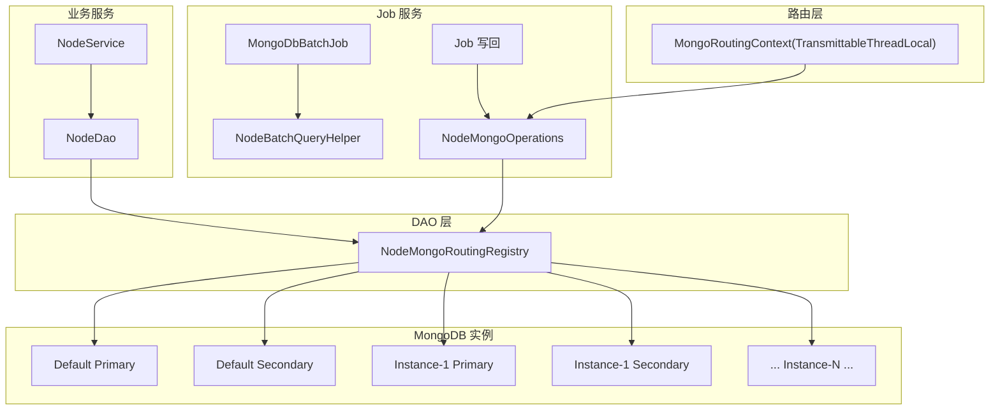

| 组件 | 来源 | 职责 |
|---|---|---|
| `MongoMultiInstanceProperties` | 通用框架 | 加载所有规则的实例、项目路由、分片路由、双写配置 |
| `MongoRoutingRegistry` | 通用框架 | 根据 `(ruleName, projectId / collectionName)` 选择 Primary 或 Secondary 模板 |
| `MongoRoutingContext` | 通用框架 | `TransmittableThreadLocal` 上下文，兼容旧 Job 写法 |
| `MongoRoutingOperations` | 通用框架 | Job 写任意路由集合的显式接口，传入 `ruleName + projectId` |
| `MongoBatchQueryHelper` | 通用框架 | 按注册表生成多实例扫描分组（`BatchQueryGroup`） |
| `BatchQueryGroup` | 通用框架 | 描述 Job 扫描使用的模板、集合列表、查询条件补丁 |
| `NodeDao` | node 专属 | **无路由代码**，仅保留业务查询方法；路由由 `AbstractMongoDao` 基类自动处理 |
| `NodeScatterQueryService` | node 专属 | 无 `projectId` 的 `pageBySha256` 散发查询 + 结果合并 |
| `MigrationSyncJob` | node / block-node / artifact-oplog | 按 `ruleName` 调度；`MigrationSyncEngine` + `MigrationScanStrategy`；INITIAL_SYNC 与双写并行，`$setOnInsert` 全量扫描 |

### 3.5 配置模型

使用通用框架的统一配置前缀 `spring.data.mongodb.multi-instance.rules`，node 作为其中一条规则：

```yaml
spring:
  data:
    mongodb:
      uri: mongodb://default-primary:27017/bkrepo
      multi-instance:
        rules:
          node:
            routing-type: project            # 按 projectId 路由
            routing-key-field: projectId
            routing-state: OFF                    # OFF / DUAL_WRITE / ROUTED
            instances:
              heavy1:
                uri: mongodb://heavy1-primary:27017/bkrepo
              heavy2:
                uri: mongodb://heavy2-primary:27017/bkrepo
            project-routing:
              projectA: heavy1
              projectB: heavy2
              projectC: heavy2
            # 部分项目迁移时禁止配置 shard-routing（见 §13.3）
            # shard-routing 仅用于整分片迁出、该集合内无未迁移项目时使用
            # shard-routing:
            #   node_65: heavy2
```

配置约束：

- `instances` 是 `Map<String, InstanceConfig>`，数量不限。
- 同一 `projectId` 不能映射到多个实例；同一分片集合名不能映射到多个实例（启动时 fail-fast 校验）。
- 删除 `rules.node` 条目或设置 `routing-state=OFF` 等价于全部降级到 Default。

#### 3.5.1 双写决策（Consul 绑定 + 项目状态）

> **门禁边界**：本节描述**代码层**路由决策。§3.10「100% 实例已部署」等为**运维 SOP**，由发布系统确认，API 不自动校验。

`project-routing` 仅表示项目与 Heavy 实例的绑定关系；运行时是否双写 / 切流由
`mongo_migration_sync_state.phase` 与 rule 级 `routing-state` 共同决定。

```kotlin
fun isProjectInDualWrite(projectId: String): Boolean {
    return routingState == DUAL_WRITE &&
        projectId in projectRouting &&
        migrationPhase(projectId) == DUAL_WRITE
}
```

| 项目阶段 | `project-routing` | `routing-state` | 实际写行为 | 实际读行为 |
| --- | --- | --- | --- | --- |
| 未绑定 / 绑定但未到 `DUAL_WRITE` | 否 / 是 | OFF | 单写 Default | Default Primary |
| `DUAL_WRITE` | 是 | DUAL_WRITE | Default Primary（主路径）+ Heavy Primary（副路径） | Default Primary |
| `ROUTED` 及之后 | 是 | ROUTED | **单写 Heavy**（已切流） | Heavy Primary |

> **读路径说明**：业务 DAO 不配置 `readPreference`，读写均走各实例 **Primary**（与现网一致，§1.3.2）。
> SyncJob `INITIAL_SYNC` 全量扫描可读 Default **Secondary** 卸压（§3.9）；散发查询见 §3.7.1。

**说明**：
- `project-routing` 由运维在 **本区域 Consul** 维护；API **不写** Consul。
- 组内尚未开始迁移的项目 **不应** 出现在 `project-routing` 中（否则 `routing-state=ROUTED` 时会立即写 Heavy）。
- `POST /migration/start` 将 DB `phase` 置为 `INITIAL_SYNC` 并启动 Job；**须先**在 Consul 加 `project-routing` 并设 `routing-state=DUAL_WRITE`，运行时双写才生效。
- 切流：API `POST /migration/route` 写 DB `phase=ROUTED`；运维确认后设 Consul `routing-state=ROUTED`。
- 回滚：`phase ≤ DUAL_WRITE` 时从 Consul 移除 `project-routing` 并 `routing-state=OFF`；**ROUTED 后**须按 §25.4.3 反向迁移（§3.11.1）。
- **路由决策只读 Consul**，`mongo_migration_sync_state.phase` 仅供 Job / Gate / 面板。

**并行迁移约束**

| 规则 | 说明 |
| --- | --- |
| 同一时刻仅一个项目处于双写 | DB `max-concurrent-dual-write` + `phase ∈ {INITIAL_SYNC, DUAL_WRITE}` 计数（Gate） |
| `routing-state=DUAL_WRITE` 时 project-routing 内全部双写 | 已 ROUTED 项目若仍在表中会短暂恢复 Default 副路径（ponytail 可接受） |
| 切流前无其他项目处于 `INITIAL_SYNC` 或 `DUAL_WRITE` | `POST /migration/route` 门禁校验 |

```yaml
spring.data.mongodb.multi-instance.rules.node:
  routing-state: OFF            # OFF / DUAL_WRITE / ROUTED
  migration:
    historical-sync-strategy: JOB_ONLY   # node 集合高频增删改，`$setOnInsert` 全量扫描 + 并发双写
    sync-job:
      batch-size: 500
      parallel-projects: 3
      change-stream-enabled: true
    min-oplog-hours: 48          # INIT 校验：local.oplog.rs 窗口下限（G-32）
    max-concurrent-dual-write: 1   # 同时进行双写的项目数上限
```

#### 3.5.1a 三态枚举状态转换规则

| 类型 | 配置 | 说明 |
|---|---|---|
| **Tier-Key**（`DEDICATED`） | `project-routing: { projectA: heavy1 }` | 单项目独占 Heavy；所有操作以 `projectId` 为单位 |
| **Tier-Biz**（`BUSINESS_GROUP`） | `business-routing` + 组内 `projects` | 同业务线多项目共享 Heavy；**配置/绑定以 `businessId` 为单位，迁移操作以 `projectId` 为粒度**（详见 §3.5.1b） |

```yaml
spring.data.mongodb.multi-instance.rules.node:
  business-routing:
    biz-ci:
      instance: heavy-biz-ci
      projects: [proj-a, proj-b, proj-c]
  project-routing:
    projectA: heavy1          # Tier-Key
    proj-a: heavy-biz-ci      # Tier-Biz 展开（或由 business-routing 运行时展开）
```

- Tier-Biz 容量按组内所有项目 node 总量规划。
- `business-routing` 为配置级概念：定义组内项目、共享 Heavy 实例、Job 过滤维度（组内全部 `projectIds`）。
- `POST /migration/binding` 支持 `businessId` — 批量创建 `mongo_migration_sync_state`。后续 `start` / `route` / `cleanup` 均以 `projectId` 为粒度；Consul `project-routing` 由运维按 SOP 维护。
- 迁移中禁止向组内新增项目；ROUTED 后新项目走 §3.5.1b 场景 C。
- `routing-state=ROUTED` 时，仅在 `project-routing` 中的项目写 Heavy；未入表者仍走 Default。

#### 3.5.1b Tier-Biz 组迁移完整流程

**状态存储**：每项目的迁移进度独立持久化在 Default 实例的 `mongo_migration_sync_state` 集合中
（§1.6.6），以 `bindingId` + `projectId` 为联合键。`routing-state` 是 rule 级全局配置；
`phase` 是项目级独立字段 — 这是组内分批/增量迁移能成立的基础。

##### 场景全景

以 `business-routing: biz-ci → [A, B, C]` 为例，三种典型场景：

| 场景 | 初始状态 | 操作粒度 | 适用条件 |
| --- | --- | --- | --- |
| **A. 全组初始迁移** | 组刚创建，A/B/C 从未迁移，`routing-state=OFF` | binding 以 `businessId`，后续以 `projectId` | 组首次迁移 |
| **B. 组内分批迁移** | 组已创建，先迁 A，验证后再迁 B、C | 全程 `projectId` | 稳妥灰度、大项目分步 |
| **C. 组已 ROUTED 后增量** | A/B/C 已全部 ROUTED，新增 D 加入组 | 全程 `projectId` | 扩组 |

##### 场景 A：全组初始迁移

组刚创建，组内所有项目数据均在 Default，一起推到 Heavy。

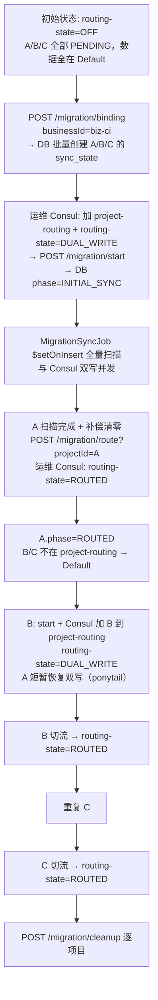

**关键约束**：`max-concurrent-dual-write=1`，任何时候组内最多一个项目处于 DUAL_WRITE。全组迁移实际就是串行逐项目推进，runtime 行为与场景 B 完全相同。

##### 场景 B：组内分批迁移

组已存在，先迁 A，稳定运行一段时间后再迁 B、C。步骤与场景 A 完全一致，仅时间线拉长。

| 阶段 | routing-state | A | B | C | 操作 |
| --- | --- | --- | --- | --- | --- |
| 绑定 | OFF | PENDING | PENDING | PENDING | `binding` + Consul 仅配 business-routing |
| A 同步 | DUAL_WRITE | INITIAL_SYNC | — | — | Consul 加 A + `routing-state=DUAL_WRITE`，再 `start` |
| A 双写 | DUAL_WRITE | DUAL_WRITE（Job 推进） | — | — | 全量扫描完成，DB phase 自动推进 |
| A 切流 | ROUTED | ROUTED | — | — | `route` + Consul ROUTED |
| B 同步 | ROUTED | ROUTED | INITIAL_SYNC | — | Consul 加 B + `routing-state=DUAL_WRITE`，再 `start` |
| B 双写 | DUAL_WRITE | ROUTED（短暂双写副路径） | DUAL_WRITE | — | Job 完成扫描 |
| B 切流 | ROUTED | ROUTED | ROUTED | — | `route` + Consul ROUTED |

##### 场景 C：组已 ROUTED 后增量（新增项目 D）

A/B/C 已全部 ROUTED 且清理完成，业务需要将新项目 D 加入组。

**前置操作**：A/B/C 已在 Consul `project-routing` 且 `routing-state=ROUTED`。D 先 **不要** 加入 `project-routing`。

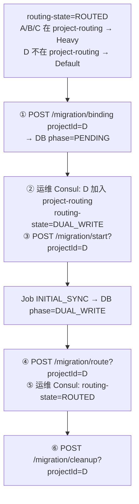

> **ponytail**：D 在加入 `project-routing` 之前读写走 Default。`routing-state=DUAL_WRITE` 期间 A/B/C 若仍在表中会短暂恢复双写副路径，切回 ROUTED 后恢复单写 Heavy。

##### API 参数总结

`businessId` 仅在 `POST /migration/binding` 中使用 — 用于批量创建组内所有项目的 `mongo_migration_sync_state` 记录。其余所有操作均以 `projectId` 为单位调用。

| API | 关键参数 | 说明 |
| --- | --- | --- |
| `POST /migration/binding` | `ruleName`, `businessId` 或 `projectId`, `strategy` | 写 DB sync_state |
| `POST /migration/start` | `ruleName`, `projectId` | 写 DB `INITIAL_SYNC` 并启动 Job；**前置**：Consul 已配 `project-routing` + `routing-state=DUAL_WRITE` |
| `POST /migration/route` | `ruleName`, `projectId` | 写 DB `ROUTED`；配合 Consul `routing-state=ROUTED` |
| `POST /migration/cleanup` | `ruleName`, `projectId` | 写 DB `CLEANUP_READY` |
| `POST /migration/rollback` | `ruleName`, `projectId` | 写 DB `ROLLBACK`；配合 Consul 清 routing |

##### 约束检查清单（全场景通用）

| 约束 | 说明 |
| --- | --- |
| `max-concurrent-dual-write=1` | DB Gate：`phase ∈ {INITIAL_SYNC, DUAL_WRITE}` 同时仅一个 |
| `project-routing` 成员 | 仅在迁移中或已 ROUTED 的项目；未开始者不入表 |
| `routing-state` 全局切换 | DUAL_WRITE ↔ ROUTED；双写期表中全部项目双写 |
| 回滚安全 | API `rollback` 仅改目标项目 DB phase；Consul 按 SOP 清理 |

> **ponytail**：Tier-Biz「配置以组为单位，操作以项目为粒度」。`business-routing` 定义共享 Heavy；`project-routing` 只列已迁出/在迁项目。`max-concurrent-dual-write=1` 由 DB Gate 强制串行。

#### 3.5.3 历史同步策略配置

```yaml
spring.data.mongodb.multi-instance.rules.node:
  migration:
    historical-sync-strategy: JOB_ONLY   # 默认；见 §1.6.1
```

`historical-sync-strategy` 与旧字段 `migration.mode` 等价映射见 [modules §3.2](./mongodb-node-sharding-modules.md#32-策略命名映射兼容旧文档)。

#### 3.6 业务 DAO 路由

#### 3.6.1 路由总流程

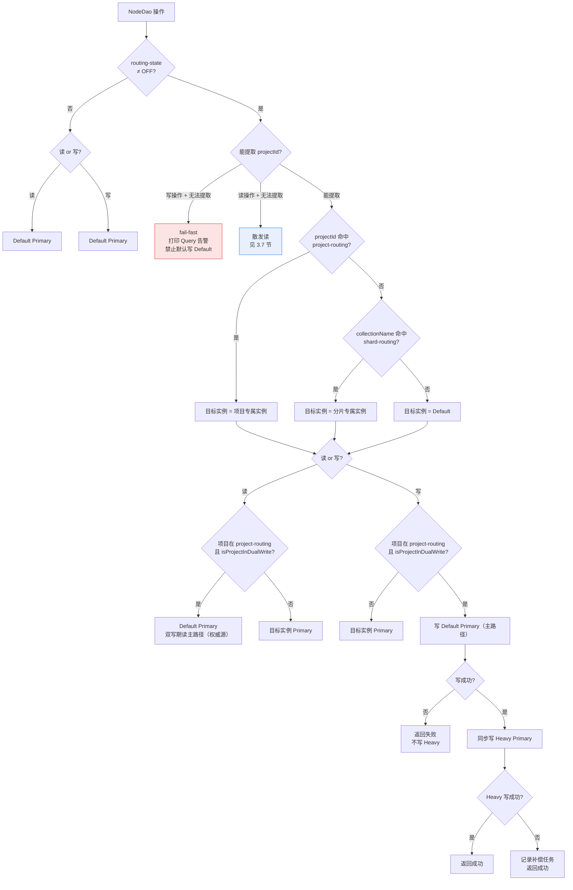

#### 3.6.2 路由决策矩阵

> `isProjectInDualWrite`：`routing-state=DUAL_WRITE` + `projectId ∈ project-routing`（纯 Consul）
> `isProjectRoutedOut`：`routing-state=ROUTED` + `projectId ∈ project-routing`
> **关键**：未入 `project-routing` 的项目始终 Default，与 DB `phase` 无关。

| routing-state | 命中 project-routing | 能提取 projectId | 读目标 | 写目标 |
| --- | --- | --- | --- | --- |
| OFF | — | — | Default Primary | Default Primary |
| DUAL_WRITE | 是 | 是 | Default Primary | Heavy + Default 双写 |
| DUAL_WRITE | 否 | 是 | Default / 分片实例 | Default / 分片±双写 |
| ROUTED | 是 | 是 | 项目实例 Primary | 项目实例 Primary |
| ROUTED | 否 | 是 | Default / 分片实例 | Default / 分片实例 |
| DUAL_WRITE/ROUTED | — | 否（写） | — | fail-fast |
| DUAL_WRITE/ROUTED | — | 否（读） | 散发所有实例 | — |

> **Tier-Biz 增量迁移决策流程**：以 `business-routing: biz-ci → [A, B, C]` 为例。
>
> | 时刻 | routing-state | A（在 project-routing） | B（在 project-routing） | C（不在表中） |
> | --- | --- | --- | --- | --- |
> | A 切流完成 | ROUTED | Heavy 单写 | — | Default |
> | B 开始迁移 | DUAL_WRITE | 双写（ponytail） | 双写 | Default |
> | B 切流完成 | ROUTED | Heavy 单写 | Heavy 单写 | Default |

#### 3.6.3 写流程

模式二双写以 **Default Primary 为主路径**（先写）、Heavy Primary 为副路径（异步补偿兜底）。

> **为什么先写 Default、再写 Heavy（关键设计）**
>
> node 集合有业务唯一索引 `{projectId, repoName, fullPath, deleted}`，且 node 模式**开启双写的同时并发跑全量同步**（INITIAL_SYNC），
> Default 在整个双写期都持有**全量历史数据**、是权威源；Heavy 是在建副本，存在「Default 有、Heavy 尚未同步」的窗口。
>
> | 写序 | 唯一键冲突场景（Default 有旧文档 Y、Heavy 无） | 结果 |
> | --- | --- | --- |
> | **先 Default（本方案）** | 主路径 Default 插入立即撞唯一键 → **同步 fail-fast 抛给调用方**，不写 Heavy | ✅ 与分库前单实例行为一致，两侧不产生分叉；旧数据经全量同步进入 Heavy |
> | 先 Heavy（❌ 已废弃） | 空 Heavy 插入成功 → Default 后写撞唯一键 → 补偿永远撞 Y、全量同步也带不过来 X | ❌ Heavy 多出 X、Default 保留 Y，两侧**不可收敛地分叉** |
>
> 结论：让**持有全量数据的 Default 当主路径同步裁决唯一性**，冲突当场暴露；Heavy 由「全量同步 + 补偿」单向追平。
> 切流门禁要求补偿队列清零 + 对账通过，此时 Heavy 已与 Default 一致，切流安全。读路径双写期本就走 Default（§3.6.4），
> 主路径同为 Default 亦保证 read-your-writes。

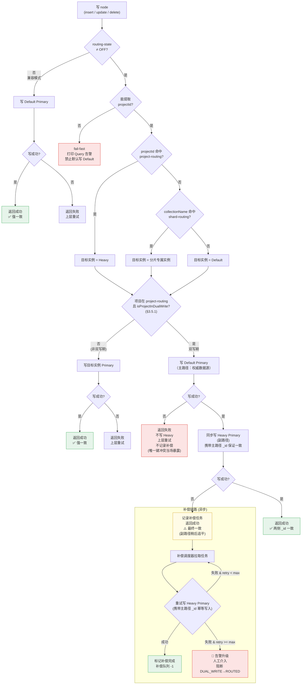

| 阶段 | 项目路由状态 | 写入目标 | `_id` 处理 | 一致性语义 | 失败处理 |
| --- | --- | --- | --- | --- | --- |
| 兼容 | routing-state=OFF | Default Primary | MongoDB 自动生成 | 强一致 | 上层重试 |
| 已路由(非双写) | project-routing 命中 | Heavy Primary | MongoDB 自动生成 | 强一致 | 上层重试 |
| 双写期 | project-routing 命中, DUAL_WRITE | Default Primary → 同步 Heavy Primary | 主路径生成 → 副路径复用 | 最终一致(补偿兜底) | 主路径(Default)失败→直接返回失败(唯一键冲突当场暴露)；副路径(Heavy)失败→补偿兜底 |
| 切流后 | project-routing 命中, ROUTED | Heavy Primary | MongoDB 自动生成 | 强一致 | 上层重试 |
| 未路由 | 未命中任何路由 | Default Primary | MongoDB 自动生成 | 强一致 | 上层重试 |
| 无 projectId | 无法提取 | — | — | — | fail-fast |

> **⚠️ 双写期 update / delete 的 `matchedCount=0` 陷阱（NONE 模式）**
>
> MongoDB 的 `updateFirst` / `updateMulti` / `remove` **不会因 `matchedCount=0` 或 `deletedCount=0` 而报错**。
> 在 NONE 模式（Heavy 无历史数据）下，update/delete 历史文档会发生：
>
> | 操作 | Heavy 行为 | 路由层判断 | 实际后果 |
> |---|---|---|---|
> | update 历史 doc (仅在 Default) | `matchedCount=0`，返回成功 | 视为"主路径写入成功" | Heavy 无变化 + Default 已更新 → **两侧不一致** |
> | delete 历史 doc (仅在 Default) | `deletedCount=0`，返回成功 | 视为"主路径写入成功" | Heavy 文档仍存在 + Default 已删除 → **切流后僵尸文档** |
>
> **路由层必须检查 `matchedCount` / `deletedCount`**，当结果为 0 且文档不在 Heavy 时：
> - `delete`：**拒绝同步到 Default**，阻断操作而非静默丢数据
> - `update`：记录告警（两侧已不一致），优先推动转为 JOB_ONLY
>
> 详细分析和代码实现见 §1.4.4a。

#### 3.6.4 读流程

双写期读走 **Default Primary**（主路径 / 权威源），与写主路径同实例，保证 read-your-writes；Heavy 副路径可能因补偿延迟而滞后，故双写期不读 Heavy。现网不配置 `readPreference`，驱动默认将所有读写发到 Primary——方案保持此行为。

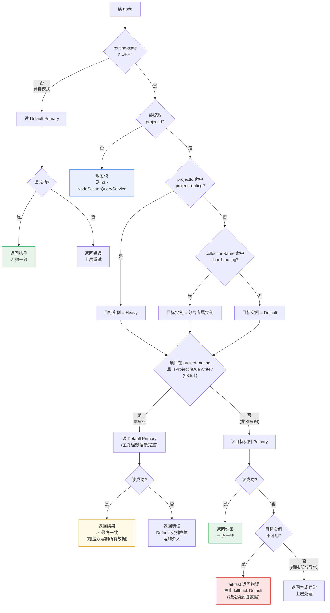

| 阶段 | 项目路由状态 | 读取目标 | 一致性语义 | 故障处理 |
| --- | --- | --- | --- | --- |
| 兼容 | routing-state=OFF | Default Primary | 强一致 | Default 故障→业务中断 |
| 双写期 | project-routing 命中, DUAL_WRITE | **Default Primary** | 最终一致(完整) | Default 故障→业务中断；Heavy 故障不影响读 |
| 切流后 | project-routing 命中, ROUTED | Heavy Primary | 强一致 | Heavy 故障→fail-fast, 禁止 fallback Default |
| 未路由 | 未命中任何路由 | Default Primary | 强一致 | Default 故障→业务中断 |
| 无 projectId | 无法提取 | 散发所有实例（`scatterTemplate`，默认 Primary；URI 加 `readPreference=secondaryPreferred` 可走 Secondary） | 最终一致 | 见 §3.7 |

### 3.7 无项目条件的查询（散发读）

`NodeDao.pageBySha256`、`NodeDao.listBySha256` 没有 `projectId`，按项目分库后必须散发到所有实例。

#### 3.7.0 业务场景分析

> **散发读不是后台统计，是业务调用路径。超时静默返回部分结果会导致"数据不完整而调用方无感知"。**

| 入口 | 调用链 | 业务场景 | 数据完整性要求 |
| --- | --- | --- | --- |
| `UserNodeController` → `GET /page?sha256=xxx` | 管理员按 sha256 查所有引用该内容的节点 | **去重溯源**：查找同一 sha256 在哪些项目/仓库中被引用 | **高**：遗漏 = 溯源结果不完整，运维决策可能出错 |
| `NodeController.listPageNodeBySha256` | 服务间调用 | 内部服务按 sha256 查找节点引用 | **高** |
| `NodeBaseService.listNodeBySha256` | 被 `ArtifactPreloadPlanServiceImpl` 调用 | 制品预加载计划：根据 sha256 定位目标节点做预加载 | **中**：遗漏个别节点不影响整体预加载效果 |

**结论**：所有散发读场景均为业务链路，默认使用 **STRICT** 模式（超时抛错让调用方重试），而非静默返回不完整结果。

**超时配置**：

| 参数 | 默认值 | 说明 |
| --- | --- | --- |
| `timeout-seconds` | 5 | `CompletableFuture.allOf().get(timeout)` 的总等待时间。实例数增加时适当调大 |
| `mode` | STRICT | STRICT：超时抛 `BadRequestException`；DEGRADE：返回已完成分片结果 + 告警 |

```yaml
# 模式/超时（NodeRoutingConfiguration @Value，rule 级）
spring.data.mongodb.multi-instance.rules.node.scatter-query:
  default-mode: STRICT       # STRICT | DEGRADE
  timeout-seconds: 5         # 散发查询总超时（秒），默认 5

# 连接池（MongoMultiInstanceProperties.scatterQuery，全局）
spring.data.mongodb.multi-instance.scatter-query:
  dedicated-max-pool-size: 10
  dedicated-min-pool-size: 2
```

**关键澄清："追加 projectId 过滤"的值从哪来？**

> 流程图中的 projectId 过滤条件**并非从用户查询中提取**——用户的查询里根本没有 `projectId`。
> 过滤值来自 **`MongoRoutingRegistry`** 的路由配置（从 Consul KV `spring.data.mongodb.multi-instance` 加载）：
>
> ```
> MongoRoutingRegistry.projectsByInstance("node")
>   → "heavy1" → {"projectA", "projectB"}   ← 已进入 ROUTED 的项目
>   → "heavy2" → {"projectC"}               ← 已进入 ROUTED 的项目
>
> MongoRoutingRegistry.routedProjectIds("node")
>   → {"projectA", "projectB", "projectC"}  ← 所有已迁出的项目集合
> ```
>
> 散发读的构建逻辑（见 `NodeScatterQueryService.buildScatterGroups()`）：
> 1. **Default scatterTemplate**：追加 `projectId NOT IN {projectA, projectB, projectC}` → 排除所有已迁出项目，避免与 Heavy 实例重复
> 2. **Heavy-1 scatterTemplate**：追加 `projectId IN {projectA, projectB}` → 只查本实例承载的迁入项目
> 3. **Heavy-2 scatterTemplate**：追加 `projectId IN {projectC}` → 同上
>
> 每个项目进入 `ROUTED` 后，散发读的 projectId 过滤值自动变更；仅写入 `project-routing` 但未切流的项目仍留在 Default 查询组。

**散发查询专用连接**：散发查询与 Batch 读使用各实例 `instances.*.uri` 构建的独立 `MongoTemplate` Bean（`scatterTemplate`），**不污染业务读写的连接池**。job 服务如需走 Secondary 卸流，在 Consul `config/job/` 覆写对应实例 URI 追加 `readPreference=secondaryPreferred` 即可，与 Default 实例覆写逻辑一致。

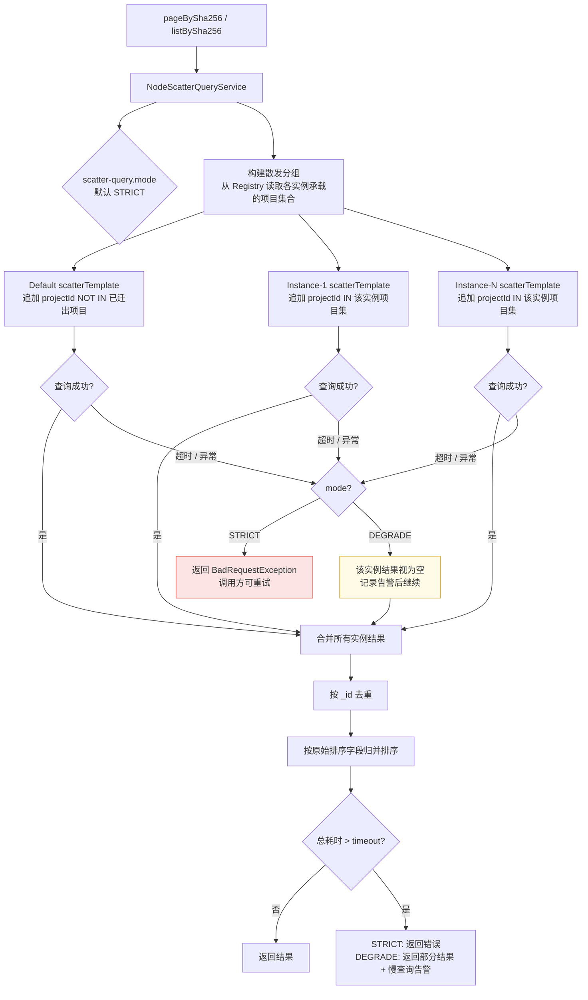

散发查询异常场景（默认 STRICT，可配置为 DEGRADE）：

| 场景 | STRICT | DEGRADE | 结果完整性 |
| --- | --- | --- | --- |
| 所有实例正常返回 | 合并去重排序 | 同左 | 完整 |
| 部分实例超时 | **抛 BadRequestException**，调用方重试 | 超时实例视为空，其余合并 + 告警 | STRICT：显式失败；DEGRADE：部分缺失 |
| 部分实例异常 | **抛 BadRequestException** | 异常实例视为空，其余合并 + 告警 | 同左 |
| 所有实例超时 | 抛异常 | 返回空结果 + 错误码 | 不可用 |
| Default 实例异常 | 抛异常 | Default 部分缺失，Heavy 结果合并 | STRICT：显式失败 |
| 散发实例数过多（> 10） | 分批并发，每批最多 10 个 | 同左 | 完整但延迟高 |
| 深度分页（offset > 10000） | 拒绝执行 | 同左 | - |

**查询完整性模式**

| 模式 | 部分实例失败时 | 适用 API |
| --- | --- | --- |
| `STRICT`（默认） | 抛 `BadRequestException`，不返回不完整结果，调用方可感知并重试 | `pageBySha256`（去重/溯源）、`listBySha256` |
| `DEGRADE` | 超时实例视为空，合并其余结果 + 告警 | 明确标注可降级的只读统计类接口 |

封装为 `NodeScatterQueryService`，不在 `NodeDao` 内假设单一 `MongoTemplate`。

#### 3.7.1 散发查询性能退化量化分析

分库后散发查询从单实例变为多实例并发，需对性能退化做量化评估。

**RT 退化模型**：

```
总 RT = max(各实例 RT) + merge_cost
其中 merge_cost = O(N * log(k))，N 为结果总数，k 为实例数
```

| 场景 | 分库前 RT | 分库后预估 RT | 退化倍数 |
| --- | --- | --- | --- |
| 单实例 + 小结果集（< 1K 条） | 50ms | 80ms（并发查询 50ms + merge 30ms） | ~1.6x |
| 单实例 + 中等结果集（1K~10K 条） | 200ms | 350ms | ~1.7x |
| 单实例 + 大结果集（> 10K 条） | 800ms | 1200ms+（最慢实例决定） | ~1.5x+ |
| 某实例慢查询（索引缺失） | — | 3s（超时）→ 降级返回 | 部分缺失 |
| 3 个 Heavy 实例 + 冷数据 | — | Default 实例可能成为瓶颈（数据量最大） | 取决于 Default RT |

**关键风险**：

| 风险 | 说明 | 缓解措施 |
| --- | --- | --- |
| Default 实例拖慢全局 | Default 承载所有未迁出项目，数据量远大于单个 Heavy | 监控 Default 的 `NOT IN` 查询执行计划，必要时为 `projectId` 建复合索引 |
| 合并内存溢出 | 大结果集合并时 `seen` 集合可能撑爆堆内存 | 合并时流式处理，逐批去重而非全量加载 |
| 连接池竞争 | 散发查询并发占用多个实例的连接 | 散发查询专用连接池（独立于业务读写池） |
| 深度分页放大 | `pageBySha256(offset > 10000)` 在各实例分开执行，总扫描量 = 实例数 × offset | 已拒绝执行（§3.7），但需在调用方增加 early return |

**缓解措施**：

| 措施 | 优先级 | 说明 |
| --- | --- | --- |
| 散发查询实例级超时硬限制 | 🔴 必须 | 单实例查询超时上限 = `scatter-timeout-ms`（默认 3s），防止某实例拖垮整个请求 |
| 合并去重流式处理 | 🟡 推荐 | 使用 `Sequence` 流式合并 + 惰性去重，避免大结果集 OOM |
| 散发查询独立连接池 | 🟡 推荐 | 避免散发查询耗尽业务读写的连接 |
| Default `projectId NOT IN` 索引优化 | 🟡 推荐 | 确保 `{ projectId: 1 }` 索引覆盖 `NOT IN` 过滤 |
| 可选的服务端聚合视图 | 🟢 评估 | 对高频查询场景评估是否需要在某 Heavy 实例建聚合视图 |

**`projectId NOT IN` 索引注意事项**：

`NOT IN` 查询在 MongoDB 中可能退化为全表扫描（取决于优化器选择）。建议：

```javascript
// 确保 projectId 上有索引（现有分表策略已建）
db.node_188.createIndex({ projectId: 1 })

// 对于 projectId NOT IN 查询，MongoDB 可能使用 IXSCAN + FETCH
// 如果退化为 COLLSCAN，考虑使用 $nin 替代 NOT IN（语义等价但优化器行为可能不同）
// 或在应用层将 NOT IN 拆为"全量查询 + 应用层过滤"（当排除项目数较少时更高效）
```

**监控指标**（详见 §22）：

| 指标 | 阈值 | 说明 |
| --- | --- | --- |
| `scatter_query_count` | — | 散发查询调用量 |
| `scatter_query_rt_p99` | > 2s 告警 | 散发查询 P99 延迟 |
| `scatter_query_partial_count` | > 0 告警 | 部分实例超时/失败的次数 |
| `scatter_query_merge_oom` | > 0 告警 | 合并阶段 OOM 次数 |
| `scatter_instance_rt_p99` | > 1s 告警 | 按实例维度统计的 RT（定位瓶颈实例） |

#### 3.7.2 `projectId` 过滤策略

Default 侧 Job / 散发查询默认使用 `projectId NOT IN [已迁出项目]`。已迁出项目数增多时，优化器可能退化或执行计划不稳定。

| 场景 | 策略 |
| --- | --- |
| 默认 | `projectId NOT IN [ROUTED 项目列表]` |
| 已迁出项目数较多 | 继续使用 `NOT IN`，并监控 `explain` |
| 需要白名单优化 | 仅在接入真实 active project 列表后启用，不从 `project-routing` 反推 |

```kotlin
fun buildDefaultProjectFilter(routedOut: Set<String>): Criteria {
    return Criteria.where("projectId").nin(routedOut)
}
```

不能用 `project-routing.keys - routedOut` 反推未迁出项目：`project-routing` 只是迁移绑定集合，不包含所有 Default 项目。

### 3.8 Job 设计

#### 3.8.1 核心原则

- 读：从各实例从库读取各自承载的项目子集。
- 写：写回数据所在项目对应的主库。
- Default 不重复扫描已迁出项目；Heavy 只扫描迁入项目。

#### 3.8.2 BatchQueryGroup

```kotlin
data class BatchQueryGroup(
    val mongoTemplate: MongoTemplate,
    val collectionNames: List<String>,
    val criteriaCustomizer: (Query) -> Query
)
```

`NodeBatchQueryHelper` 自动为每个实例生成分组，Job 代码无需感知实例数量：

```text
Default:
  criteria: originalCriteria AND projectId 过滤（NOT IN 或 IN 白名单，见 §3.7.2）

Heavy1:
  criteria: originalCriteria AND projectId IN [projectA]
```

#### 3.8.3 Job 执行流程

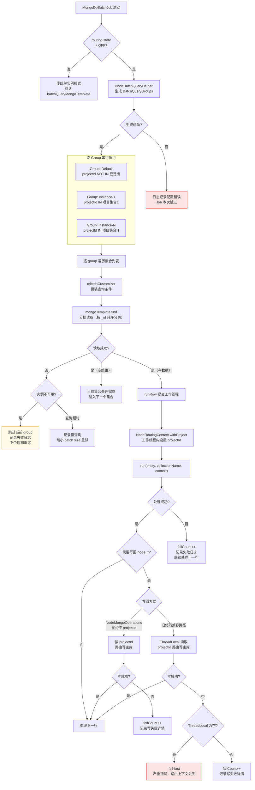

Job 执行异常场景：

| 场景 | 处理 | 影响范围 |
| --- | --- | --- |
| 某实例从库不可用 | 跳过该 group，其他 group 继续 | 该实例承载的项目本周期不处理 |
| 查询超时 | 缩小 batch size 重试，仍超时则跳过 | 该集合本周期不处理 |
| 单行处理失败 | failCount++，继续下一行 | 单行数据本周期不处理 |
| 写回路由上下文丢失 | fail-fast，记录严重错误 | 当前行写失败 |
| 写回目标主库不可用 | failCount++，记录详情 | 该实例写操作全部失败 |
| group 生成失败（配置错误） | Job 整体跳过，记录配置错误 | 所有项目本周期不处理 |

#### 3.8.4 Job 写回

优先使用显式 `projectId` 接口：

```kotlin
interface NodeMongoOperations {
    fun remove(projectId: String, query: Query, collectionName: String): DeleteResult
    fun updateFirst(projectId: String, query: Query, update: Update, collectionName: String): UpdateResult
    fun updateMulti(projectId: String, query: Query, update: Update, collectionName: String): UpdateResult
    fun upsert(projectId: String, query: Query, update: Update, collectionName: String): UpdateResult
    fun findAndModify(projectId: String, query: Query, update: Update, collectionName: String): TNode?
    fun bulkOps(projectId: String, collectionName: String): BulkOperations
}
```

凡写 `node_*` 的代码必须满足其中之一：

- 显式传入 `projectId` 调用 `NodeMongoOperations`
- 在 `MongoDbBatchJob.runRow()` 工作线程内，由 `NodeRoutingContext` 注入 `projectId`

不满足时一律 fail-fast，禁止默认写 Default。

Job 适配方式（直接写 `node_*` 的代码路径）：

| Job / 组件 | 写操作 | projectId 来源 | 适配方式 |
| --- | --- | --- | --- |
| `DeletedNodeCleanupJob` | `remove`, `updateFirst` | `row.projectId` | 直接传入 `NodeMongoOperations` |
| `NodeCopyJob` | `updateFirst` | `row.projectId` | 直接传入 |
| `DeletedRepositoryCleanupJob` | `updateMulti` | Repository 行含 `projectId` | 直接传入 |
| `NodeFolderStat` | `bulkOps.updateOne` | 统计上下文中的 `projectId` | 显式保存 projectId 并传入 |
| `EmptyFolderCleanup` | `updateFirst` | `StatNode.projectId` | 显式传入 |
| `BackupNodeDataHandler` | `updateFirst` | 备份上下文含 `projectId` | 注入 `NodeMongoOperations` |
| `DataRestorerImpl`（separation） | `updateFirst` | 分离任务含 `projectId` | 注入 `NodeMongoOperations` |
| `AbstractHandler`（separation） | `updateFirst` | 分离任务含 `projectId` | 注入 `NodeMongoOperations` |

间接通过 `nodeService` 写 `node_*` 的 Job（无需 Job 层改造，由 `NodeDao` 路由覆盖）：

| Job | 写操作 | 说明 |
| --- | --- | --- |
| `ExpiredNodeMarkupJob` | `nodeService.deleteNode()` | NodeService → NodeDao，路由在 DAO 层生效 |
| `PipelineArtifactCleanupJob` | `nodeService.deleteBeforeDate()` | 同上 |

旧代码无法快速改造的路径，使用 `NodeRoutingContext` 兼容，逐步替换。

#### 3.8.5 NodeCommonUtils 改造

当前 `NodeCommonUtils` 使用 `companion object` 持有静态 `mongoTemplate`：

```kotlin
companion object {
    lateinit var mongoTemplate: MongoTemplate
    // findNodes / nodeExist / buildNodeBloomFilter
    // 等方法全部使用此静态引用
    private val workPool = ThreadPoolExecutor(...)
}
```

此模式无法支持多实例路由。改造方案：

**将 `NodeCommonUtils` 从 companion object 静态方法改为实例方法，
注入 `NodeMongoRoutingRegistry`**，按需获取对应实例的 template。

```kotlin
@Component
class NodeCommonUtils(
    private val routingRegistry: NodeMongoRoutingRegistry,
    private val defaultTemplate: MongoTemplate,
) {
    // 不再使用 companion object 静态引用
}
```

各方法改造：

| 方法 | 改造方式 |
| --- | --- |
| `findNodes(query, storageCredentialsKey)` | Query 带 `projectId` 时通过 registry 路由到对应实例；无 `projectId` 时散发所有实例 |
| `forEachByCollectionParallel` | 接受 `BatchQueryGroup` 列表或显式 `(template, criteria)` 对；内部按 group 并发 |
| `buildNodeBloomFilter` | 散发到所有实例，每个实例用对应路由 template（job 服务在 Consul 覆写 URI 加 `readPreference=secondaryPreferred` 即可走 Secondary，与 Default 实例覆写逻辑一致） |
| `nodeExist` | 通过 registry 获取所有实例 template，逐实例查询 |
| `workPool` 线程池 | submit 时将 `(template, collectionName)` 作为任务参数显式传入，不依赖外层引用 |
| `findByCollection` | 已支持传入 `mongoTemplate` 参数，保持不变 |

影响范围：所有调用 `NodeCommonUtils.Companion.xxx()` 的代码
需改为注入 `NodeCommonUtils` 实例后调用。涉及文件约 10+，
需逐一排查替换。

| Job | 适配方式 |
|---|---|
| `DeletedNodeCleanupJob` | `row.projectId` 已有，直接传入 `NodeMongoOperations` |
| `NodeCopyJob` | 行实体含 `projectId`，直接传入 |
| `DeletedRepositoryCleanupJob` | Repository 行含 `projectId`，直接传入 |
| `NodeFolderStat` / `EmptyFolderCleanup` | 在统计上下文中显式保存 `projectId` |
| 旧代码无法快速改造的 | 使用 `NodeRoutingContext` 兼容路径，逐步替换 |

#### 3.8.6 各阶段 Job 写目标与同步机制

**核心原则**：Job 写 `node_*` 的目标实例由路由框架根据项目当前迁移阶段自动决定，
但**数据同步到 Heavy 是由一个独立进程（`MigrationSyncJob`）完成的，而非 Job 自身负责**。

##### 各阶段写目标与同步路径

| 迁移阶段 | 项目在 `project-routing` 中？ | `NodeMongoOperations(projectId)` 写目标 | 数据同步到 Heavy 的路径 |
| --- | --- | --- | --- |
| INITIAL_SYNC | ✅ 已配置（与 DUAL_WRITE 同时启动）| 主路径 **Default Primary** + 副路径 **Heavy Primary** | ① SyncJob 全量扫 Default Secondary → `$setOnInsert` Heavy<br>② 双写副路径同步/补偿写 Heavy（携带主路径 `_id`） |
| DUAL_WRITE | ✅ 已配置 | 主路径 **Default Primary** + 副路径写 Heavy | 业务写落 Default；补偿队列异步追平 Heavy |
| ROUTED ~ CLEANUP | ✅ 已配置 | **Heavy Primary** | Job 直接写 Heavy；Default 已是僵尸 |

##### INITIAL_SYNC 期间的同步时序

```
              运维 Consul: routing-state=DUAL_WRITE + project-routing
                     │
              POST /migration/start（INIT 校验 → INITIAL_SYNC）
                     │
    ─────────────────┼────────────────────────────────────────────▶ 时间
                     │
    ┌────────────────┼────────────────────────────────────┐
    │  DUAL_WRITE     │  INITIAL_SYNC                      │
    │  业务写 Default  │  全量扫 Default 从库               │
    │  (主路径)        │  $setOnInsert 写入 Heavy          │
    │  副路径写 Heavy  │  (已存在文档不覆盖)                │
    └────────────────┴────────────────────────────────────┘

Heavy 的数据由两条 Default→Heavy 路径覆盖：
  - 新写入（双写副路径）→ 携带主路径 _id 同步/补偿写入 Heavy ✅
  - 存量数据 → INITIAL_SYNC 扫描 → $setOnInsert 到 Heavy ✅
  - 副路径与扫描重叠的文档 → 同 _id，$setOnInsert / duplicate key 跳过（不覆盖）✅
```

> **一致性保证**：
> 1. **`$setOnInsert`** 确保全量扫描不覆盖双写已写入的新数据。
> 2. **`_id` 必须是 `ObjectId`（单调递增）**（§3.9.2）——确保按 `_id` 升序分页不遗漏后续插入的文档。
> 3. 双写补偿队列为零后，两侧数据达到最终一致，可进入 ROUTED。

> **⚠️ 这是一个最终一致模型**。
> INITIAL_SYNC 期间，存量数据逐步写入 Heavy。已扫描区间的旧数据在 Heavy 立即可见；未扫描区间的数据需等待扫描到达。
> 全量扫描完成后，补偿队列清零，两侧数据达到最终一致。

##### 路由原理

INITIAL_SYNC 与 Consul 双写并发：运维在 `POST /migration/start` **之前**将项目加入 `project-routing` 并设 `routing-state=DUAL_WRITE`。
此时 `NodeMongoOperations(projectId)` 命中 `project-routing=是`，写主路径为 **Default Primary**、副路径同步写 **Heavy Primary**；读走 **Default Primary**（§1.3），保证存量未扫完前旧数据可见。

DUAL_WRITE 阶段（DB `phase` 由 Job 自动推进）路由配置不变，`NodeMongoOperations(projectId)` 行为同上。

这一机制确保了：
- **双写与全量扫描并发**，扫描期间增量不丢（§1.6.2）
- **读走 Default**，Heavy 存量未齐时不影响读一致性（§1.3）
- **Job 代码零感知**：阶段变化由路由框架和 Consul 驱动，Job 仅需调用 `NodeMongoOperations(projectId)`

### 3.9 历史数据迁移

> 统一框架见 **§1.6**；本节为 `MigrationSyncJob` 实现细节与 §3.9.1 状态机。

#### 3.9.1 迁移状态机

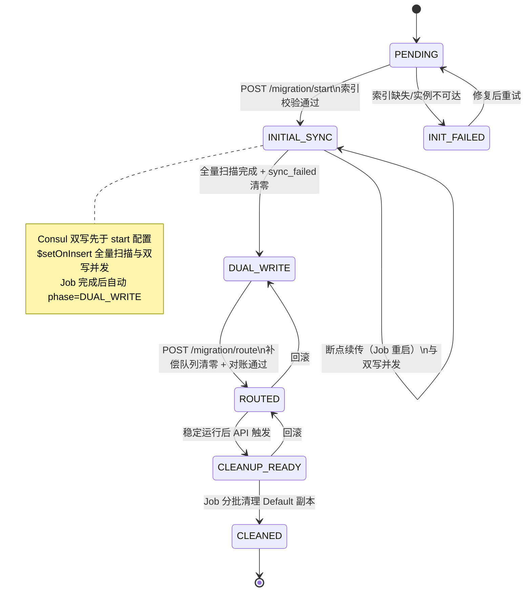

#### 3.9.2 各阶段动作与异常处理

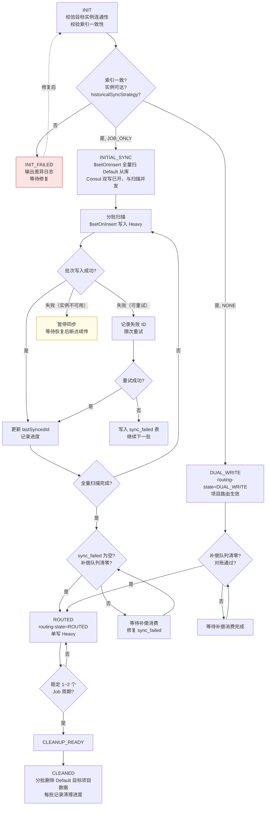

各状态异常与恢复：

| 状态 | 可能异常 | 自动恢复 | 处理 |
| --- | --- | --- | --- |
| INIT | 索引缺失 | 否 | 输出差异，等待手动创建索引 |
| INIT | `_id` 类型非 ObjectId | 否 | 输出告警；JOB_ONLY 按 `_id` 升序分页依赖 ObjectId 前 4 字节为时间戳，非 ObjectId 时需确认 `_id` 值是否单调递增 |
| INIT | 实例不可达 | 否 | 等待运维恢复网络/实例 |
| INITIAL_SYNC | Job 重启 | 是 | lastSyncedId 断点续传 |
| INITIAL_SYNC | 单批 `$setOnInsert` 失败 | 是 | 限次重试，超限写 sync_failed |
| INITIAL_SYNC | Heavy 实例不可用 | 否 | 暂停，恢复后断点续传 |
| INITIAL_SYNC | Default 从库切换 | 是 | 重新连接，继续扫描 |
| DUAL_WRITE | 补偿积压 | 否 | 等待消费完成，不允许切流 |
| CLEANED | 清理中 Heavy 故障 | 否 | 立即停止清理，恢复 Heavy |

> **JOB_ONLY 断点续传的 `_id` 单调性前提**：`lastSyncedId` 按 `_id` 升序分页扫描依赖一个关键假设——**`_id` 是单调递增的**。
> MongoDB 默认 `ObjectId` 前 4 字节为 Unix 时间戳，满足此假设。但如果业务自定义 `_id`（非 ObjectId），需确认自定义 `_id` 是否为单调递增。
> `INIT` 阶段校验 `_id` 类型为 ObjectId 可确保此前提成立。若 `_id` 非 ObjectId：
> 1. 使用 `_id` 排序扫描仍可工作，但新插入的文档可能落在已扫描区间之前（如果 `_id` 非单调）
> 2. 建议改用 `createdDate` 字段做断点续传（需确保该字段上有索引）
> 3. move/copy 操作会创建新 `_id`（ObjectId），不破坏单调性（新 `_id` 更大）

> **`$setOnInsert` 语义说明**：全量扫描与双写并发期间，存量文档可能已被双写路径写入 Heavy。
> `$setOnInsert` 确保扫描遇到已存在文档时**不覆盖**，仅对尚未写入的文档执行插入。
> 全量扫描结束后 Heavy 侧数据 = 存量 + 双写增量，与 CATCH_UP 方案达到相同一致性结果，且无 oplog 窗口依赖。

全部满足后才允许进入清理：

| 条件 | JOB_ONLY 模式 | NONE 模式 |
| --- | --- | --- |
| 目标项目路由 | 已在 Heavy 实例稳定路由 | 已在 Heavy 实例稳定路由 |
| 双写关闭 | `routing-state=ROUTED` 后已运行 1~2 个完整 Job 周期 | 同左 |
| 历史同步完成 | `node_project_sync_failed` 队列为空 | 不涉及（无历史迁移） |
| Default 历史数据 | 全量已迁移至 Heavy | 仍在 Default，需确保双写期内无遗漏 |
| 人工确认 | 回滚方案（清理后需走反向同步） | 回滚方案（清理后需走反向同步 + Default 历史数据回归） |

清理方式（分批，按 `_id` 范围分段）：

```javascript
db.node_188.deleteMany({ projectId: "projectA", _id: { $lt: maxCleanedId } })
```

#### 3.9.5 Default 侧残留数据（僵尸副本）生命周期

项目迁出后，**`node_188` 等集合名会同时存在于 Default 与 Heavy**，两侧承载不同 `projectId` 子集，不是数据重复故障，而是设计使然。

```text
阶段              Default.node_188              Heavy.node_188
─────────────────────────────────────────────────────────────────
INITIAL_SYNC      projectA+B+C（权威源）         projectA（副本写入中）
DUAL_WRITE        projectA+B+C（主路径+新写入）  projectA（副路径副本，同步中）
ROUTED            projectA（僵尸副本，只读遗留）  projectA（权威源）
CLEANED           projectB+C                    projectA
```

**僵尸副本定义**：ROUTED 之后、CLEANUP 之前，Default 上已迁出项目的数据副本。业务读写已不再访问，仅作回滚保险。

**各阶段约束**

| 阶段 | Default 上迁出项目数据 | 允许的操作 | 禁止的操作 |
| --- | --- | --- | --- |
| DUAL_WRITE | 与 Heavy 同步中（最终一致） | 双写 update/delete；Job 扫描带 `NOT IN` | 仅对 Default 副本单独 delete 而不走双写 |
| ROUTED ~ CLEANUP | 僵尸副本，不再更新 | 对账抽样；ROUTED 后写 Default 被 Zombie 写保护拦截（§25.2.2） | 任何 Job/脚本对 Default 上迁出项目做 delete/update |
| CLEANUP | 分批删除中 | `deleteMany({ projectId })` 按进度清理 | 误删同集合其他项目（必须带 projectId 条件） |
| CLEANED | 仅未迁出项目 | 正常 Job 扫描 | — |

**Job 与运维硬约束**

- 所有扫描 Default 的 Job **必须**带 `projectId NOT IN [已迁出项目]`（§3.8.2），ROUTED 后不得处理迁出项目。
- 运维手动脚本清理 Default 时 **必须**带 `projectId` 过滤；禁止 `db.node_188.drop()` 或无条件 `deleteMany`。
- 散发查询在 ROUTED 后仍可能扫 Default（未迁出项目 + 历史 sha256），但 **不得**依赖 Default 上迁出项目的数据（读路径已切 Heavy）。

**与回滚的关系**

| 状态 | Default 僵尸副本作用 |
| --- | --- |
| ROUTED（未清理） | 僵尸副本存在但不再更新；回滚需反向迁移（§25.4.3），不属应急操作 |
| CLEANED | 僵尸副本已删除，回滚需 Heavy 全量反向同步，成本高 |

**ROUTED → CLEANUP 最大停留时间硬性约束**

ROUTED 之后 Default 上迁出项目数据沦为"僵尸副本"——不再更新但占用磁盘。
僵尸副本停留时间越长，累积的增量差异越大，回滚成本越高。必须设置硬性上限：

```yaml
spring.data.mongodb.multi-instance.rules.node:
  cleanup:
    # ROUTED 后必须在 max-zombie-hours 内启动清理，超时告警升级
    max-zombie-hours: 168  # 默认 7 天
    # 超时动作：WARN（仅告警）/ BLOCK（阻断后续项目迁移，防止多项目僵尸累积）
    zombie-timeout-action: BLOCK
```

```kotlin
/**
 * ponytail: 分布式互斥由 ShedLock（JobAutoConfiguration 已配置 @EnableSchedulerLock）保证，
 * @SchedulerLock 一行解决多 Pod 并发问题，无需手写 findAndModify。
 */
@Component
class ZombieReplicaMonitor(
    private val defaultMongoTemplate: MongoTemplate,
) {
    @Scheduled(fixedDelay = 21_600_000)  // 每 6 小时检查一次
    @SchedulerLock(name = "zombie_replica_check", lockAtMostFor = "PT30M")
    fun checkZombieReplicas() {
        val zombieProjects = defaultMongoTemplate.find(
            Query(Criteria.where("phase").`is`("ROUTED")),
            Document::class.java,
            "mongo_migration_sync_state",
        ).filter { doc ->
            val updatedAt = doc.getDate("updatedAt") ?: return@filter false
            Duration.between(updatedAt.toInstant(), Instant.now()).toHours() > config.maxZombieHours
        }

        if (zombieProjects.isNotEmpty()) {
            val msg = zombieProjects.joinToString("\n") { doc ->
                val projectId = doc.getString("projectId")
                val updatedAt = doc.getDate("updatedAt")
                "projectId=$projectId, zombieHours=" +
                    "${Duration.between(updatedAt.toInstant(), Instant.now()).toHours()}h"
            }
            when (config.zombieTimeoutAction) {
                ZombieTimeoutAction.WARN -> alarm("Zombie replicas exceeded max retention: $msg")
                ZombieTimeoutAction.BLOCK -> {
                    alarm("Zombie replicas BLOCKED: $msg. " +
                        "New project migration suspended until cleanup completes.")
                    migrationGate.close()
                }
            }
        }
    }
}
```

**僵尸副本磁盘冗余监控**：

```kotlin
/**
 * 仅在存在僵尸项目时才触发，避免常态下扫集合元数据。
 * 同样使用 ShedLock 保证多实例互斥，每 6 小时检查一次。
 */
@Component
class ZombieDiskMonitor(
    private val defaultMongoTemplate: MongoTemplate,
) {
    @Scheduled(fixedDelay = 21_600_000)  // 每 6 小时
    @SchedulerLock(name = "zombie_disk_check", lockAtMostFor = "PT30M")
    fun checkZombieDiskUsage() {
        // ponytail: 僵尸副本正常情况下为 0，常态不触发磁盘扫描
        val zombieCount = defaultMongoTemplate.count(
            Query(Criteria.where("phase").`is`("ROUTED")),
            "mongo_migration_sync_state",
        )
        if (zombieCount == 0L) return

        val zombieProjects = defaultMongoTemplate.find(
            Query(Criteria.where("phase").`is`("ROUTED")),
            Document::class.java,
            "mongo_migration_sync_state",
        )
        for (doc in zombieProjects) {
            val projectId = doc.getString("projectId")
            val size = estimateZombieSize(projectId, NODE_COLLECTION_NAMES)
            if (size > config.maxZombieDiskBytes) {
                alarm("Zombie replica disk exceeds threshold: " +
                    "projectId=$projectId, size=${size / 1024 / 1024 / 1024}GB")
            }
        }
    }

    // 按 projectId 统计 Default 上僵尸副本的数据量
    private fun estimateZombieSize(projectId: String, collectionNames: List<String>): Long {
        return collectionNames.sumOf { col ->
            defaultMongoTemplate.estimatedCount(
                Query.query(Criteria.where("projectId").`is`(projectId)), col
            ) * AVG_DOC_SIZE_BYTES  // 约 512 bytes/doc
        }
    }
}
```

### 3.10 滚动升级流程

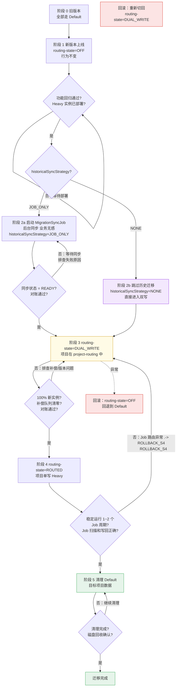

滚动发布并存行为（`routing-state=DUAL_WRITE` 阶段）：

> **硬门禁**：为某项目开启 `DUAL_WRITE` 前，必须 **100% 实例已部署路由代码且配置已刷新到最新版本**。禁止在新旧实例并存时进入双写——旧实例只写 Default 且双写期 CATCH_UP 已暂停（§3.15.7），Heavy 将缺失旧实例写入；双写期读走 Default Primary（§1.3），但**仍须消灭旧实例写入窗口**。

**监测方案：Prometheus 指标上报，不逐实例调 HTTP 接口**

多服务 × 多实例场景下对每个实例调 `GET /routing/readiness` 完全不可行。改用指标上报：

```text
每个实例启动 / @RefreshScope 刷新配置后上报 Gauge 指标：
  bkrepo_mongo_routing_config_version{rule="node", service="generic"} 42

运维进入 DUAL_WRITE 前查询 Prometheus：
  # 所有实例的 config-version 是否都 >= min-config-version？
  count(bkrepo_mongo_routing_config_version{rule="node"} >= $minConfigVersion)
  == count(bkrepo_mongo_routing_config_version{rule="node"})

  # 或更简单：是否存在低于目标版本的实例？
  bkrepo_mongo_routing_config_version{rule="node"} < $minConfigVersion
  # 该查询结果为空 → 全部就绪
```

| 检查项 | 方式 | 说明 |
| --- | --- | --- |
| 所有实例已更新 | 发布系统确认（如蓝盾/蓝鲸 PaaS 发布状态） | 确认所有实例已完成部署并启动 |
| 配置热加载就绪 | Prometheus 指标 `bkrepo_mongo_routing_config_version` | 每实例自主上报，运维查 Prometheus 一次获取集群全貌 |
| 路由代码就绪（G-34） | 同上指标 + `GET /routing/readiness`（仅需**抽一个实例**验证） | G-34 P0 清单完整性与版本无关，上任一实例验证即可 |

`MigrationGate` 不做集群实例自动校验，由**运维 SOP + Prometheus 看板**确认。

| 实例类型 | 读（迁出项目，双写期） | 写 | 说明 |
| --- | --- | --- | --- |
| 旧实例（无路由代码） | — | — | **双写前必须摘流/更新完毕**，不得与双写并存 |
| 新实例（项目 `status=DUAL_WRITE`） | **Default Primary** | Heavy Primary + Default Primary | 读走 Default，与 §1.3 一致 |
| 新实例（项目未命中路由） | Default Primary | Default Primary | 未迁出项目行为不变 |
| MigrationSyncJob | Default Secondary | Heavy Primary（upsert） | 仅在 `INITIAL_SYNC` / `CATCH_UP` 阶段运行 |

**CATCH_UP 与双写的时序**（修正：双写期不运行 Change Stream）

| 阶段 | Change Stream（CATCH_UP） | 旧实例写入 Default 如何到 Heavy |
| --- | --- | --- |
| `INITIAL_SYNC` → `CATCH_UP` → `READY` | ✅ 运行，Default → Heavy 追增量 | CATCH_UP 同步 |
| `DUAL_WRITE` | ❌ **暂停**（§3.15.7） | 仅新实例双写 Heavy+Default；**无旧实例** |
| `ROUTED` 后 | ❌ 停止 | 单写 Heavy |

并存期数据流（**仅在 READY 前、双写开启前**可能存在旧实例 + CATCH_UP）：

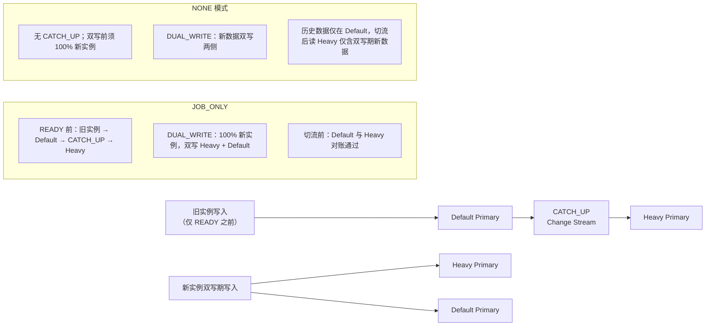

**JOB_ONLY**：Change Stream 仅在进入 `DUAL_WRITE` **之前**将 Default 变更同步到 Heavy；**进入 `DUAL_WRITE` 后 CATCH_UP 必须暂停**，一致性仅由双写 + 补偿队列保证。

**NONE 模式**：无 Change Stream；开启双写前须完成 100% 新实例部署，历史数据保留在 Default，切流后通过完整迁移或接受散发查询合并两侧。

### 3.11 回滚策略

#### 3.11.1 主动回滚（运维决策）

**核心约束**：

- **`routing-state=OFF` 即可完成的回滚**：仅当 Default 数据完整时可行（阶段 1~3）。关路由后业务立即恢复，无需数据搬迁。
- **ROUTED 之后（阶段 4+）的回滚本质是反向迁移**：Default 已非权威数据源，Heavy 有独占写入。此时回滚需要 Heavy→Default 反向同步 + 对账，等价于重新执行一次迁移（方向相反），**不是运维点个按钮就能完成的操作**，须按迁移流程重新规划。
- **Heavy 实例故障 ≠ 业务层回滚**：实例级故障由 DBA 恢复（副本集自动选举、从库补位），业务层不应擅自反向同步数据。§3.11.2 被动应急覆盖实例故障场景。

**可安全回滚的阶段**：

```
阶段 1 (OFF)              阶段 2 (同步中)           阶段 3 (DUAL_WRITE)
routing-state 未开启       数据正在同步              双写进行中
                                                                    
Default: ✅ 权威           Default: ✅ 权威          Default: ✅ 有全量
Heavy: 未使用              Heavy: 部分数据           Heavy: 有全量（双写）
                                                                    
回滚：无操作              回滚：停止 SyncJob         回滚：routing-state=OFF
      或停止 SyncJob            清理 Heavy              业务立即恢复
                              业务不受影响            Heavy 数据可后续清理
```

| 阶段 | 能否简单回滚 | 回滚动作 | 数据风险 | 业务中断 |
| --- | --- | --- | --- | --- |
| 1 OFF | ✅ | 无需操作 | 无 | 0 |
| 2 同步中 | ✅ | 停止 SyncJob，清理 Heavy | 无（Default 完整） | 0 |
| 3 DUAL_WRITE | ✅ | `routing-state=OFF`，清理 Heavy | 无（Default 完整，双写期两侧一致） | 秒级 |
| 4 ROUTED（Default 未清理） | ❌ | 反向迁移（Heavy→Default），非一键操作 | 需对账 | 分钟~小时 |
| 5 清理后 | ❌ | 全量反向迁移，Default 可能已部分清空 | 高 | 小时级 |

> **ponytail**: 阶段 3 是安全回滚的最后一站。阶段 4 开始回滚已不是"撤回"而是"反向迁移"，不纳入运维 SOP 的快速回滚范畴。如需从 ROUTED 回退，按 §25.4.3 反向迁移流程执行，不在本节重复。

#### 3.11.2 被动应急（Heavy 实例故障）

> **核心原则**：Heavy 实例故障是**基础设施问题**，由 DBA 恢复（副本集自动选举、从库补位、备份恢复），业务层不应擅自切换读写目标。下述各阶段仅说明影响面，非业务层应急操作。

| 阶段 | Heavy 角色 | Heavy 故障影响 | 业务层操作 | 恢复方式 |
| --- | --- | --- | --- | --- |
| 1 OFF | 未使用 | 无 | 无 | — |
| 2 同步中 | 仅 SyncJob 写入 | SyncJob 暂停，业务不受影响 | 无 | DBA 恢复 Heavy 后 SyncJob 断点续传 |
| 3 DUAL_WRITE | 副路径写入（Default 为主路径）| 双写副路径失败→**入补偿队列**，业务写不受影响（主路径 Default 成功）；补偿延迟增大 | 无 | DBA 恢复 Heavy 后补偿队列自动追平 |
| 4 ROUTED（未清理） | 读写唯一目标 | 迁出项目**读写全部不可用** | 无 | DBA 紧急恢复 Heavy |
| 4 ROUTED（清理后） | 读写唯一目标 | 迁出项目**读写全部不可用** | 无 | DBA 恢复 Heavy 或从备份恢复 |

> **ponytail**: 阶段 2-3 Heavy 故障影响可控（读不受影响），不是紧急事件。阶段 4+ 是严重故障但无业务层降级手段——落到 Default 会产生分裂脑数据（Default 自 ROUTED 后无新写入），后续"反向同步"比等 DBA 恢复 Heavy 更复杂。不实现 `fallback-before-cleanup` 临时降级，保持设计简洁。

#### 3.11.3 回滚决策矩阵

**判断准则**：Default 是否为当前权威数据源？

| 阶段 | Default 权威？ | 能否回滚 | 回滚动作 | 业务中断 |
| --- | --- | --- | --- | --- |
| 1 OFF | ✅ | ✅ | 无需操作 | 0 |
| 2 同步中 | ✅ | ✅ | 停止 SyncJob | 0 |
| 3 DUAL_WRITE | ✅ | ✅ | `routing-state=OFF` | 秒级 |
| 4 ROUTED（未清理） | ❌ Heavy 权威 | ❌ | 须反向迁移 | — |
| 4 ROUTED（清理后） | ❌ Heavy 权威 | ❌ | 须全量反向迁移 | — |

> **当 Default 不再是权威数据源时，"回滚"等价于一次方向相反的迁移**：需制定迁移计划、同步数据、对账通过后再切流。这不是应急操作，不纳入回滚 SOP。反向迁移流程见 §25.4.3。
>
> **Heavy 实例故障**（副本集宕机、主库切换等）由 DBA 恢复，不在业务层回滚范畴。临时降级方案见 §3.11.2。

#### 3.11.4 回滚后的补偿队列清理

阶段 3（DUAL_WRITE→OFF）回滚后，补偿队列中可能残留该项目的 PENDING 任务。回滚时必须按 `projectId` 删除这些任务，避免后续消费时在 Default 上执行与回滚后状态不一致的操作。

```kotlin
fun cleanupCompensationOnRollback(projectId: String) {
    val deleted = compensationQueue.deleteByProjectIdAndStatus(projectId, PENDING)
    if (deleted > 0) {
        alarm("回滚清理 $deleted 条补偿任务 projectId=$projectId")
    }
    // PROCESSING 状态的自然完成，不中断
}
```

### 3.12 异常场景穷举

#### 3.12.1 路由层异常

| 场景 | 自动恢复 | 处理 | 业务影响 |
| --- | --- | --- | --- |
| routing-state 误设非 OFF（实例未就绪） | 否 | 立即回退配置为 OFF | 目标项目读写失败 |
| routing-state 误设 OFF（已切流） | 否 | 恢复为非 OFF；若 Default 已清理则数据缺失 | 读写走 Default（可能数据不完整） |
| project-routing 配置错误（项目→错误实例） | 否 | 修正配置，动态刷新；错误期间写入需补偿 | 数据写错实例 |
| 同一项目配置到多个实例 | 否 | 启动时校验 fail-fast，修正后重启 | 启动失败 |
| 同一分片配置到多个实例 | 否 | 启动时校验 fail-fast，修正后重启 | 启动失败 |
| 配置中引用不存在的 instance | 否 | 启动时校验 fail-fast | 启动失败 |
| 动态刷新路由表失败 | 是 | 保留旧路由表继续服务，记录错误日志 | 无（路由不更新） |
| projectId 提取失败（写操作） | 否 | fail-fast，打印 Query 内容，开发排查 | 单次写失败 |
| projectId 提取失败（读操作） | 是 | 走散发读路径 | 延迟增加 |

#### 3.12.2 业务读写异常

| 场景 | 自动恢复 | 处理 | 业务影响 |
| --- | --- | --- | --- |
| Heavy 主库不可用（单写期） | 否 | 目标项目写 fail-fast，运维恢复 | 目标项目写不可用 |
| Heavy 主库不可用（双写期） | 是 | Heavy 写失败记录补偿，Default 写正常返回 | 无 |
| Heavy 从库不可用 | 否 | 目标项目读 fail-fast | 目标项目读不可用 |
| Heavy 从库延迟高（> 10s） | 是 | 查询可能返回旧数据，等从库追上 | 读到过期数据 |
| Default 主库不可用 | 否 | 全局非路由项目写不可用 | 全局影响 |
| Default 从库不可用 | 否 | 全局非路由项目读不可用 | 全局影响 |
| 双写期 Heavy 写失败（副路径）| 是 | 记录补偿，Default（主路径）写已成功 | 无 |
| 双写期 Default 写失败（主路径）| 否 | 主路径失败→返回失败，不写 Heavy，唯一键冲突当场暴露 | 单次写失败（上层重试）|
| 双写期两边都失败 | 否 | 返回失败，上层重试 | 单次写失败 |
| 散发查询部分实例超时 | 是 | 超时实例结果为空，降级返回 | 结果不完整 |
| 散发查询全部实例超时 | 否 | 返回错误码 | 查询不可用 |
| **Heavy Primary failover（自动选举）** | 是 | 双写副路径(Heavy)同步写入 10~30s 内大量失败 → 补偿 spike（§24.23 E-22） | 补偿延迟短暂增大 |
| **MongoDB 驱动 retryableWrites 重复写入** | 否 | 驱动层网络超时自动重试；$inc 重复计数 → 改用 findAndModify（§24.20 E-19） | $inc 可能重复计数 |

#### 3.12.3 Job 执行异常

| 场景 | 自动恢复 | 处理 | 业务影响 |
| --- | --- | --- | --- |
| 某实例从库不可用 | 是 | 跳过该 group，下周期重试 | 该实例项目本周期不处理 |
| Job 查询超时（集合过大） | 是 | 缩小 batch size 重试 | 该集合本周期延迟处理 |
| Job 单行处理失败 | 是 | failCount++，继续下一行 | 单行延迟处理 |
| Job 写回路由上下文丢失（ThreadLocal 为空） | 否 | fail-fast，严重错误日志 | 单行写失败 |
| Job 写回目标主库不可用 | 否 | failCount++，记录详情 | 该实例写操作全部失败 |
| Job 查询无 projectId 且无法散发 | 否 | fail-fast，需开发补充散发实现 | Job 功能不可用 |
| NodeBatchQueryHelper 生成 group 失败 | 否 | Job 本次跳过，记录配置错误 | 所有项目不处理 |
| 工作线程提交失败（线程池满） | 是 | 等待线程释放后重试 | 处理延迟 |
| 内部线程池依赖外层 ThreadLocal | 否 | 禁止此模式，改为工作线程内显式设置 | 路由错误 |

#### 3.12.4 数据迁移异常

| 场景 | 自动恢复 | 处理 | 业务影响 |
| --- | --- | --- | --- |
| SyncJob 重启 | 是 | lastSyncedId / resumeToken 断点续传 | 无（迁移延迟） |
| 全量同步期间源数据被修改 | 是 | CATCH_UP 阶段的 Change Stream 会捕获变更 | 无 |
| 单批 upsert 失败 | 是 | 记录失败 ID，限次重试 | 无（迁移延迟） |
| upsert 重试仍失败 | 否 | 写入 sync_failed 表，人工排查 | 无（迁移阻断） |
| Change Stream 短暂断开（oplog 窗口内） | 是 | resumeToken 恢复 | 无 |
| Change Stream 超出 oplog 窗口 | 否 | 标记 INIT_FAILED，人工确认后重新全量同步 | 无（迁移回退） |
| resumeToken 失效 | 否 | 标记 INIT_FAILED | 无（迁移回退） |
| delete 事件无法确认归属 | 否 | 标记需对账，VERIFY 修复 | 无 |
| 对账 count 不一致 | 是 | 扩大抽样，定位差异文档自动修复 | 无 |
| 对账差异无法自动修复 | 否 | 写入 sync_failed 表，人工核查 | 无（迁移阻断） |
| Heavy 实例迁移期间磁盘不足 | 否 | 暂停迁移，扩容后断点续传 | 无（迁移延迟） |
| Default 从库迁移期间切换（failover） | 是 | 重新连接，从断点继续 | 无 |

#### 3.12.5 双写补偿异常

| 场景 | 自动恢复 | 处理 | 业务影响 |
| --- | --- | --- | --- |
| 补偿任务重试成功 | 是 | 标记完成，清除任务 | 无 |
| 补偿任务重试达上限 | 否 | 告警人工介入 | 数据不一致风险 |
| 补偿队列积压 > 1000 | 否 | 告警，暂停切流计划 | 切流阻断 |
| 补偿调度器宕机 | 是 | 重启后从任务表恢复 | 补偿延迟 |
| 补偿写入 duplicate key | 否 | 记录冲突详情，人工核查 | 无 |
| 补偿队列未清零时误切流 | 否 | 系统阻断（`POST /migration/route` 门禁） | 切流失败 |
| **补偿任务入队失败（MongoDB 不可写）** | 否 | P0 告警 + 补偿消费者自带重试（MAX_RETRY=3）+ FAILED 后人工介入（§24.16 E-15） | Heavy/Default 永久不一致风险 |
| **多 Pod 并发消费同一补偿任务** | 是 | `findAndModify` 分布式锁（status PENDING→PROCESSING）；僵死任务 TTL 回收（§24.17 E-16） | 重复消费副作用（$set 覆盖/非幂等 $inc） |
| **Heavy Primary failover 导致补偿 spike** | 是 | 自动检测 spike（入队速率 > 100/min）并提升消费速率（§24.23 E-22） | 补偿延迟增大 |

#### 3.12.6 清理阶段异常

| 场景 | 自动恢复 | 处理 | 业务影响 |
| --- | --- | --- | --- |
| 分批删除某批失败 | 是 | 记录进度，重试该批 | 无 |
| 清理过程中 Heavy 故障 | 否 | 立即停止清理，优先恢复 Heavy | 目标项目不可用 |
| 清理过程中发现需回滚 | 否 | 停止清理，按 3.11 执行反向同步 | 回滚耗时长 |
| 清理误删非目标项目数据 | 否 | 清理脚本按 projectId 严格过滤，出错从备份恢复 | 数据丢失 |
| 清理后磁盘未回收（碎片化） | 否 | 执行 compact 或 repairDatabase | 无（磁盘未释放） |
| 清理进度丢失 | 是 | 扫描已清理范围，从断点继续 | 无（清理延迟） |

#### 3.12.7 配置与部署异常

| 场景 | 自动恢复 | 处理 | 业务影响 |
| --- | --- | --- | --- |
| 新旧 Pod 并存配置不一致 | 否 | 配置中心统一下发，全部 Pod 一致 | 部分请求路由错误 |
| 新增 Heavy 实例连接串错误 | 否 | 启动校验失败，修正后重启 | 启动失败 |
| Heavy 实例 SSL/认证配置错误 | 否 | 连接失败日志，修正认证信息 | 目标实例不可用 |
| 滚动升级期间部分 Pod 异常 | 是 | K8s 自动重启，断点恢复 | 短暂请求失败 |
| 配置中心不可用 | 是 | 使用本地缓存配置继续服务 | 配置无法动态刷新 |
| 连接池耗尽 | 否 | 调大连接池或减少 Pod 数 | 请求排队/超时 |

#### 3.12.8 MongoDB 实例与驱动层异常

以下异常涉及 MongoDB 实例配置、驱动行为和系统级约束，需在 INIT 阶段或迁移前预检查：

| 场景 | 自动恢复 | 处理 | 业务影响 |
| --- | --- | --- | --- |
| writeConcern 不满足 majority | 否 | INIT 阶段校验：副本集节点数 ≥ 3 且全部健康（§24.18 E-17） | 迁移前阻断 |
| Default oplog 保留窗口不足以覆盖 INITIAL_SYNC | 否 | INIT 阶段校验：oplog 保留时间 ≥ 2× INITIAL_SYNC 预估耗时（§24.25 E-24） | 迁移前阻断 |
| 迁移期间对涉及实例执行 DDL（createIndex/dropIndex） | 否 | `migration.project-locks.freeze-ddl=true` 拒绝 DDL；索引必须在迁移前完成（§24.19 E-18） | DDL 阻塞所有读写 |
| TTL 索引缺失或不一致 | 否 | INIT 阶段校验包含 TTL 索引（§3.9.2 索引校验扩展） | 过期文档清理遗漏 |
| MongoDB 版本不一致（Default vs Heavy） | 否 | INIT 阶段校验目标实例版本 ≥ 4.4（推荐 6.0+）；pre-image 功能需显式启用 | 行为差异 |
| Change Stream pre-image 未启用 | 是 | delete 事件降级查 Heavy 确认归属（已有）；建议全部 256 张 node_* 表启用（§3.9.3） | delete 补偿精准度降低 |
| resumeToken 持久化到 MongoDB 失败 | 是 | 双重持久化：降级写本地文件，恢复扫描器定期重试入队（§24.21 E-20） | CATCH_UP 起点丢失 |
| 业务查询无 projectId 但含其他条件（隐式散发读） | 否 | 代码审计识别所有不带 projectId 的查询；要求业务方改造或接受散发读性能退化 | 性能退化 |

### 3.13 后续大项目快速迁移 SOP

1. 统计确认大项目 `projectId` 和所在分片编号（`HashShardingUtils.shardingSequenceFor`）。
2. 配置新增目标实例，`routing-state=OFF` 或暂不加入 `project-routing`。
3. 启动 `MigrationSyncJob(projectId, targetInstance)`，等待 `READY`。
4. 推送 `routing-state=DUAL_WRITE` + `project-routing`，滚动发布或动态刷新配置。
5. 对账通过、补偿任务清零后，推送 `routing-state=ROUTED`。
6. 观察 1~2 个 Job 周期，确认 Job 扫描条件和写回路由正确。
7. 满足 `CLEANUP_READY` 条件后，分批清理 Default 上该项目数据。

### 3.15 双写期 Update / Delete 操作处理

#### 3.15.1 问题

§2.5 和 §3.3 描述的双写流程以 `insert` 为主要场景。但实际业务中存在大量 `update` 和 `delete` 操作，双写期间这些操作的副路径处理比 `insert` 更复杂：

- `update`：副路径需要**同步更新**对应文档，而非新增；若副路径文档尚未同步到位（补偿延迟），`update` 可能找不到目标文档。
- `delete`：副路径需要**同步删除**对应文档；若副路径文档不存在，需判断是"尚未同步"还是"已删除"。

#### 3.15.1.1 `_id` 捕获：单文档 vs 批量（关键）

§1.4.3 要求副路径按 `_id` 操作，但业务代码中大量 update/delete **没有显式 `_id`**——它们使用 `Query` 条件（如 `{projectId:"X", fullPath:"/a/b"}`），只返回 `matchedCount`。必须区分两类场景处理：

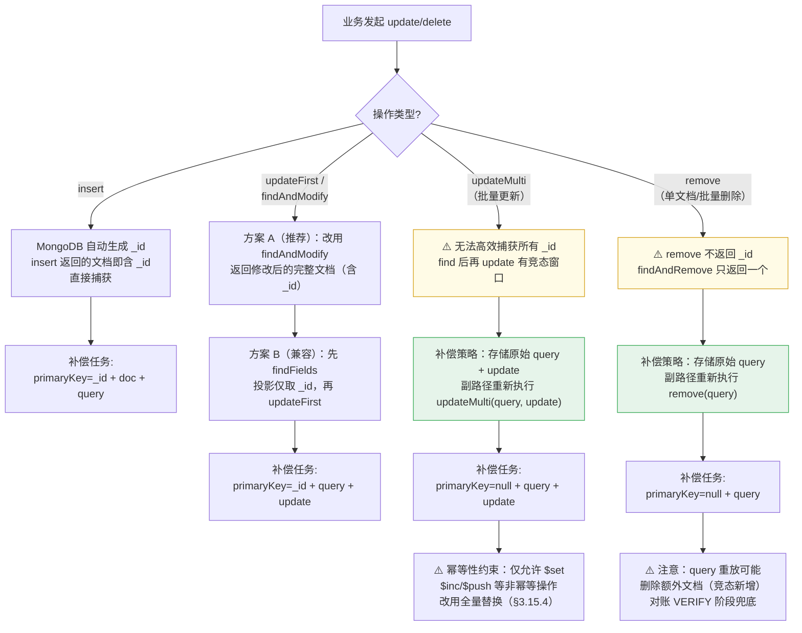

**单文档操作 `_id` 捕获实现**：

```kotlin
// 方案 A（推荐）：用 findAndModify 替代 updateFirst
// 原代码：
//   template.updateFirst(query, update, collectionName)
// 改造为：
fun updateFirstWithIdCapture(
    template: MongoTemplate,
    query: Query,
    update: Update,
    collectionName: String
): Pair<UpdateResult, ObjectId?> {
    val result = template.findAndModify(
        query, update,
        FindAndModifyOptions.options().returnNew(true),
        TNode::class.java,
        collectionName
    )
    return Pair(
        UpdateResult.acknowledged(if (result != null) 1 else 0, 1, null),
        result?.id                       // 捕获 _id
    )
}

// 方案 B（兼容，无法改调用方时）：先查 _id 再更新
fun captureIdThenUpdate(
    template: MongoTemplate,
    query: Query,
    update: Update,
    collectionName: String
): ObjectId? {
    // 先查 _id（投影仅返回 _id 字段，开销极小）
    val doc = template.findOne(
        query.with(Sort.unsorted()).apply { fields().include("_id") },
        Document::class.java,
        collectionName
    )
    // 再执行更新
    if (doc != null) {
        template.updateFirst(query, update, collectionName)
    }
    return doc?.getObjectId("_id")
}
```

**各操作 `_id` 捕获能力矩阵**：

| 操作 | 能否捕获全部 `_id` | 补偿方式 | 补偿 `primaryKey` |
| --- | --- | --- | --- |
| `insert` | ✅ 自动（返回值含 `_id`） | 副路径 `insert(_id, doc)` | 有效 |
| `updateFirst` | ✅（findAndModify 返回） | 副路径 `updateFirst({_id}, update)` | 有效 |
| `findAndModify` | ✅（返回值含 `_id`） | 副路径 `updateFirst({_id}, update)` | 有效 |
| `updateMulti` | ❌（只返回 matchedCount） | 副路径 `updateMulti(query, update)` | null |
| `remove` | ❌（只返回 deletedCount） | 副路径 `remove(query)` | null |
| `bulkOps` | ❌ | 拆分为逐条，同 `updateFirst`/`remove` | 有效/null |

> **原则**：优先捕获 `_id` 做精确补偿（无歧义、天然幂等）；无法捕获时降级为 query 重放（需幂等性约束 + 对账兜底）。补偿任务结构扩展 `query`、`update` 字段，详见 §3.15.2。

#### 3.15.2 Update 双写处理

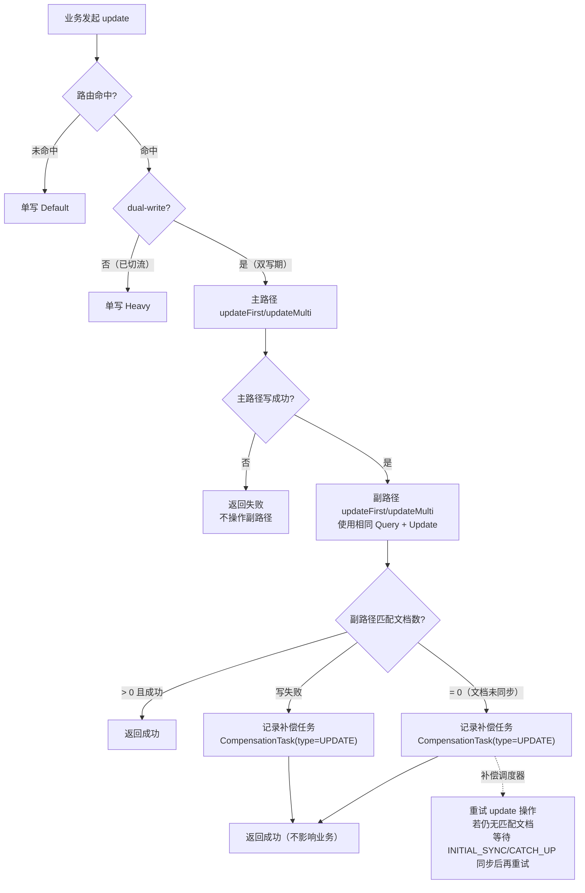

**关键约束**：

| 约束 | 说明 |
| --- | --- |
| Update 幂等性 | 同一 `update` 多次执行结果一致（`$set` 操作天然幂等；`$inc` 非幂等（补偿重试会导致计数偏移），补偿时需先查当前值再用 `$set` 绝对值更新；`$push` 等非幂等操作需业务层保证） |
| 副路径 Query 一致 | 副路径 `update` 必须使用与主路径**完全相同的 Query 条件和 Update 表达式** |
| 文档未同步场景 | 副路径 update 匹配 0 条时，说明文档尚在 INITIAL_SYNC / CATCH_UP 中，补偿任务需设置**依赖同步完成**的前置条件 |

**补偿任务结构扩展**：

```text
{
  _id,
  type,              // INSERT / UPDATE / DELETE
  collectionName,
  query,             // update/delete 的查询条件（JSON 序列化）
  update,            // update 的更新表达式（仅 type=UPDATE，保留完整 MongoDB Update 操作符：$set/$inc/$push 等）
  doc,               // 主路径写入后的完整文档快照（JSON），用于 $max 保护和其他防御性场景
  primaryKey,        // 从 query 中提取的 _id，用于队列去重
  routingKey,        // projectId，用于路由到正确实例
  retryCount,
  maxRetry,
  nextRetryAt,             // 下次可消费时间；null=立即可消费
  createdAt,         // System.currentTimeMillis()，JVM 重启后仍可用于排序
  enqueuedAt,        // System.nanoTime() 单调递增时间戳，仅同 JVM 生命周期内比较新旧任务
  status             // PENDING / WAITING_SYNC / DONE / FAILED
}
```

`WAITING_SYNC` 状态：当副路径 update 匹配 0 条且项目仍在 INITIAL_SYNC / CATCH_UP 阶段时，补偿任务进入此状态，等待同步完成后再重试。

#### 3.15.3 Delete 双写处理

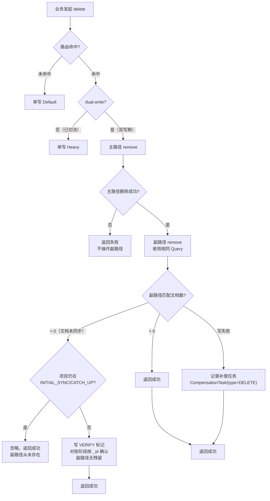

**关键约束**：

| 约束 | 说明 |
| --- | --- |
| Delete 副路径无匹配 + 仍在同步 | `INITIAL_SYNC` / `CATCH_UP` 阶段可忽略（副路径尚未有文档） |
| Delete 副路径无匹配 + 同步已完成 | 写 `VERIFY` 标记，对账按 `_id` 确认副路径无僵尸文档；禁止静默忽略 |
| Delete 副路径失败 → 补偿 | 文档可能在副路径但删除失败（网络/权限），需补偿确保最终一致 |
| 补偿任务幂等 | `delete` 操作天然幂等，重复执行无副作用 |

#### 3.15.4 两种模式的 Update/Delete 双写差异

| 维度 | 模式一（集合族整体迁移） | 模式二（Node 项目级路由） |
| --- | --- | --- |
| 主路径 | Offload Primary | Default Primary |
| 副路径 | Default Primary | Heavy Primary |
| Update 副路径无匹配 | 记录补偿（WAITING_SYNC） | 记录补偿（WAITING_SYNC） |
| Delete 副路径无匹配 | 同步中可忽略；同步完成后写 VERIFY 对账 | 同步中可忽略；同步完成后写 VERIFY 对账 |
| 补偿依赖同步完成 | 不涉及（模式一无 Change Stream 同步） | 依赖 `MigrationSyncJob` 同步完成 |
| 非幂等 Update | `artifact_oplog` 以 `insert` 为主，极少 `update` | `node_*` 存在 `updateLastModifiedDate`、`updateDeleted` 等操作 |

**模式一特殊说明**：

`artifact_oplog_*` 是追加写日志，`update` 和 `delete` 操作极少。如有，处理方式与上表一致。

**模式二非幂等 Update 场景**：

| 操作 | 幂等性 | 双写处理 |
| --- | --- | --- |
| `updateDeleted(deleted=true)` | 幂等（`$set`） | 正常双写 |
| `updateLastModifiedDate` | 幂等（`$set`） | 正常双写 |
| `updateNodeMetadata`（`$push` 等） | ⚠️ 非幂等 | 副路径使用**全量替换**（`replaceOne` / `save`）而非增量操作，避免 `$push` 重复追加 |
| `moveNode` / `copyNode` | 幂等（内部调用 `doCreate`） | 走 `doCreate` 双写路径 |

#### 3.15.5 补偿调度器升级

现有补偿调度器需升级以支持 Update / Delete 补偿：

```kotlin
@Component
class DualWriteCompensationScheduler {

    fun consume(task: CompensationTask) {
        when (task.type) {
            CompensationType.INSERT -> retryInsert(task)
            CompensationType.UPDATE -> retryUpdate(task)
            CompensationType.DELETE -> retryDelete(task)
        }
    }

    private fun retryUpdate(task: CompensationTask) {
        val template = determineTargetTemplate(task)
        val query = deserializeQuery(task.query)
        val update = deserializeUpdate(task.update)

        if (task.status == CompensationStatus.WAITING_SYNC) {
            // 检查同步状态是否完成
            if (!isSyncCompleted(task.routingKey, task.collectionName)) {
                return // 下次调度再检查
            }
        }

        val result = template.updateFirst(query, update, task.collectionName)
        if (result.matchedCount == 0L) {
            // 文档可能已被删除，标记补偿完成
            markDone(task)
        } else {
            markDone(task)
        }
    }

    private fun retryDelete(task: CompensationTask) {
        val template = determineTargetTemplate(task)
        val query = deserializeQuery(task.query)
        template.remove(query, task.collectionName)
        markDone(task) // delete 天然幂等
    }
}
```

#### 3.15.6 异常场景

| 场景 | 自动恢复 | 处理 | 业务影响 |
| --- | --- | --- | --- |
| Update 副路径文档尚未同步 | 是（WAITING_SYNC） | 补偿任务等待同步完成再重试 | 无 |
| Update 副路径文档已被删除 | 是 | 补偿 update 匹配 0 条，标记完成 | 无（文档已不存在） |
| 非幂等 Update 补偿重试 | 是 | 使用全量替换而非增量操作 | 无 |
| Delete 副路径失败 | 是 | 补偿重试删除 | 无 |
| Delete 副路径无匹配且同步已完成 | 是 | 写 VERIFY 标记，对账按 `_id` 确认无僵尸 | 无（对账兜底） |
| 补偿 Update 与后续 Delete 竞争 | 否 | 按时间序消费补偿任务；Delete 先于 Update 时，Update 补偿匹配 0 条自动完成 | 无 |
| 双写期主路径 Delete 成功、副路径 Update 补偿仍在队列 | 是 | Update 补偿匹配 0 条自动完成 | 无 |

#### 3.15.7 双写期补偿与 CATCH_UP 的竞态风险

**核心风险**：双写期间，补偿任务（compensation）和 Change Stream 的 CATCH_UP 同步是两套独立机制，
**没有因果顺序保证**。可能产生以下竞态场景：

```text
竞态场景 1：补偿 Update 与 CATCH_UP 交错
────────────────────────────────────────
T1: 业务发起 update(fullPath: /old → /new)，Default 主路径更新成功（副路径 Heavy 待补偿）
T2: 补偿任务(TYPE=UPDATE, query={fullPath:/new}, update={$set:{size:100}}) 写入队列
T3: CATCH_UP Change Stream 消费到 T1 之前的一条旧 update 事件，将旧数据同步到 Heavy
    （此时 Heavy 上文档被覆盖为旧值）
T4: 补偿任务消费，按 _id 执行 update — 基于 T2 时刻的 update 表达式
T5: 结果不可预测：最终数据取决于 T3 和 T4 的时间序

竞态场景 2：补偿 Insert 与 CATCH_UP Delete
────────────────────────────────────────
T1: 业务发起 insert，Default 主路径插入成功，补偿 INSERT 任务入队（副路径 Heavy）
T2: 业务发起 delete（同一 _id），Default 主路径删除成功，补偿 DELETE 任务入队（副路径 Heavy）
T3: CATCH_UP 收到 insert 事件，再次 upsert 到 Heavy
T4: 补偿 DELETE 任务先消费 → Heavy 文档被删除
T5: CATCH_UP 的 upsert 后执行 → 文档又被恢复（错误！）
```

**解决方案：双写期暂停 CATCH_UP，仅依赖补偿队列**

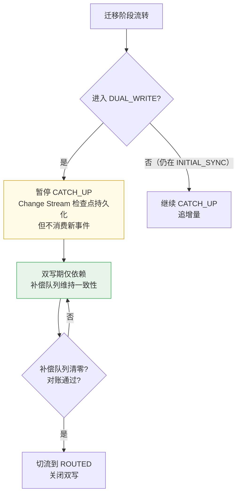

**关键约束**：

| 约束 | 说明 |
| --- | --- |
| **双写期 CATCH_UP 必须暂停** | 避免补偿任务与 Change Stream 事件产生竞态，确保数据一致性的唯一可控路径是补偿队列 |
| **CATCH_UP 的 resumeToken 必须持久化** | 暂停时保存当前消费位点，以便回滚到 READY 阶段后重新恢复 CATCH_UP |
| **CATCH_UP 暂停期间 oplog 窗口风险** | 如果双写期过长（> oplog 保留时间），CATCH_UP 可能无法恢复。双写期应设硬性时限（默认 < 24h） |
| **补偿队列同 _id 去重** | 入队时按 `_id` 检查：若已有同一 `_id` 的待消费任务则替换（而非追加），从根源消除乱序覆盖风险 |
| **补偿 update 使用 `$max` 保护** | `lastModifiedDate` 从 `$set` 移到 `$max`：`{ $set: {...}, $max: { lastModifiedDate: <original> } }`，确保时间戳不降级，即使写路径遗漏更新 `lastModifiedDate` 也不会被旧补偿覆盖 |

**补偿 update 的双重防护实现**：

> **设计说明**：原方案使用 `$lte` 条件式乐观锁（`lastModifiedDate ≤ original`），存在以下风险：
> 1. **遗漏更新**：10/13 写路径未更新 `lastModifiedDate`（代码审计确认，见 §3.19.1），导致 `$lte` 条件仍匹配 → 旧补偿覆盖新数据
> 2. **时间精度**：毫秒级精度无法区分同毫秒内的多操作
> 3. **时钟回拨**：回拨后 `$lte` 误匹配
>
> 改为**队列去重 + `$max` 保护**的双重方案，不新增字段、不改写路径、不需历史回填。

**第一层：补偿队列同 _id 去重**（从根源消除乱序）

```kotlin
/**
 * 补偿入队时按 _id 去重：同一 _id 只保留最新任务，旧任务直接替换。
 * 消费时同 _id 串行执行，保证同一文档的补偿不会乱序覆盖。
 * 
 * $inc 去重合并：当新旧任务都含 $inc 操作时，将旧任务的 $inc 增量合并到新任务，
 * 而非简单替换（替换会丢失增量语义）。
 * 序列化格式使用 MongoDB 原生 Update JSON（保留 $inc/$set/$push 等操作符），
 * 以支持解析操作类型并执行合并逻辑。
 */
fun enqueueUpdate(route: WriteRoute, col: String, query: Query, update: Update) {
    val primaryKey = extractPrimaryKey(query)
    val newTask = CompensationTask(
        type = CompensationType.UPDATE,
        collectionName = col,
        query = serializeQuery(query),
        update = serializeUpdate(update),
        primaryKey = primaryKey,
        enqueuedAt = System.nanoTime(),  // 单调递增，不受时钟回拨影响
    )
    // 替换同一 _id 的旧补偿任务，而非追加
    // 若新旧任务均含 $inc，则合并增量而非覆盖
    compensationQueue.replaceOrAdd(newTask) { existing, new ->
        mergeCompensationTasks(existing, new)
    }
}

/**
 * $inc 去重合并：将旧任务的 $inc 增量累加到新任务的同名字段。
 * - $set 字段：后者覆盖前者
 * - $inc 字段：同名字段增量累加（如 old $inc:{size:5} + new $inc:{size:3} → merged $inc:{size:8}）
 * - 无交集字段：各自保留
 */
fun mergeCompensationTasks(old: CompensationTask, new: CompensationTask): CompensationTask {
    val oldUpdate = deserializeUpdate(old.update)
    val newUpdate = deserializeUpdate(new.update)
    val mergedUpdate = mergeUpdates(oldUpdate, newUpdate)
    return new.copy(update = serializeUpdate(mergedUpdate))
}

fun mergeUpdates(old: Update, new: Update): Update {
    val merged = Update()
    // $set: 后者覆盖前者
    val oldSet = old.getSetOperations()   // Map<String, Any>
    val newSet = new.getSetOperations()   // Map<String, Any>
    val mergedSet = oldSet + newSet       // 后者覆盖同 key
    mergedSet.forEach { (k, v) -> merged.set(k, v) }
    
    // $inc: 同名字段增量累加，独有字段各自保留
    val oldInc = old.getIncOperations()   // Map<String, Number>
    val newInc = new.getIncOperations()   // Map<String, Number>
    val mergedInc = mutableMapOf<String, Number>()
    (oldInc.keys + newInc.keys).forEach { field ->
        mergedInc[field] = (oldInc[field]?.toDouble() ?: 0.0) + (newInc[field]?.toDouble() ?: 0.0)
    }
    mergedInc.forEach { (k, v) -> merged.inc(k, v) }
    
    return merged
}
```

> **与三级熔断（§3.17.9）的交互**：`replaceOrAdd` 按主键替换不增加队列深度，即使触发硬限制（hardLimit）熔断仍应允许替换已有任务（保留最新数据），仅拒绝新增主键的入队。

> **`enqueuedAt` 持久化约束**：`System.nanoTime()` 返回 JVM 单调时钟的 `Long` 值，**JVM 重启后会重置**，因此：
> - 持久化到 MongoDB 时以 `Long` 类型存储（非 `Date`），仅用于同 JVM 生命周期内比较新旧任务
> - JVM 重启后队列中的残留任务应按 `createdAt`（`System.currentTimeMillis()`）排序消费，而非 `enqueuedAt`
> - 重启后新入队任务的 `enqueuedAt` 从新的基准开始，与重启前残留任务不可直接比较

> **`$inc` 合并竞态防护**：`replaceOrAdd` 在入队时合并旧任务的 `$inc`，前提是旧任务**尚未被消费**。如果旧任务正在被消费线程处理中（状态从 PENDING → PROCESSING），合并操作存在竞态：
> ```
> T1: 消费线程读取 task_A（$inc:{size:5}），status → PROCESSING
> T2: 入队线程执行 replaceOrAdd，读取到 task_A 状态为 PROCESSING
> T3: 若 T2 仍执行合并（将 size:5 合并到新任务），则 task_A 消费后 +5，新任务再 +5 → 重复计数
> ```
>
> **解决方案**：`replaceOrAdd` 使用 CAS（Compare-And-Swap）乐观锁，仅当旧任务状态为 `PENDING` 时执行合并替换：
>
> ```kotlin
> fun replaceOrAdd(newTask: CompensationTask, merger: (CompensationTask, CompensationTask) -> CompensationTask): Boolean {
>     val existing = findPendingByPrimaryKey(newTask.primaryKey) ?: run {
>         insert(newTask)
>         return true
>     }
>     // CAS：仅当 status=PENDING 时才执行 replace
>     val updated = collection.updateOne(
>         Filters.and(
>             Filters.eq("primaryKey", newTask.primaryKey),
>             Filters.eq("status", CompensationStatus.PENDING.name)
>         ),
>         Updates.combine(
>             Updates.set("update", newTask.update),
>             Updates.set("enqueuedAt", newTask.enqueuedAt),
>             Updates.set("updatedAt", Instant.now())
>         )
>     )
>     if (updated.matchedCount == 0L) {
>         // 旧任务已被消费（status != PENDING），追加新任务（幂等消费会跳过重复）
>         log.info("Compensation merge skipped, old task is being consumed. primaryKey={}", newTask.primaryKey)
>         insert(newTask)
>     }
>     return updated.matchedCount > 0L
> }
> ```
>
> **$inc 合并与 CAS 的交互**：如果 CAS 失败（旧任务正被消费），新任务不再尝试合并旧 `$inc`——旧任务消费时会正确处理 `$inc`，新任务追加后串行执行，`$inc` 不会丢失也不会重复。

**第二层：`$max` 保护 lastModifiedDate**（防御性冗余）

```kotlin
fun retryUpdate(task: CompensationTask) {
    val template = determineTargetTemplate(task)
    val query = deserializeQuery(task.query)
    val update = deserializeUpdate(task.update)

    // $inc 非幂等处理：补偿重试会导致 $inc 计数偏移，因此改为先查当前值再用 $set 绝对值更新
    val incOperations = update.getIncOperations()  // Map<String, Number>
    if (incOperations.isNotEmpty()) {
        val currentDoc = template.findOne(query, task.collectionName)
        if (currentDoc != null) {
            // 将 $inc 改为 $set 绝对值：当前值 + inc 增量
            incOperations.forEach { (field, delta) ->
                val currentVal = (currentDoc[field] as? Number)?.toDouble() ?: 0.0
                update.remove(field)  // 从 $inc 中移除
                update.set(field, currentVal + delta.toDouble())  // 改用 $set 绝对值
            }
        }
        // 若文档已被删除（currentDoc == null），updateFirst 匹配 0 条，markDone 即可
    }

    // 将 lastModifiedDate 从 $set 中提取，改为 $max 语义更新
    // $max 保证：如果副路径的 lastModifiedDate 更新，则不会降级
    // 即使写路径遗漏更新 lastModifiedDate，$max 也不会将时间戳回退
    val originalModifiedDate = task.doc?.get("lastModifiedDate") as? LocalDateTime
    if (originalModifiedDate != null && task.status != CompensationStatus.WAITING_SYNC) {
        // 从 $set 中移除 lastModifiedDate
        update.set("lastModifiedDate").let { /* 移除 $set 中的 lastModifiedDate */ }
        // 改用 $max：只有当 originalModifiedDate > 当前值时才更新，保证时间戳只升不降
        update.max("lastModifiedDate", originalModifiedDate)
    }

    val result = template.updateFirst(query, update, task.collectionName)
    if (result.matchedCount == 0L) {
        log.info("Compensation update skipped, document not found. _id={}", task.primaryKey)
    }
    markDone(task)
}
```

**`$lte` vs `$max` 行为对比**：

| 场景 | `$lte` + `$set`（旧方案） | `$max`（新方案） |
| --- | --- | --- |
| 正常乱序（T2 先到，T1 后到） | ✅ T1 的 `$lte` 不匹配，跳过 | ✅ T1 的 `$max` 不降级时间戳 |
| 遗漏更新（写路径未更新 lastModifiedDate） | ❌ `$lte` 条件仍匹配 → `$set` 覆盖新数据 | ✅ `$max` 不降级时间戳（其他 `$set` 字段仍覆盖，但队列去重已从根源消除乱序） |
| `$inc` 非幂等（补偿重试导致计数偏移） | ❌ `$lte` 无法防止 `$inc` 多次执行导致计数偏移 | ✅ 先查当前值再 `$set` 绝对值，消除计数偏移 |
| 时间精度（毫秒内多操作） | ❌ 无法区分 | ✅ `$max` 原子操作，无精度问题 |
| 时钟回拨 | ❌ 回拨后 `$lte` 误匹配 | ✅ `$max` 只升不降，回拨不影响 |

> **`$max` 方案的残余盲区与缓解**：`$max` 仅保护 `lastModifiedDate` 字段不降级，**其他 `$set` 字段仍会被旧补偿覆盖**。场景举例：
> - T1 补偿 UPDATE `{$set: {size: 100, archived: false}}` 入队
> - T2 业务 `setNodeArchived(true)` 更新了 `archived` 字段但**遗漏更新** `lastModifiedDate`
> - T1 补偿消费：`$max` 不降级 `lastModifiedDate`（✅），但 `$set: {archived: false}` 仍覆盖了 T2 的更新（❌）
>
> **队列去重是此盲区的主要缓解**：同一 `_id` 只保留最新补偿任务，消除了乱序覆盖。上述场景只有在"**同一 `_id` 只有一条补偿任务且其快照早于后续业务更新**"时才会发生。实际概率极低：
> - 该补偿任务对应的**主路径写入已经成功**（补偿只是同步到副路径），主路径的最新状态会在下次读操作时被正确返回
> - 对账检测（§2.7）通过全量扫描可发现此类不一致
> - **终极缓解**：补全所有写路径的 `lastModifiedDate` 更新（§3.19.1 建议），使 `$max` 保护对所有字段变更生效

#### 3.15.8 双写期时序保障矩阵

| 操作 | 主路径 | 副路径一致性保障 | 竞态防护 |
| --- | --- | --- | --- |
| INSERT | Default Primary | 补偿任务（INSERT，副路径 Heavy）+ 显式指定 `_id` | 唯一键冲突在主路径(Default)同步 fail-fast；副路径 `insert` 幂等（同 `_id` duplicate key 忽略） |
| UPDATE | Default Primary | 补偿任务（UPDATE，副路径 Heavy）+ 队列去重 + `$max` 保护 | 队列去重消除乱序；`$max` 防止 lastModifiedDate 降级 |
| DELETE | Default Primary | 补偿任务（DELETE，副路径 Heavy） | Delete 操作天然幂等 |

> **CATCH_UP 处理**：双写期暂停 Change Stream 消费，避免与补偿队列产生竞态。
> 仅在回滚到 READY 阶段后恢复 CATCH_UP 继续追增量。

### 3.16 ThreadLocal 跨异步边界传递安全性

#### 3.15.1 问题

`NodeRoutingContext`（以及通用框架中的 `MongoRoutingContext`）当前使用普通 `ThreadLocal<String?>`。
**`ThreadLocal` 不跨线程边界传递**：提交任务到线程池后，工作线程是独立的新线程（或复用的旧线程），
不继承父线程的 `ThreadLocal` 值，路由上下文会静默丢失，写操作降级到 Default 实例而无任何报错。

下列所有异步场景均会导致丢失：

| 异步方式 | 原因 |
| --- | --- |
| `ExecutorService.submit` / `ThreadPoolExecutor.submit` | 工作线程独立，不继承父线程 `ThreadLocal` |
| Spring `@Async` 方法 | 由 Spring `TaskExecutor` 调度到线程池新线程 |
| `CompletableFuture.supplyAsync` / `thenApplyAsync` | 默认用 `ForkJoinPool`，不继承 `ThreadLocal` |
| Kotlin 协程 `launch` / `async` | 协程可挂起后在不同线程恢复，`ThreadLocal` 失效 |
| Reactor / WebFlux 响应式链 | 操作符在不同线程切换，`ThreadLocal` 随线程切换丢失 |

#### 3.15.2 当前代码风险审查

| 位置 | 异步方式 | `NodeRoutingContext` 使用方式 | 结论 |
| --- | --- | --- | --- |
| `MongoDbBatchJob.runRow` | 线程池（`executor.executeWithId`） | 在**工作线程内**调用 `NodeRoutingContext.withProject` 显式 set | ✅ 安全 |
| `NodeCommonUtils.workPool.submit` | 普通 `ThreadPoolExecutor` | consumer 闭包未 set `ThreadLocal`，靠 `templateFor(collection)` 路由 | ⚠️ 若 consumer 内有 `node_*` 写操作则路由丢失 |
| `NodeModifyEventListener.handle` | Spring `@Async` | 无直接使用，但链路经 `nodeDao` | ⚠️ Query 若不含 `projectId` 则路由降级 Default |
| `MigrateFailedNodeService.fixMissingFailedNode` | Spring `@Async` | 无使用，`projectId` 来自 `failedNode` 对象字段 | ✅ `nodeDao` 从 Query 中提取 `projectId`，安全 |
| `NodeScatterQueryService.scatterFind` | `CompletableFuture.supplyAsync` | 无需 `projectId`（散发全实例） | ✅ 安全 |

#### 3.15.3 三层安全准则

**准则 1（强制）：写操作 projectId 必须显式传参**

所有写 `node_*` 的路径必须满足其中之一，严禁依赖外层线程的 `ThreadLocal` 值：
- 调用 `NodeMongoOperations` 接口，显式传入 `projectId` 参数
- 在**工作线程内部**调用 `NodeRoutingContext.withProject(projectId) { ... }`

```kotlin
// ✅ 正确：在工作线程内显式 set，不依赖外层
executor.submit {
    NodeRoutingContext.withProject(projectId) {
        nodeDao.remove(query)
    }
}

// ❌ 错误：父线程 set 后 submit，子线程看不到
NodeRoutingContext.set(projectId)
executor.submit {
    nodeDao.remove(query)  // ThreadLocal 已丢失
}
```

**准则 2（推荐）：自建线程池使用 TTL 包装**

引入 Alibaba `transmittable-thread-local`，将 `ThreadLocal` 替换为 `TransmittableThreadLocal`，
并用 `TtlExecutors` 包装所有自建线程池，作为准则 1 的防御层：

```kotlin
// NodeRoutingContext 改为 TransmittableThreadLocal
import com.alibaba.ttl.TransmittableThreadLocal

object NodeRoutingContext {
    private val context = TransmittableThreadLocal<String?>()
    // 其余代码不变
}

// NodeCommonUtils.workPool 改为 TTL 包装
private val workPool = TtlExecutors.getTtlExecutorService(
    ThreadPoolExecutor(
        Runtime.getRuntime().availableProcessors(),
        Runtime.getRuntime().availableProcessors(),
        1L, TimeUnit.MINUTES,
        ArrayBlockingQueue(DEFAULT_BUFFER_SIZE),
        ThreadFactoryBuilder().setNameFormat("node-utils-%d").build()
    )
)
```

**准则 3：Spring `@Async` 线程池配置 `TaskDecorator`**

```kotlin
@Configuration
class AsyncExecutorConfig : AsyncConfigurer {
    override fun getAsyncExecutor(): Executor =
        ThreadPoolTaskExecutor().apply {
            // TTL 提供的 TaskDecorator，自动在任务提交时捕获 + 还原 TransmittableThreadLocal
            setTaskDecorator { runnable -> TtlRunnable.get(runnable) }
            corePoolSize = 8
            initialize()
        }
}
```

#### 3.15.4 通用框架中的处理（见 19.4.3）

`MongoRoutingContext` 的新设计直接使用 `TransmittableThreadLocal`，
不引入 plain `ThreadLocal` 的历史负担：

```kotlin
object MongoRoutingContext {
    // TransmittableThreadLocal 替代 ThreadLocal，支持跨线程池自动传递
    private val store = ConcurrentHashMap<String, TransmittableThreadLocal<String?>>()

    fun set(ruleName: String, key: String) =
        store.getOrPut(ruleName) { TransmittableThreadLocal() }.set(key)

    fun get(ruleName: String): String? = store[ruleName]?.get()

    fun clear(ruleName: String) = store[ruleName]?.remove()

    inline fun <T> withRoutingKey(ruleName: String, key: String, block: () -> T): T {
        set(ruleName, key)
        return try { block() } finally { clear(ruleName) }
    }
}
```

#### 3.15.5 需要修复的现有代码

| 文件 | 当前问题 | 修复方式 |
| --- | --- | --- |
| `NodeRoutingContext.kt` | `ThreadLocal<String?>` | 改 `TransmittableThreadLocal<String?>` |
| `NodeCommonUtils.workPool` | 普通 `ThreadPoolExecutor` | `TtlExecutors.getTtlExecutorService(...)` 包装 |
| `MongoDbBatchJob.executor` | 待确认是否 TTL 包装 | 若否，保留 `withProject` 显式 set 模式，或改用 `TtlExecutors` 包装 |
| `AsyncExecutorConfig`（Spring `@Async`） | 无 `TaskDecorator` | 配置 `TtlRunnable.get` 作为 `TaskDecorator` |

#### 3.16.6 TTL 的已知局限与运行时检测

**准则 1（显式传参）是唯一可靠的兜底**，TTL（TransmittableThreadLocal）在以下场景存在已知局限：

| 失效场景 | 原因 | 影响 |
| --- | --- | --- |
| `ForkJoinPool.commonPool()` | `CompletableFuture.supplyAsync` 默认使用 `ForkJoinPool`，不受 `TtlExecutors` 包装 | 通过此线程池提交的任务丢失上下文 |
| 虚拟线程（Java 21+ Loom） | 虚拟线程的调度机制与 TTL 的 capture/replay 不完全兼容 | 路由上下文可能在虚拟线程挂起/恢复时丢失 |
| 第三方库自建线程池 | 未被 `TtlExecutors` 包装的内部线程池（如 Netty event loop、Reactor Schedulers 等） | 进入这些线程池的任务丢失上下文 |
| Kotlin 协程 `Dispatchers.Default` | 协程调度器不经过 `TtlExecutors`，`ThreadLocal` 方式传递天然的脆弱 | 协程内丢失上下文 |
| `CompletableFuture.thenApplyAsync`（无 executor 参数） | 默认使用 `ForkJoinPool.commonPool()` | 同上 |

**运行时断言（Fail-Fast 检测）**：

在 `NodeMongoOperations` / `MongoRoutingOperations` 的写操作入口增加**运行时上下文检查**，
当 `ThreadLocal` 为空时立即报错，避免静默降级写入 Default 实例：

```kotlin
class NodeMongoOperationsImpl(
    private val routingRegistry: NodeMongoRoutingRegistry,
) : NodeMongoOperations {

    override fun remove(projectId: String, query: Query, collectionName: String): DeleteResult {
        val template = routingRegistry.routeWrite(projectId, collectionName)
            ?: throw RoutingContextLostException(
                "projectId=$projectId, collection=$collectionName. " +
                "路由上下文丢失！请确保：\n" +
                "1. 显式传入 projectId 参数（推荐）\n" +
                "2. 或在工作线程内调用 NodeRoutingContext.withProject()"
            )
        return template.remove(query, collectionName)
    }

    // ... 其他方法同样检查
}

// 自定义异常，携带足够诊断信息
class RoutingContextLostException(
    message: String,
    val collectionName: String? = null,
    val projectId: String? = null,
) : RuntimeException(message)
```

**准则补充：禁止在以下场景依赖 ThreadLocal**

| 场景 | 替代方案 |
| --- | --- |
| `CompletableFuture.supplyAsync`（无 executor） | 改为 `supplyAsync(fn, ttlExecutor)` 或显式传参 |
| Kotlin 协程 `launch { ... }` | 通过协程上下文（`CoroutineContext`）传递 `projectId`，不使用 ThreadLocal |
| Reactor / WebFlux 操作符链 | 通过 Reactor Context 传递，不依赖 ThreadLocal |
| `@Scheduled` 定时任务 | 从 Job 参数或配置中显式获取，不依赖 ThreadLocal |

**三层防御优先级调整**：

实际落地顺序：
1. **准则 1 最优先（必须）**：所有写路径显式传 `projectId`
2. **准则 3 辅助（推荐）**：`@Async` 配置 `TaskDecorator`
3. **准则 2 防御（推荐）**：`ThreadLocal` 改为 TTL + `TtlExecutors` 包装自建线程池

注意：准则 2 和 3 是**防御层**，不能替代准则 1。即使 TTL + TaskDecorator 都配置正确，
仍然存在上述已知局限（如 `ForkJoinPool`、虚拟线程）。**准则 1 是唯一可以覆盖所有场景的方案。**

---

### 3.17 数据一致性系统化保障机制

#### 3.17.1 问题

§1.3 定义了数据一致性模型，§3.15 补全了 Update/Delete 双写处理。但缺少**系统化的端到端一致性保障体系**——包括自动对账、数据自愈、一致性验证工具和持续监控。

当前方案的对账手段（`count()` + 抽样）存在盲区：
- `count()` 无法检测文档内容差异。
- 抽样校验可能漏掉小概率不一致。
- 双写期 update 差异无法通过 count 发现。
- 缺少持续性的对账机制（仅在迁移阶段门控时执行）。

#### 3.17.2 一致性保障层级

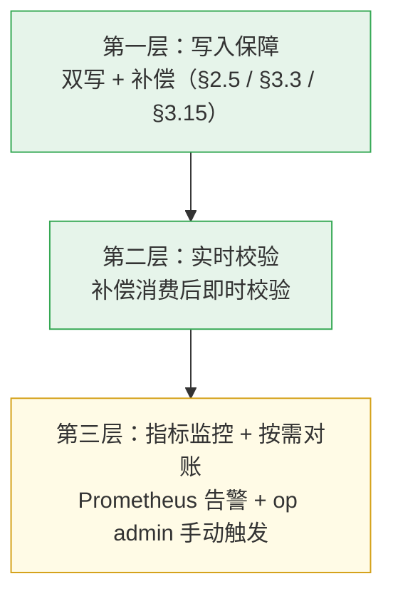

| 层级 | 机制 | 覆盖阶段 | 延迟 | 说明 |
| --- | --- | --- | --- | --- |
| 第一层：写入保障 | 双写 + 补偿队列 | 双写期 | 秒~分钟 | 保证主路径成功，副路径最终一致 |
| 第二层：实时校验 | 补偿消费后 `_id` + 关键字段校验 | 双写期 | 秒级 | 检测 `_id` 不一致、文档缺失 |
| 第三层：指标监控 + 按需对账 | Prometheus Gauge + op admin `POST /migration/verify` | 全阶段 | 实时 / 手动 | 告警通知运维；按需触发 count+抽样深度对比 |

**设计原则（为什么不搞自动对账/自愈）**：

1. **正常情况两侧不会不一致**——双写主路径成功才写副路径，副路径失败入补偿队列重试。
2. **不一致意味着有未知根因**——自动修复可能覆盖正确数据，造成二次损坏，必须人工介入。
3. **`aggregate` 是慢查询**——迁移项目本就数据量大、负载高，额外跑 aggregate/全量扫描是火上浇油。
4. **定时 Job 结果人无法感知**——多 Pod 并发跑同一任务有竞态风险，结果没人看等于白跑。
5. **太复杂就容易出问题**——对账策略越多，误报、漏报、修复副作用越难控制。

#### 3.17.3 第二层：实时校验（补偿消费后校验）

补偿任务消费成功后，触发即时校验。校验统一按 `_id` 查询（双写时副路径复用主路径 `_id`，两侧一致）：

```kotlin
@Component
class CompensationPostCheck {

    fun postInsertCheck(task: CompensationTask) {
        // 两侧 _id 一致，直接按 _id 查询
        val primaryDoc = primaryTemplate.findOne(queryById(task.primaryKey), task.collectionName)
        val secondaryDoc = secondaryTemplate.findOne(queryById(task.primaryKey), task.collectionName)

        if (primaryDoc == null || secondaryDoc == null) {
            alarm("Post-check failed: doc missing after compensation, _id=${task.primaryKey}")
            return
        }

        // _id 一致性校验（两侧 _id 必须相同）
        if (primaryDoc["_id"] != secondaryDoc["_id"]) {
            alarm("Post-check _id mismatch: primary=${primaryDoc["_id"]}, secondary=${secondaryDoc["_id"]}, this should never happen!")
        }

        // 关键字段一致性校验
        val fieldsToCheck = listOf("projectId", "fullPath", "deleted", "sha256", "createdDate")
        for (field in fieldsToCheck) {
            if (primaryDoc[field] != secondaryDoc[field]) {
                alarm("Post-check field mismatch: field=$field, primary=${primaryDoc[field]}, secondary=${secondaryDoc[field]}, _id=${task.primaryKey}")
                recordInconsistency(task.collectionName, task.primaryKey, field, primaryDoc[field], secondaryDoc[field])
            }
        }
    }
}
```

| 校验项 | 说明 | 失败动作 |
| --- | --- | --- |
| `_id` 一致性 | 两侧 `_id` 必须完全相同（副路径复用主路径 `_id`） | 告警 + 记录不一致（不应出现） |
| `projectId` 一致性 | 两侧 `projectId` 必须相同 | 告警 + 记录不一致 |
| `deleted` 状态一致 | 两侧逻辑删除状态必须相同 | 告警 + 记录不一致 |
| `sha256` 一致性 | 文件哈希必须相同 | 告警 + 记录不一致 |
| 文档存在性 | 两侧文档必须都存在 | 告警 + 记录不一致 |

> **实现**：校验失败时除 `warn` 日志外，持久化至 Default 库 `mongo_inconsistency_log`（`ruleName`/`routingKey`/`collectionName`/`primaryKey`/`operationType`/`reason`/`createdAt`）。

#### 3.17.4 第三层：指标监控 + 按需对账

不做定时自动对账 Job。运维通过以下两个渠道感知一致性状态：

**3.17.4.1 自动指标监控**

| 指标 | 来源 | 告警 |
| --- | --- | --- |
| `bkrepo.mongo.routing.compensation.queue.depth` | `MongoRoutingMetrics` Gauge，每规则实时采集 | > 100 持续 10 分钟 → 副路径写入异常 |
| `GET /compensation/health/{ruleName}` | `CompensationHealthChecker`，前端页面可主动查看 | `healthy=false` 时告警 |

补偿队列深度是数据一致性的**先行指标**——队列清零 = 两侧已追平，队列积压 = 可能有差异。

**3.17.4.2 按需触发对账**

运维在 op admin 的"分库迁移"页面点击按钮，触发旁路对账：

| 按钮 | API | 说明 |
| --- | --- | --- |
| "全量对账" | `POST /migration/verify` | 对所有 `DUAL_WRITE` 状态的项目执行对账 |
| "单项目对账" | `POST /migration/verify/{ruleName}/{projectId}` | 对单个项目执行对账 |

对账逻辑由 `NodeReconciliationHelper` 提供：
- count 对比（两侧同一 projectId 的文档数）
- 分段抽样深度对比（按 `_id` 时间戳分 10 段，每段随机抽 100 条逐字段对比）
- 结果写入 `node_reconciliation_log`

**切流前置门禁**（§3.10）：`POST /migration/route` 前必须满足旁路对账最近结果 `passed == true` + 补偿队列深度为 0。

#### 3.17.5 各阶段一致性保障矩阵

| 阶段 | 写入保障 | 实时校验 | 指标监控 | 按需对账 |
| --- | --- | --- | --- | --- |
| 迁移前 | 单写 Default | 无需 | ✅ 补偿队列 Gauge | 无需 |
| 历史迁移（JOB_ONLY） | 双写 + 补偿 | ✅ 补偿后校验 | ✅ compensation.queue.depth | ✅ Job 完成后触发 |
| 历史迁移（NONE） | 双写 + 补偿（仅新数据） | ✅ 补偿后校验 | ✅ compensation.queue.depth | — |
| 双写期 | 双写 + 补偿 | ✅ 补偿后校验 | ✅ compensation.queue.depth | 运维按需触发 |
| 切流前 | — | — | ✅ 队列深度=0 | ✅ **强制**：passed==true 门禁 |
| 切流后 | 单写 Heavy | 无需 | 无需 | 运维按需触发 |
| 清理后 | 单写 Heavy | 无需 | 无需 | 按需 |

> **Job 完成后的确认链路**：历史迁移（JOB_ONLY）结束后，运维应在"分库迁移"页面手动触发 `POST /migration/verify/{ruleName}/{projectId}` 进行 count + 分段抽样深度对比，`passed == true` 是进入下一阶段（双写期 / 切流）的**前提条件**。补偿队列深度 ≈ 0 是对账可行的前置信号——若队列还有积压则对账结果不可信，应先等消费追平再对账。

#### 3.17.9 补偿队列容量限制与 Default 实例故障降级

**问题**：双写期间若 Default 实例长期不可用，补偿队列会无限增长，
可能导致以下风险：

| 风险 | 说明 |
| --- | --- |
| 内存溢出（OOM） | 补偿任务在内存队列中积压，撑爆 JVM 堆 |
| 磁盘耗尽 | 补偿任务持久化表（MongoDB）数据量膨胀 |
| 切流无限延迟 | 补偿队列未清零，无法满足切流前置条件 |
| 对账失真 | 大量积压导致对账结果不可信 |

**解决方案：三级熔断降级**

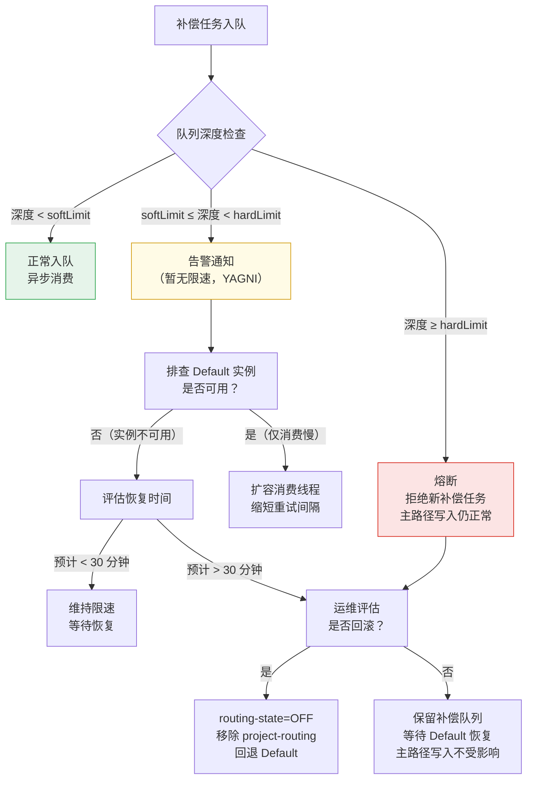

**配置模型**：

```yaml
compensation:
  queue:
    # 软限制：触发告警（当前实现仅 WARN，暂无限速入队）
    soft-limit: 5000
    # 硬限制：触发熔断，拒绝新任务入队
    hard-limit: 10000
    # 消费线程池配置
    consumer:
      core-threads: 2
      max-threads: 8
      queue-capacity: 1000
  retry:
    max-retry: 3
    # 固定梯度退避（非指数）：失败重置 PENDING 时设 nextRetryAt = now + [10s, 30s, 60s][retryCount]
    intervals: [10s, 30s, 60s]
```

**告警规则**：

| 指标 | 阈值 | 级别 | 动作 |
| --- | --- | --- | --- |
| 队列深度 > softLimit | 5000 | WARNING | 企业微信/邮件通知 |
| 队列深度 > softLimit 持续 15 分钟 | 5000 | CRITICAL | 电话告警 + 暂停低优先级补偿 |
| 队列深度 > hardLimit | 10000 | EMERGENCY | 熔断 + 电话告警 + 评估回滚 |
| 补偿成功率 < 90% | — | WARNING | 排查 Default 实例状态 |
| 单任务最大重试次数达到上限 | 3 | WARNING | 记录失败详情，人工介入 |

**Default 实例长期不可用的决策矩阵**：

| 双写期 Default 不可用时 | 影响 | 建议 |
| --- | --- | --- |
| 不可用 < 15 分钟 | 补偿积压，无业务影响 | 等待自动恢复，补偿队列追平 |
| 不可用 15~30 分钟 | 补偿积压加重 | 限速入队，排查根因 |
| 不可用 > 30 分钟 | 补偿队列接近 hardLimit | 触发熔断，考虑回滚到单写模式 |
| 不可用时间未知 | 无法预估 | 立即回滚：Consul `routing-state=OFF`，清理 `project-routing` |

### 3.18 迁移期 Job 冻结策略（project-locks）

迁移期间（INITIAL_SYNC → CLEANUP），`migration.project-locks` 通过四个 freeze 开关冻结可能干扰
数据一致性的 Job 和操作。所有受影响 Job 通过读取 `migration.project-locks` 判断是否跳过迁出项目。

#### 3.18.1 配置结构

```yaml
spring.data.mongodb.multi-instance.rules.node:
  migration:
    project-locks:
      freeze-gc: true                          # 冻结 GC 相关 Job（§3.18.2）
      freeze-physical-delete: true             # 冻结物理删除相关 Job（§3.18.3）
      freeze-default-node-mutation: true       # 禁止 Default 侧 node 变更（§3.18.4）
      freeze-ddl: true                         # 禁止对涉及实例执行 DDL（§3.18.5）
      freeze-ddl-instances:                    # 受保护的 DDL 实例列表
        - default
        - heavy1
```

#### 3.18.2 freeze-gc：冻结 GC 与引用计数清理

迁移期间 Default 上的 `file_reference` 计数存在以下风险（G-03）：

- 双写期 Default 侧 `file_reference` decrement 后，补偿队列可能覆盖旧值导致计数错误。
- ROUTED 后 Default 已是僵尸副本，GC 操作属于误操作。

**受影响 Job**（Job 内读取 `migration.project-locks.freeze-gc`，跳过已迁出项目）：

| Job | 受影响原因 | 跳过条件 |
| --- | --- | --- |
| `SystemGcJob` | Default 上 GC 清理会误删迁出项目关联文件 | `projectId` 在已迁出集合中 |
| `FileReferenceCleanupJob` | `file_reference` decrement 与双写补偿存在竞态（G-03） | `projectId` 在已迁出集合中 |

**行为**：`freeze-gc=true` 时，Job 仅处理未迁出项目，跳过已迁出项目的 GC/清理逻辑，
日志 `"freeze-gc active, skip {projectId}"`。

**解除时机**：全部项目 CLEANED（Default 数据已物理删除）后恢复全量 GC。

#### 3.18.3 freeze-physical-delete：冻结物理删除

迁移期间禁止对 Default 上迁出项目的 node 数据执行物理删除，原因：

- 双写期物理删除后，补偿队列可能写回 Default 造成二次污染。
- ROUTED 后 Default 僵尸副本是回滚的唯一保险，误删将导致无法回滚。

**受影响 Job**（读取 `migration.project-locks.freeze-physical-delete`）：

| Job | 受影响原因 |
| --- | --- |
| `DeletedNodeCleanupJob` | 物理删除 Default 上迁出项目的 node 数据 |
| `DeletedRepositoryCleanupJob` | 物理删除 Default 上迁出项目的仓库数据 |
| `PipelineArtifactCleanupJob` | 清理流水线产物时删除 Default 上迁出项目数据 |

**行为**：`freeze-physical-delete=true` 时，Job 对已迁出项目的清理操作**跳过不执行**，
日志 `"freeze-physical-delete active, skip {projectId}"`。

**解除时机**：项目进入 `CLEANUP_READY` 后，编排 API 临时解除该项目锁，
Job 执行物理删除后立即恢复锁。详见 §3.20.2 阶段 5 操作。

#### 3.18.4 freeze-default-node-mutation：禁止 Default 侧 node 变更

迁移期间（DUAL_WRITE → CLEANUP）禁止对 Default 上迁出项目的 `node_*` 集合执行任何写操作
（insert/update/delete）。

**实现位置**：`AbstractMongoDao` 写入口 — 僵尸副本写保护（G-02，§25.2.2）。

**行为**：请求写 Default 且 `projectId` 在已迁出集合中 → fail-fast 抛异常，不执行。

**解除时机**：CLEANED 后 Default 数据已删除，保护自动失效。

#### 3.18.5 freeze-ddl：禁止迁移期 DDL

迁移期间禁止对涉及实例执行 DDL 操作，因为前台建索引会阻塞所有读写（§24.19 E-18）：

| DDL 操作 | 阻塞影响 |
| --- | --- |
| `createIndex`（前台） | 阻塞所有读写 |
| `dropIndex` | 同上 |
| `compact` | 阻塞写入 |
| `convertToCapped` | 集合级排他锁 |

**实现**：`MigrationDdlGuard.ensureDdlAllowed(instanceName)` 在执行 DDL 前校验。
`freeze-ddl=true` 且目标实例在 `freeze-ddl-instances` 列表中 → 拒绝执行。

**解除时机**：全部项目 CLEANED 后，运维手动关闭 `freeze-ddl`。

#### 3.18.6 生命周期与解除顺序

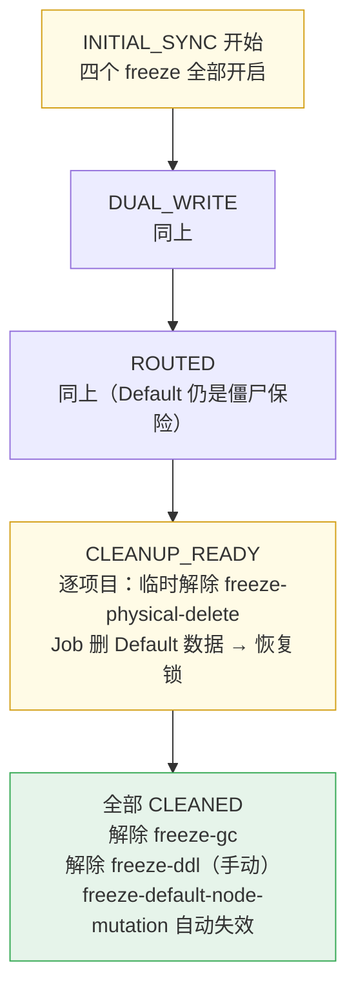

| freeze 开关 | 开启时机 | 解除时机 |
| --- | --- | --- |
| `freeze-gc` | INITIAL_SYNC 开始 | 全部项目 CLEANED |
| `freeze-physical-delete` | INITIAL_SYNC 开始 | 逐项目 CLEANUP_READY → CLEANED（项目级临时解除） |
| `freeze-default-node-mutation` | DUAL_WRITE 开始 | CLEANED 后自动失效 |
| `freeze-ddl` | INITIAL_SYNC 开始 | 全部项目 CLEANED，运维手动关闭 |

### 3.19 写入字段与实施审计清单

#### 3.19.1 `lastModifiedDate` 写路径审计

双写补偿的 `$max` 保护（§3.15.7）依赖 `lastModifiedDate`。**代码审计发现：10/13 写路径遗漏更新 `lastModifiedDate`**，具体如下：

| 写路径 | 是否更新 `lastModifiedDate` | 风险 |
| --- | --- | --- |
| `NodeDao` insert / save | ✅ 已有 | — |
| `NodeQueryHelper.update()` | ✅ 已有 | — |
| `NodeDao.incSizeAndNodeNumOfFolder()` | ✅ 已有 | — |
| `NodeDao.setNodeArchived()` | ❌ 遗漏 | 归档后补偿可能覆盖 |
| `NodeArchiveSupport.archiveNode()` | ❌ 遗漏 | 同上 |
| `NodeCompressSupport.compressedNode()` | ❌ 遗漏 | 压缩后补偿可能覆盖 |
| `NodeQueryHelper.nodeDeleteUpdate()` | ❌ 遗漏 | 删除标记后补偿可能覆盖 |
| `MetadataServiceImpl.deleteMetadata()` | ❌ 遗漏 | 元数据变更后补偿可能覆盖 |
| `MetadataServiceImpl.createMetadata()` | ❌ 遗漏 | 同上 |
| `MetadataServiceImpl.updateMetadata()` | ❌ 遗漏 | 同上 |
| `NodeMoveSupport` move 相关 | ❌ 遗漏 | 移动后补偿可能覆盖 |
| `NodeCopySupport` copy 相关 | ❌ 遗漏 | 复制后补偿可能覆盖 |
| `DeletedNodeCleanupJob` 清理 | ❌ 遗漏 | 清理后补偿可能覆盖 |

> **注意**：`$max` 与队列去重可降低乱序覆盖风险，但**不能替代 `lastModifiedDate` 更新**——对账检测（`lastModifiedDate` 对比）依赖该字段。**M7 灰度前须补全 §3.19.1 所列全部写路径**（13/13），不得推迟到后续迭代。

**审计方式**：Code Review 检查所有 `Update` 构造是否含 `lastModifiedDate`；集成测试模拟补偿乱序，验证旧 update 不覆盖新数据。

#### 3.19.2 Job / 异步路径改造清单（G-34 门禁）

**硬规则**：下列路径全部改造并验收通过后，方可启动模式二迁移编排（§10.5）。模式一 oplog **不受此限**。G-34 探针**禁止**配置项旁路（`completedReadinessItems` 已废弃），须通过实际结构探测。

**A. 非 Job 服务**

| # | 模块 | 类 | 改造方式 |
| --- | --- | --- | --- |
| A1 | auth | `BkiamNodeResourceService` | `filterNodeInfo` 改 `NodeService` 或 fan-out，禁止直查 Default `node_$index` |
| A2 | replication | `LocalDataManager` | 直拼 `node_{hash}` → `NodeService` / `NodeMongoOperations` |
| A3 | opdata | `GcInfoModel` | `forEachCollectionAsync` / `processSpecificProjects` 按实例 fan-out |
| A4 | metadata | `RNodeDao.pageBySha256` | 与 sync 同等跨实例 fan-out |
| A5 | job | `NodeIterator` | 仓库存储迁移走路由 template |
| A6 | job | `NodeCommonUtils` | 直查 node → 路由感知 |

**B. Job — 全表扫描类**（`collectionNames()` 路由感知 + 实例过滤）

| # | Job |
| --- | --- |
| B1 | `InactiveProjectNodeFolderStatJob` |
| B2 | `InactiveProjectEmptyFolderCleanupJob` |
| B3 | `ExpiredNodeMarkupJob` |
| B4 | `ProjectRepoMetricsStatJob` |
| B5 | `StatBaseJob` |
| B6 | `NodeStatCompositeMongoDbBatchJob` |
| B7 | `ArchiveNodeStatJob` |
| B8 | `NodeReport2BkbaseJob` |
| B9 | `BasedRepositoryNodeRetainResolver` |
| B10 | `SeparationStatBaseJob` |

> **B10 特例**：`SeparationStatBaseJob` 操作 `separation_node_*` 集合，降冷数据独立存储，
> 不在 `node_*` 分库迁移范围，无需路由改造。G-34 探针 B10 项保留结构探测即可。

**C. Job / 分离备份 — 按 projectId 读写**

| # | 类 |
| --- | --- |
| C1 | `DeletedRepositoryCleanupJob` |
| C2 | `DeletedNodeCleanupJob` |
| C3 | `PipelineArtifactCleanupJob` |
| C4 | `NodeCopyJob` |
| C5 | `IdleNodeArchiveJob` |
| C6 | `SystemGcJob` |
| C7 | `FileReferenceCleanupJob` |
| C8 | `DataSeparatorImpl` / `DataRestorerImpl` / `AbstractHandler` |
| C9 | `MavenRepoSpecialDataSeparatorHandler` |
| C10 | `FixFailedDataSeparationJob` |
| C11 | `BackupNodeDataHandler` |
| C12 | `MigrateExecutor` |

**D. 异步写路径**（G-41）

| # | 类 / 场景 | 改造方式 |
| --- | --- | --- |
| D1 | `NodeModifyEventListener`（`@Async`） | 显式 `projectId` 或 `NodeMongoOperations` |
| D2 | `NodeCommonUtils.workPool` | `withProject(projectId)` 或 TTL 包装线程池 |
| D3 | 自建线程池 / `CompletableFuture` / 协程 | 写操作禁止依赖外层 `ThreadLocal` |

**验收**

| 层级 | 内容 |
| --- | --- |
| CI | `mongoTemplate` + `node_` 出现在非白名单 → 构建失败 |
| 集成 | B/C 类 Job 在 mock Heavy 环境跑一轮，断言不读写 Default 僵尸数据 |
| API | `GET /routing/readiness` 返回清单完成度（§10.5） |
| CR | §20 `@Transactional` + 显式 `projectId` 全量签核 |

#### 3.19.3 灰度验收门禁

> 完整版 **17 项**门禁见 **§25.5**（在下列 11 项基础上补充 claimTask 幂等、freeze-ddl、Zombie 写保护、writeConcern 校验、旁路对账、G-34）。

M7 首个大项目迁移前，以下项必须全部通过：

- [ ] 双写决策按 §3.5.1 实现（`isProjectInDualWrite` = Consul `routing-state=DUAL_WRITE` + 项目在 `project-routing` 中），非双写项目不误双写
- [ ] 进入 `DUAL_WRITE` 前 100% 新实例，无旧实例与双写并存（§3.10）
- [ ] 双写期迁出项目读 Default Primary（§1.3、§3.6.2）
- [ ] `shard-routing` 与 `project-routing` 冲突校验启动 fail-fast（§13.3）
- [ ] 迁出项目 Job 扫描 Default 时 `projectId` 过滤生效（§3.7.2 白名单）
- [ ] `migration.project-locks` 迁移全程（INITIAL_SYNC ~ CLEANUP）`freeze-gc=true`
- [ ] 散发查询 `STRICT` 模式部分实例失败时返回错误
- [ ] **13/13 写路径更新 `lastModifiedDate`**（§3.19.1，M7 阻塞项）
- [ ] 补偿队列同 `_id` 去重（`replaceOrAdd`）生效，同 `_id` 只保留最新补偿任务（§3.15.7）
- [ ] 补偿 update `lastModifiedDate` 使用 `$max` 保护，验证旧补偿不会降级时间戳（§3.15.7）
- [ ] 连接池总量未超 MongoDB `maxConnections` 阈值（§4.1）

### 3.20 完整配置流程（Consul 配置 + 迁移状态）

本节描述模式二从零到迁移完成的**完整配置操作序列**。实例、路由绑定和 rule 级开关存储在 Consul；项目实际迁移阶段以 `mongo_migration_sync_state.phase` 为准，由迁移 API 推进。

#### 3.20.1 配置分层概览

```
┌──────────────────────────────────────────────────────────────────┐
│                       Consul（唯一配置源）                         │
│  ┌──────────────────────────────────────────────────────────────┤ │
│  │ 启动级（变更需滚动重启）:                                        │ │
│  │   rules.node.instances.*.uri                  │ │
│  │   rules.node.collection-prefix（默认 "node_"）                 │ │
│  │   rules.node.routing-type（固定 "project"）                    │ │
│  │   rules.node.routing-key-field（固定 "projectId"）             │ │
│  │   rules.node.sharding-count（默认 256）                        │ │
│  │   rules.node.migration.historical-sync-strategy / sync-job / project-locks │
│  ├──────────────────────────────────────────────────────────────┤ │
│  │ 热加载级（直接修改 Consul，@RefreshScope 秒级生效）:             │ │
│  │   rules.node.routing-state                                     │ │
│  │   rules.node.project-routing.*  （逐项目增量添加/删除）        │ │
│  │   config-version / min-config-version                         │ │
│  └──────────────────────────────────────────────────────────────┘ │
└──────────────────────────────────────────────────────────────────┘
```

**操作方式**：所有配置变更直接在 Consul KV 中修改 `spring.data.mongodb.multi-instance` 键。变更后 Pod 通过 `@RefreshScope` 热加载生效（启动级配置需滚动重启）。

**A/B 类配置表**（`MongoMultiInstanceProperties` + `DefaultMongoRoutingRegistry`）：

| 类别 | 字段 | 生效方式 |
| --- | --- | --- |
| **A 类（热加载）** | `routingState`、`projectRouting`、`shardRouting`、`businessRouting`、`configVersion`、`minConfigVersion`、`maxConcurrentDualWrite`、`migration.*`（非 URI）、`rules.node.scatter-query.default-mode/timeout-seconds`、`compensation.softLimit/hardLimit` | `@RefreshScope` 刷新后 registry **live 读** `properties.rules[ruleName]`；散发 mode/timeout 经 `@Value` 注入 `NodeRoutingConfiguration` |
| **B 类（滚动重启）** | `instances.*.uri/maxPoolSize/minPoolSize`、`collectionPrefix`、`routingType`、`routingKeyField`、`shardingCount`、`scatterQuery.dedicated*PoolSize`、新增/删除整个 rule | 需重建 `MongoClient` / `prefixIndex` |

> `prefixIndex`（`collectionPrefix → ruleName`）在 registry 构造时缓存；B 类 `collectionPrefix` 变更需滚动重启。A 类变更不重建 `primaryTemplates`（MongoClient 仍缓存）。

### 3.20.2 阶段 0 → 1：首次部署（Consul Bootstrap）

**操作**：在 Consul 中创建 `node` 规则的基础配置（启动级属性），部署新版本代码，执行滚动重启。

```yaml
# Consul Key: spring.data.mongodb.multi-instance
# 注意：路由态（routing-state、project-routing）由运维在 Consul 手改，@RefreshScope 热加载。
spring:
  data:
    mongodb:
      uri: mongodb://default-primary:27017/bkrepo       # Default 主实例（不变）
      multi-instance:
        config-version: 0                                # 初始为 0，运维首次修改后手动递增
        min-config-version: 0
        max-concurrent-dual-write: 1                     # 同时双写项目数上限
        rules:
          node:
            routing-type: project                        # 按 projectId 路由
            routing-key-field: projectId                 # 从 Query/Entity 提取的字段
            collection-prefix: "node_"                   # 匹配 node_* 集合
            sharding-count: 256                          # 分表数量
            routing-state: OFF                              # 阶段 1 不开启路由
            migration:
              historical-sync-strategy: JOB_ONLY         # node 集合高频增删改，需增量追平
              sync-job:
                batch-size: 500
                parallel-projects: 3
                change-stream-enabled: true
                retry-count: 3
              max-concurrent-dual-write: 1
              project-locks:
                freeze-gc: true                          # 迁移期间冻结 GC（§3.18.2）
                freeze-ddl: true                         # 迁移期间禁止 DDL
                freeze-physical-delete: true             # 禁止物理删除 Default 副本
                freeze-default-node-mutation: true       # 禁止 Default 侧 node 变更
            instances:
              heavy1:
                uri: mongodb://heavy1-primary:27017/bkrepo         # ← 启动级
                max-pool-size: 50
                min-pool-size: 5
              heavy2:
                uri: mongodb://heavy2-primary:27017/bkrepo         # ← 启动级
                max-pool-size: 50
                min-pool-size: 5
```

**生效方式**：

| 属性 | 生效方式 | 说明 |
|------|----------|------|
| `instances.*.uri` | **滚动重启** | 新增 `MongoTemplate` Bean，必须重启才能创建连接池 |
| `collection-prefix` / `routing-type` / `routing-key-field` | **滚动重启** | 规则元数据变更 |
| `migration.sync-job.*` / `project-locks.*` | **滚动重启** | 迁移策略配置 |
| `routing-state` | **热加载**（运维手动改 Consul） | 运营态变更，全生命周期 1~2 次 |
| `project-routing` | **Consul（运维手动）** | 迁移 SOP 中按步骤添加/删除 |
| `config-version` | **Consul** | Prometheus `bkrepo_mongo_routing_config_version` 对账 |

**验证**：

```bash
# 1. 确认所有实例已部署完成（发布系统确认）
# 2. 确认所有 Heavy 实例可连通（从任意实例内执行）
# 查看实例启动日志，搜索 "MongoTemplate" 确认无连接创建错误

# 3. 确认路由未生效（routing-enabled=false）
# 业务日志中搜索 "routing.*node"，应无路由命中日志

# 4. 确认 node_* 读写仍在 Default
# Default 实例的 mongostat 中应看到所有 node_* 集合流量

# 5. 确认 Consul 配置可正常读写（后续步骤直接修改 Consul KV）
curl -s consul:8500/v1/kv/spring.data.mongodb.multi-instance | jq .
```

#### 3.20.3 阶段 1 → 2：创建迁移项目（opdata API 操作）

**操作**：通过 opdata API 或 op admin 页面添加项目路由绑定。

```bash
# 方式一：opdata API
curl -X POST /api/migration/binding \
  -d '{"ruleName":"node","projectId":"projectA","instanceName":"heavy1","historicalSyncStrategy":"JOB_ONLY"}'

# 方式二：op admin "分库迁移"页面操作
# 在项目绑定区域，选择规则 node，添加项目 projectA 到 heavy1
# 绑定数据写入 DB mongo_migration_sync_state
```

**生效方式**：API 写 DB `phase=PENDING`；路由未生效直至运维添加 Consul `project-routing`。

**验证**：

```bash
# 1. 确认 DB 绑定已写入
curl -s /api/migration/status?projectId=projectA | jq .

# 2. 确认路由尚未生效（routing-state=OFF）
# 业务日志中搜索 "routing.*node"，应无路由命中日志
```

#### 3.20.4 阶段 1 → 2：开启双写（Consul）

**前置条件**（全部满足；Consul 变更无 API 自动门禁，见 §1.4.4、§25.5）：

- [ ] `POST /migration/binding` 完成（DB `phase=PENDING`）
- [ ] G-34 路由就绪（`GET /routing/readiness` 全绿）
- [ ] Heavy 部署完成、索引与 Default 一致
- [ ] 全部实例已部署路由代码（§3.10）
- [ ] Prometheus：`bkrepo_mongo_routing_config_version` 全集群 ≥ `min-config-version`（E-06）
- [ ] `max-concurrent-dual-write` 未超限

**操作**（**② 必须在 ④ 之前**）：

1. 运维在 Consul 将项目加入 `project-routing`，设 `routing-state=DUAL_WRITE`
2. 等待 ≥ 30s（覆盖 `@RefreshScope` 默认 3s 刷新周期），或查 Prometheus config-version 确认全集群一致
3. `POST /migration/start`（INIT 校验通过 → DB `phase=INITIAL_SYNC`，Job 开扫）
4. Job 全量扫描与运行时双写并发；扫描完成 + `sync_failed` 清零后 Job 自动推进 DB `phase=DUAL_WRITE`

```bash
# 步骤 1：Consul（本区域）
# project-routing.projectA: heavy1
# routing-state: DUAL_WRITE

# 步骤 2：确认 config-version 全集群就绪
# Prometheus: bkrepo_mongo_routing_config_version{rule="node"} < $minConfigVersion
# 结果为空 → 全集群就绪

# 步骤 3：启动同步
curl -X POST /api/migration/start?projectId=projectA

# 步骤 4：确认 DB phase（Job 自动推进）
curl -s /api/migration/status?projectId=projectA | jq '.phase'
```

**生效**：`isProjectInDualWrite` = Consul `routing-state=DUAL_WRITE` ∧ 项目在 `project-routing` 中（步骤 1 后立即生效，不读 DB `phase`）。

**INIT 失败回滚**：`start` 返回 `INIT_FAILED` 时，立即从 Consul 移除 `project-routing` 并设 `routing-state=OFF`。

**验证**：

```bash
# 1. 确认双写生效（写入 projectA 的一个 node，检查两侧）
# Heavy1:
mongo heavy1-primary:27017/bkrepo --eval '
  db.node_65.count({"projectId":"projectA"})
'
# Default:
mongo default-primary:27017/bkrepo --eval '
  db.node_65.count({"projectId":"projectA"})
'
# 两侧 count 应一致（允许秒级延迟）

# 2. 确认非迁移项目不受影响（projectB 仍单写 Default）
# Default 上 projectB 的写入正常

# 3. 监控补偿队列
# 观察补偿任务表，确认无持续积压（积压 > 1000 条触发告警）
```

#### 3.20.5 阶段 2 → 3：历史数据同步（Job 与双写并发）

**操作**：Consul 保持 `routing-state=DUAL_WRITE`；`MigrationSyncJob` 在 `POST /migration/start` 后执行 `$setOnInsert` 全量扫描，与运行时双写并发。

```bash
# 已在 §3.20.4 步骤 3 触发 start；Job 自动断点续传
# 扫描完成 + sync_failed 清零 → DB phase=DUAL_WRITE
```

**验证**：

```bash
# 1. 双侧数据对账
# 对比 Default 和 Heavy1 上 projectA 各 node_* 分表的 count()
for i in $(seq 0 255); do
  def_count=$(mongo default-primary:27017/bkrepo --quiet --eval "db.node_$i.count({projectId:'projectA'})")
  hvy_count=$(mongo heavy1-primary:27017/bkrepo --quiet --eval "db.node_$i.count({projectId:'projectA'})")
  if [ "$def_count" != "$hvy_count" ]; then
    echo "MISMATCH: node_$i default=$def_count heavy=$hvy_count"
  fi
done

# 2. 确认补偿队列清零
```

#### 3.20.6 阶段 3 → 4：切流（projectA 进入 ROUTED）

**前置条件**：

- [ ] 双侧 data count 一致（对账通过）
- [ ] 补偿队列清零
- [ ] 稳定双写 ≥ 1 天，无异常告警
- [ ] 100% Pod 已完成部署

**操作**：通过 opdata API 将 projectA 的 `phase` 推进到 `ROUTED`（写入 DB `mongo_migration_sync_state`）。

```bash
curl -X POST /api/migration/route?projectId=projectA
```

**生效方式**：运维将 Consul `routing-state=ROUTED`。`project-routing` 中该项目读写切 Heavy。

**验证**：

```bash
# 1. 确认 projectA 读写已切到 Heavy1
# Default 实例的 mongostat 中 projectA 所在分表的流量应消失
# Heavy1 实例可观察到对应分表的读写流量

# 2. 确认 projectA 写入成功（在 Heavy1 上）
mongo heavy1-primary:27017/bkrepo --eval '
  db.node_65.find({"projectId":"projectA"}).limit(1).pretty()
'

# 3. 确认读取走 Heavy Primary
# Heavy Primary 上可观察到读流量

# 4. 确认非迁移项目不受影响
# projectB 仍在 Default 上正常读写
```

#### 3.20.7 阶段 4 → 5：清理 Default 副本

**前置条件**：

- [ ] projectA 切流后稳定运行 1~2 天
- [ ] 业务无异常告警
- [ ] 无计划回滚

**操作**：清理 Job 自动执行 Default 上 projectA 的 node 数据物理删除（受 `freeze-physical-delete` 锁保护，仅切流后阶段解除）。

#### 3.20.8 每项目迁移循环

上述 §3.20.4 ~ §3.20.7 对每个待迁移项目重复执行。关键约束：

| 约束 | 说明 |
|------|------|
| 同一时刻仅 1 个项目处于双写期 | Gate + `max-concurrent-dual-write`（`phase ∈ {INITIAL_SYNC, DUAL_WRITE}`） |
| `routing-state=DUAL_WRITE` 时表中项目全部双写 | 含已 ROUTED 项目会短暂恢复副路径 |
| 逐项目切流后 `routing-state=ROUTED` | 表中已迁出项目单写 Heavy |
| Consul `config-version` 递增 | 跨 Pod 对账（`bkrepo_mongo_routing_config_version`） |

**多项目并行迁移示意**：

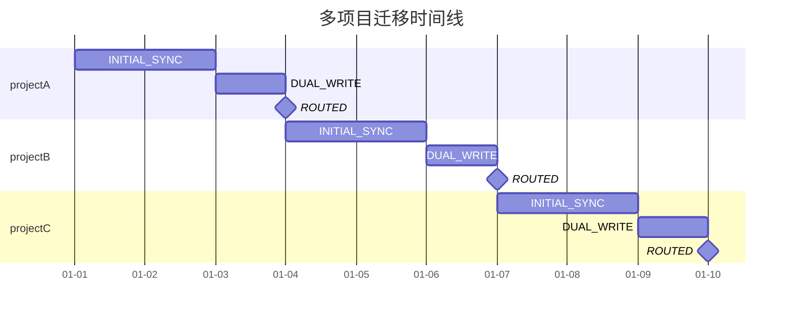

#### 3.20.9 配置校验清单

**启动时校验**（`validateOnStartup()`，fail-fast）：

| 校验项 | 规则 | 不通过行为 |
|--------|------|-----------|
| project-routing 引用 instance 存在 | 所有 `projectId → instanceName` 的 instance 在 `instances` 中 | 启动失败 |
| project/shard 互斥（§13.3） | projectId 哈希分表不得同时出现在 `shard-routing` | 启动失败 |
| 实例 URI 可连通 | `MongoTemplate` 构建时自动检测 | 启动失败 |
| PROJECT 模式 + projectRouting 非空 → instances 非空 | 有路由项目则必须有实例 | 启动失败 |

**Consul 配置校验**（提交前检查）：

| 校验项 | 规则 | 不通过行为 |
|--------|------|-----------|
| 项目唯一性 | 同一 `projectId` 不得在 `project-routing` 中重复出现 | Config update 被拒绝 |
| 实例引用有效性 | `project-routing` 中的 instanceName 必须在 `instances` 中存在 | 启动失败 |
| shard/project 互斥 | 提交时检查哈希冲突 | Config update 被拒绝 |
| `routing-state=DUAL_WRITE` 前置 | §3.20.4 前置清单（binding、G-34、100% 部署、config-version 等）；**无** API 自动校验 |
| 双写项目数上限 | DB Gate `max-concurrent-dual-write`；`phase ∈ {INITIAL_SYNC, DUAL_WRITE}` |

**运行时校验**（各 Pod 本地，非阻塞）：

| 校验项 | 规则 | 不通过行为 |
|--------|------|-----------|
| configVersion 一致性 | `localVersion >= minConfigVersion`（M5-03 本地就绪探测） | 告警，等待 Pod 刷新；**不阻塞** `MigrationGate` |
| 项目在 project-routing 但未配置实例 | `projectRouting` 中有该 projectId 但 `instances` 中无对应实例 | 报警，路由走 Default（保守） |

#### 3.20.10 紧急回滚操作

**单项目回滚**（无需影响其他项目）：

```bash
# opdata API 回滚项目（写入 DB phase=ROLLBACK）
curl -X POST /api/migration/rollback?projectId=projectA
```

**全局紧急回滚**（关闭所有路由）：

```bash
# 运维手动在 Consul 中设置 routing-state=OFF（全局总闸）
# Consul Key: spring.data.mongodb.multi-instance.rules.node.routing-state: OFF
```

> **ROUTED 项目警告**：`routing-state=OFF` 仅改路由，不搬数据。ROUTED 期间写入仅在 Heavy，
> Default 为切流时刻僵尸快照——直接切回会导致**丢失 ROUTED 期间增量**或**分裂脑**（§3.11.2）。
> phase ≤ `DUAL_WRITE` 的项目可安全一键回滚；ROUTED 项目须 §25.4.3 反向迁移后再改路由。

**回滚后验证**：

```bash
# 1. 确认所有 node_* 读写恢复走 Default
# Default 实例的 mongostat 中应重新看到所有流量

# 2. 确认 DB 中 phase 已变更
curl -s /api/migration/status?projectId=projectA | jq .phase
```

> **注意**：回滚后 Heavy 实例上的数据不再写入新数据。如需重新迁移该项目，须从 INITIAL_SYNC 重新开始（数据已分叉，不可增量续传）。


---

