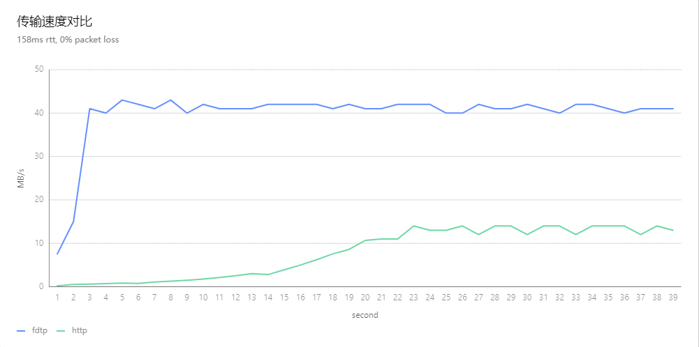

# fdtp

fdtp(Fast Data Transfer Protocol)是bkrepo团队基于UDT自研实现的一个快速数据传输安全协议，
比普通的http更加紧凑，目标是在高带宽延迟积（BDP）网络下具备安全，和更快速的的传输性能。



# Feature

- [x] 支持高BDP网络传输文件
- [x] ssl
- [x] 多路复用

# 实现原理

由于tcp的拥塞控制方法，导致tcp在高BDP网络下传输性能不佳。udt协议改进了这点，fdtp在udt的基础上，
封装了更通用的协议，使用户可以更方便的使用udt传输，而无需关心传输细节。
fdtp是基于流的（Stream），并将数据分割成二进制帧（Frame）进行传输，fdtp有两种数据帧，Header frame和Data frame。
Header frame包含k-v的头部信息，Data frame包含二进制数据。

Frame的头部数据结构

```text
   0                   1                   2                   3
   0 1 2 3 4 5 6 7 8 9 0 1 2 3 4 5 6 7 8 9 0 1 2 3 4 5 6 7 8 9 0 1 2
   +-+-+-+-+-+-+-+-+-+-+-+-+-+-+-+-+-+-+-+-+-+-+-+-+-+-+-+-+-+-+-+-+
   |                 Payload Length                |
   +-+-+-+-+-+-+-+-+-+-+-+-+-+-+-+-+-+-+-+-+-+-+-+-+-+-+-+-+-+-+-+-+
   |     Type      |      Flag     | 
   +-+-+-+-+-+-+-+-+-+-+-+-+-+-+-+-+-+-+-+-+-+-+-+-+-+-+-+-+-+-+-+-+
   |                          Stream ID                            |
   +-+-+-+-+-+-+-+-+-+-+-+-+-+-+-+-+-+-+-+-+-+-+-+-+-+-+-+-+-+-+-+-+
```

Payload Length使用24bit,Type和Flag使用8个bit，Stream ID使用32个bit.

# Q&A
1. 是否存在队头阻塞？

   fdtp本身不存在队头阻塞，但是依赖的udt是可靠传输协议，如果发生丢包，则udt会进行重传，这时会发生队头阻塞。
   仅当使用fdtp多路复用时才会出现。

# roadmap

-[ ] 队头阻塞
-[ ] 头部压缩
